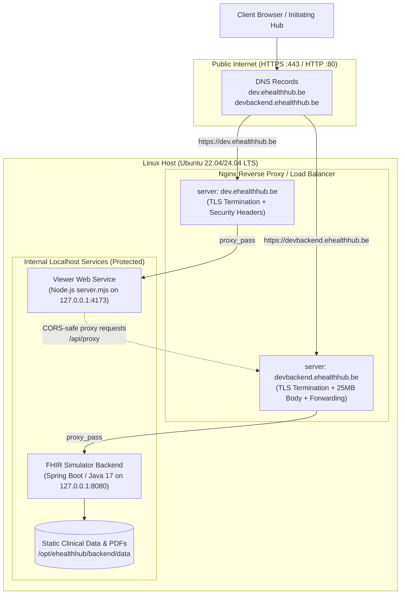

# Production Deployment Guide: Belgian eHealth Interhub

This guide details how to build, configure, and operate the **Belgian eHealth Interhub Simulator Backend** and **Workspace Viewer** on a Linux server behind an **Nginx reverse proxy / load balancer** with TLS/SSL encryption.

---

## 1. Target Architecture & Domains



### Domain Routing Matrix

| Public Domain | Target Service | Internal Address | Purpose |
| :--- | :--- | :--- | :--- |
| **`https://dev.ehealthhub.be`** | Simulator Viewer | `http://127.0.0.1:4173` | Web UI, document explorer, FHIR console, authentication workbench, and specification reader. |
| **`https://devbackend.ehealthhub.be`** | FHIR Simulator Backend | `http://127.0.0.1:8080` | FHIR R4 server exposing `/fhir/*` (MHD ITI-67 discovery, ITI-68 `$retrieve-document`, and `/metadata`). |

---

## 2. Linux Server Prerequisites & Dependencies

### 2.1 Supported Linux Distributions
- Ubuntu 22.04 LTS / 24.04 LTS (Recommended)
- Debian 12 (Bookworm)
- RHEL 9 / Rocky Linux 9 / AlmaLinux 9

### 2.2 Install Base Packages & Compilers (Ubuntu/Debian)

```bash
# Update package lists
sudo apt update && sudo apt upgrade -y

# Install essential utilities, build tools, Nginx, and Certbot
sudo apt install -y curl wget git unzip build-essential nginx certbot python3-certbot-nginx

# Install Java 17 JDK & Maven (Backend)
sudo apt install -y openjdk-17-jdk maven

# Verify Java and Maven
java -version    # OpenJDK 17.x or 21.x
mvn -version     # Maven 3.8+
```

### 2.3 Install Node.js ≥ 22.x (Frontend Viewer)

Node.js ≥ 22 is required for native test execution and ES module support.

```bash
# Install Node.js 22.x via NodeSource
curl -fsSL https://deb.nodesource.com/setup_22.x | sudo -E bash -
sudo apt install -y nodejs

# Verify Node.js and NPM
node -v   # v22.x or higher
npm -v    # 10.x or higher
```

### 2.4 Create a Dedicated Service User & Directory Layout

Never run production network services as `root`. Create a dedicated system user:

```bash
sudo useradd --system --shell /usr/sbin/nologin --home-dir /opt/ehealthhub ehealthhub
sudo mkdir -p /opt/ehealthhub/backend /opt/ehealthhub/viewer /var/log/ehealthhub
sudo chown -R ehealthhub:ehealthhub /opt/ehealthhub /var/log/ehealthhub
```

---

## 3. Building the Applications

You can build directly on the production host or build in CI/CD (GitHub Actions) and copy artifacts to the host.

### 3.1 Build the Backend Simulator (`fhir-ehealth-hub-simulator`)

```bash
cd /opt/ehealthhub/backend-src  # or your repository checkout path
cd fhir-ehealth-hub-simulator

# Run tests and package standalone JAR
mvn clean package -DskipTests

# Copy JAR and data directory to production directory
sudo cp target/fhir-ehealth-hub-simulator-1.0.0-SNAPSHOT.jar /opt/ehealthhub/backend/simulator.jar
sudo cp -r data /opt/ehealthhub/backend/
sudo chown -R ehealthhub:ehealthhub /opt/ehealthhub/backend
```

### 3.2 Build the Viewer Application (`fhir-ehealthhub-simulator-viewer`)

We deploy the Node.js server (`server.mjs`). This enables both static asset serving **and** the `/api/proxy` endpoint, which allows the browser UI to communicate with `devbackend.ehealthhub.be` without browser CORS limitations.

```bash
cd /opt/ehealthhub/viewer-src  # or your repository checkout path
cd fhir-ehealthhub-simulator-viewer

# Run syntax verification and unit tests
npm run check
npm test

# Copy viewer files to production directory
sudo cp -r src public package.json server.mjs index.html /opt/ehealthhub/viewer/
sudo chown -R ehealthhub:ehealthhub /opt/ehealthhub/viewer
```

---

## 4. Production Configuration

### 4.1 Backend Production Config (`application-prod.yml`)

Create an external production configuration file at `/opt/ehealthhub/backend/application-prod.yml`:

```yaml
server:
  port: 8080
  # Trust X-Forwarded-* headers from Nginx reverse proxy
  forward-headers-strategy: framework

hub:
  simulator:
    # Absolute path to production data directory
    data-dir: "/opt/ehealthhub/backend/data"
    strict-ssin-checksum: false
    simulate-partial-failure: false
    hub-oid: "urn:oid:1.3.6.1.4.1.21297.1.3"
    hub-ehp: "1990000003"
    hub-name: "Belgian Interhub Reference Node"
    # Canonical external base URL
    server-base-url: "https://devbackend.ehealthhub.be/fhir"
    default-page-size: 20
    max-page-size: 200
    continuation-token-ttl-seconds: 300
    continuation-token-cache-size: 1000
    withdrawn-references:
      - withdrawn
      - gone
    pdf-renderings:
      DocRefLabReportContainedExample: rendered-lab-report-example-01.pdf
      DocRefLabReportExample: rendered-lab-report-example-01.pdf
      DocRefTelemonitoringExample: holter-001.pdf

logging:
  file:
    name: "/var/log/ehealthhub/backend.log"
  level:
    root: INFO
    be.ehealth.hub.simulator: INFO
    ca.uhn.fhir: WARN
```

Set permissions:
```bash
sudo chown ehealthhub:ehealthhub /opt/ehealthhub/backend/application-prod.yml
sudo chmod 640 /opt/ehealthhub/backend/application-prod.yml
```

---

## 5. Systemd Service Setup

We use Linux `systemd` to manage automatic startup, health monitoring, and graceful restarts.

### 5.1 Backend Service (`/etc/systemd/system/ehealthhub-backend.service`)

Create `/etc/systemd/system/ehealthhub-backend.service`:

```ini
[Unit]
Description=Belgian eHealth Interhub FHIR Simulator Backend
After=network.target

[Service]
Type=simple
User=ehealthhub
Group=ehealthhub
WorkingDirectory=/opt/ehealthhub/backend
ExecStart=/usr/bin/java -Xms512m -Xmx2048m -Dspring.config.additional-location=file:/opt/ehealthhub/backend/application-prod.yml -jar /opt/ehealthhub/backend/simulator.jar
Restart=always
RestartSec=5
SuccessExitStatus=143

# Security Sandboxing
NoNewPrivileges=true
ProtectSystem=strict
ProtectHome=true
ReadWritePaths=/var/log/ehealthhub /opt/ehealthhub/backend
PrivateTmp=true

[Install]
WantedBy=multi-user.target
```

### 5.2 Viewer Service (`/etc/systemd/system/ehealthhub-viewer.service`)

Create `/etc/systemd/system/ehealthhub-viewer.service`:

```ini
[Unit]
Description=Belgian eHealth Interhub Simulator Web Viewer
After=network.target

[Service]
Type=simple
User=ehealthhub
Group=ehealthhub
WorkingDirectory=/opt/ehealthhub/viewer
Environment="PORT=4173"
Environment="HOST=127.0.0.1"
# Allow proxying to the production backend, localhost, and eHealth IAM endpoints
Environment="PROXY_ALLOWED_ORIGINS=https://devbackend.ehealthhub.be,http://localhost:8080,http://127.0.0.1:8080"
ExecStart=/usr/bin/node server.mjs
Restart=always
RestartSec=5

# Security Sandboxing
NoNewPrivileges=true
ProtectSystem=strict
ProtectHome=true
ReadWritePaths=/var/log/ehealthhub /opt/ehealthhub/viewer
PrivateTmp=true

[Install]
WantedBy=multi-user.target
```

### 5.3 Enable and Start Services

```bash
# Reload systemd configuration
sudo systemctl daemon-reload

# Enable automatic startup on system boot
sudo systemctl enable ehealthhub-backend ehealthhub-viewer

# Start both services
sudo systemctl start ehealthhub-backend ehealthhub-viewer

# Check service status
sudo systemctl status ehealthhub-backend --no-pager
sudo systemctl status ehealthhub-viewer --no-pager
```

---

## 6. Nginx Load Balancer & Reverse Proxy Configuration

Create `/etc/nginx/sites-available/ehealthhub.conf`:

```nginx
# ==============================================================================
# Upstream Definitions
# ==============================================================================
upstream upstream_ehealthhub_viewer {
    server 127.0.0.1:4173;
    keepalive 32;
}

upstream upstream_ehealthhub_backend {
    server 127.0.0.1:8080;
    keepalive 32;
}

# ==============================================================================
# 1. FRONTEND: dev.ehealthhub.be (HTTP -> HTTPS Redirect)
# ==============================================================================
server {
    listen 80;
    listen [::]:80;
    server_name dev.ehealthhub.be;

    # Let's Encrypt ACME challenge location
    location /.well-known/acme-challenge/ {
        root /var/www/html;
    }

    location / {
        return 301 https://$host$request_uri;
    }
}

# ==============================================================================
# 1. FRONTEND: dev.ehealthhub.be (HTTPS Reverse Proxy)
# ==============================================================================
server {
    listen 443 ssl http2;
    listen [::]:443 ssl http2;
    server_name dev.ehealthhub.be;

    # SSL certificates (configured by Certbot)
    ssl_certificate /etc/letsencrypt/live/dev.ehealthhub.be/fullchain.pem;
    ssl_certificate_key /etc/letsencrypt/live/dev.ehealthhub.be/privkey.pem;
    include /etc/letsencrypt/options-ssl-nginx.conf;
    ssl_dhparam /etc/letsencrypt/ssl-dhparams.pem;

    # Security Headers
    add_header X-Content-Type-Options "nosniff" always;
    add_header X-Frame-Options "SAMEORIGIN" always;
    add_header Referrer-Policy "strict-origin-when-cross-origin" always;
    add_header Strict-Transport-Security "max-age=31536000; includeSubDomains" always;

    # Access and Error Logs
    access_log /var/log/nginx/dev.ehealthhub.be.access.log;
    error_log /var/log/nginx/dev.ehealthhub.be.error.log warn;

    # Gzip Compression for JSON, JS, CSS, and Markdown
    gzip on;
    gzip_vary on;
    gzip_min_length 1024;
    gzip_proxied any;
    gzip_types text/plain text/css application/json application/javascript text/xml application/xml application/xml+rss text/javascript;

    # Static Assets Caching
    location ~* \.(css|js|svg|png|jpg|ico|woff2)$ {
        proxy_pass http://upstream_ehealthhub_viewer;
        proxy_http_version 1.1;
        proxy_set_header Connection "";
        proxy_set_header Host $host;
        expires 7d;
        add_header Cache-Control "public, no-transform";
    }

    # Main Viewer Application & Proxy Endpoint (/api/proxy)
    location / {
        proxy_pass http://upstream_ehealthhub_viewer;
        proxy_http_version 1.1;
        proxy_set_header Upgrade $http_upgrade;
        proxy_set_header Connection "upgrade";
        proxy_set_header Host $host;
        proxy_set_header X-Real-IP $remote_addr;
        proxy_set_header X-Forwarded-For $proxy_add_x_forwarded_for;
        proxy_set_header X-Forwarded-Proto $scheme;
        proxy_read_timeout 60s;
        proxy_send_timeout 60s;
    }
}

# ==============================================================================
# 2. BACKEND: devbackend.ehealthhub.be (HTTP -> HTTPS Redirect)
# ==============================================================================
server {
    listen 80;
    listen [::]:80;
    server_name devbackend.ehealthhub.be;

    # Let's Encrypt ACME challenge location
    location /.well-known/acme-challenge/ {
        root /var/www/html;
    }

    location / {
        return 301 https://$host$request_uri;
    }
}

# ==============================================================================
# 2. BACKEND: devbackend.ehealthhub.be (HTTPS FHIR Server)
# ==============================================================================
server {
    listen 443 ssl http2;
    listen [::]:443 ssl http2;
    server_name devbackend.ehealthhub.be;

    # SSL certificates (configured by Certbot)
    ssl_certificate /etc/letsencrypt/live/devbackend.ehealthhub.be/fullchain.pem;
    ssl_certificate_key /etc/letsencrypt/live/devbackend.ehealthhub.be/privkey.pem;
    include /etc/letsencrypt/options-ssl-nginx.conf;
    ssl_dhparam /etc/letsencrypt/ssl-dhparams.pem;

    # Security Headers
    add_header X-Content-Type-Options "nosniff" always;
    add_header X-Frame-Options "DENY" always;
    add_header Referrer-Policy "no-referrer" always;
    add_header Strict-Transport-Security "max-age=31536000; includeSubDomains" always;

    # Access and Error Logs
    access_log /var/log/nginx/devbackend.ehealthhub.be.access.log;
    error_log /var/log/nginx/devbackend.ehealthhub.be.error.log warn;

    # Critical: Allow large clinical documents and PDF binary payloads (25MB)
    client_max_body_size 25M;
    client_body_buffer_size 512k;

    # Proxy Pass to Spring Boot / HAPI FHIR
    location / {
        proxy_pass http://upstream_ehealthhub_backend;
        proxy_http_version 1.1;
        proxy_set_header Connection "";
        proxy_set_header Host $host;
        proxy_set_header X-Real-IP $remote_addr;
        proxy_set_header X-Forwarded-For $proxy_add_x_forwarded_for;
        proxy_set_header X-Forwarded-Proto https;
        proxy_set_header X-Forwarded-Port 443;
        proxy_set_header X-Forwarded-Host $host;

        # Disable buffering for raw PDF binary streaming
        proxy_buffering off;
        proxy_read_timeout 90s;
        proxy_connect_timeout 15s;
        proxy_send_timeout 90s;

        # CORS Headers (Allows direct web clients when not using /api/proxy)
        if ($request_method = 'OPTIONS') {
            add_header 'Access-Control-Allow-Origin' 'https://dev.ehealthhub.be' always;
            add_header 'Access-Control-Allow-Methods' 'GET, POST, OPTIONS' always;
            add_header 'Access-Control-Allow-Headers' 'Authorization, Content-Type, Accept, DPoP, Signature, Signature-Input, Content-Digest, X-Simulate-Partial-Failure' always;
            add_header 'Access-Control-Max-Age' 1728000;
            add_header 'Content-Type' 'text/plain; charset=utf-8';
            add_header 'Content-Length' 0;
            return 204;
        }

        add_header 'Access-Control-Allow-Origin' 'https://dev.ehealthhub.be' always;
        add_header 'Access-Control-Allow-Credentials' 'true' always;
    }
}
```

---

## 7. SSL / TLS Certificate Setup with Let's Encrypt

Before running Certbot, ensure both DNS A/AAAA records point to your server IP:
- `dev.ehealthhub.be` → `<SERVER_PUBLIC_IP>`
- `devbackend.ehealthhub.be` → `<SERVER_PUBLIC_IP>`

### 7.1 Obtain Certificates via Certbot

```bash
# Enable the site configuration in Nginx
sudo ln -sf /etc/nginx/sites-available/ehealthhub.conf /etc/nginx/sites-enabled/

# Obtain certificates for both domains
sudo certbot --nginx -d dev.ehealthhub.be -d devbackend.ehealthhub.be
```

### 7.2 Automatic Certificate Renewal
Certbot installs an automatic systemd timer. Verify it is running:

```bash
sudo systemctl status certbot.timer

# Test renewal with dry-run
sudo certbot renew --dry-run
```

### 7.3 Test & Reload Nginx

```bash
# Verify Nginx syntax
sudo nginx -t

# Reload configuration
sudo systemctl reload nginx
```

---

## 8. Firewall Configuration (UFW)

Ensure only ports `80` (HTTP), `443` (HTTPS), and `22` (SSH) are exposed to the public Internet. Internal ports `8080` and `4173` must remain unexposed:

```bash
sudo ufw default deny incoming
sudo ufw default allow outgoing
sudo ufw allow OpenSSH
sudo ufw allow 'Nginx Full'  # Opens ports 80 & 443
sudo ufw enable
sudo ufw status
```

---

## 9. Verification & Smoke Testing

### 9.1 Backend Smoke Tests

```bash
# 1. CapabilityStatement Discovery
curl -i https://devbackend.ehealthhub.be/fhir/metadata

# 2. Document Discovery (ITI-67) for Jan Peeters (SSIN: 79080412345)
curl -i -X POST https://devbackend.ehealthhub.be/fhir/DocumentReference/_search \
  -H "Content-Type: application/x-www-form-urlencoded" \
  -d "patient.identifier=https%3A%2F%2Fwww.ehealth.fgov.be%2Fstandards%2Ffhir%2Fcore%2FNamingSystem%2Fssin%7C79080412345"

# 3. Document Retrieval (ITI-68) for Lab Report
curl -i -X POST https://devbackend.ehealthhub.be/fhir/DocumentReference/\$retrieve-document \
  -H "Content-Type: application/fhir+json" \
  -d '{
    "resourceType": "Parameters",
    "parameter": [{
      "name": "documentReference",
      "valueReference": {"reference": "DocumentReference/DocRefLabReportContainedExample"}
    }]
  }'

# 4. Hub-Rendered PDF Content Negotiation
curl -i -X POST https://devbackend.ehealthhub.be/fhir/DocumentReference/\$retrieve-document \
  -H "Content-Type: application/fhir+json" \
  -H "Accept: application/pdf" \
  -d '{
    "resourceType": "Parameters",
    "parameter": [{
      "name": "documentReference",
      "valueReference": {"reference": "DocumentReference/DocRefLabReportContainedExample"}
    }]
  }' --output test-report.pdf
```

### 9.2 Frontend Viewer Verification

1. Open **`https://dev.ehealthhub.be`** in your browser.
2. In the top bar, click **Connection Settings** (`#settings`):
   - **Environment**: Select `Live · configured FHIR server`.
   - **FHIR base URL**: Set to `https://devbackend.ehealthhub.be/fhir`.
   - **HTTP transport**: Select `Local proxy · avoids browser CORS` (uses `/api/proxy`).
   - Click **Save connection**.
3. Go to **Documents** and click **Find documents** for SSIN `79080412345`.
4. Inspect the returned entries, click **Retrieve FHIR**, and verify the clinical tabs and PDF preview.

---

## 10. Operations, Maintenance & Troubleshooting

### 10.1 Service Inspection & Logs

```bash
# Real-time backend logs
sudo journalctl -u ehealthhub-backend -f

# Real-time viewer logs
sudo journalctl -u ehealthhub-viewer -f

# Nginx access & error logs
sudo tail -f /var/log/nginx/devbackend.ehealthhub.be.error.log
sudo tail -f /var/log/nginx/dev.ehealthhub.be.error.log
```

### 10.2 Common Issues & Resolutions

| Issue | Root Cause | Solution |
| :--- | :--- | :--- |
| **HTTP 502 Bad Gateway** | Service is stopped or not listening on the expected port. | Run `sudo systemctl status ehealthhub-backend` or `ehealthhub-viewer`. Check logs with `journalctl -u <service> -n 50`. |
| **HTTP 413 Request Entity Too Large** | Default Nginx body size is 1MB, blocking large Bundles/PDFs. | Ensure `client_max_body_size 25M;` is present in the `devbackend.ehealthhub.be` server block. |
| **CORS Errors in Browser Console** | Direct transport used without CORS headers or wrong origin. | Use the **Local proxy** transport in the Viewer settings, or verify that `devbackend.ehealthhub.be` includes the `Access-Control-Allow-Origin: https://dev.ehealthhub.be` headers. |
| **Proxy Origin Forbidden (HTTP 403)** | `server.mjs` blocked the target origin. | Ensure `PROXY_ALLOWED_ORIGINS` in `/etc/systemd/system/ehealthhub-viewer.service` contains `https://devbackend.ehealthhub.be`. |
| **SSIN Search Returns 400 Bad Request** | Missing or malformed patient SSIN parameter. | Interhub ITI-67 requires `patient.identifier` in the POST body using either the canonical URL or OID format. |

### 10.3 Zero-Downtime Deployment Script (`deploy-update.sh`)

Save this script on the server at `/opt/ehealthhub/deploy-update.sh`:

```bash
#!/bin/bash
set -euo pipefail

echo "=== Pulling latest changes ==="
cd /opt/ehealthhub/repo
git pull origin main

echo "=== Building Backend Simulator ==="
cd /opt/ehealthhub/repo/fhir-ehealth-hub-simulator
mvn clean package -DskipTests
cp target/fhir-ehealth-hub-simulator-*.jar /opt/ehealthhub/backend/simulator.jar
cp -r data /opt/ehealthhub/backend/

echo "=== Updating Viewer Application ==="
cd /opt/ehealthhub/repo/fhir-ehealthhub-simulator-viewer
npm run check
npm test
cp -r src public package.json server.mjs index.html /opt/ehealthhub/viewer/

echo "=== Restarting Services ==="
chown -R ehealthhub:ehealthhub /opt/ehealthhub
systemctl restart ehealthhub-backend
systemctl restart ehealthhub-viewer
systemctl reload nginx

echo "=== Deployment Completed Successfully ==="
```
