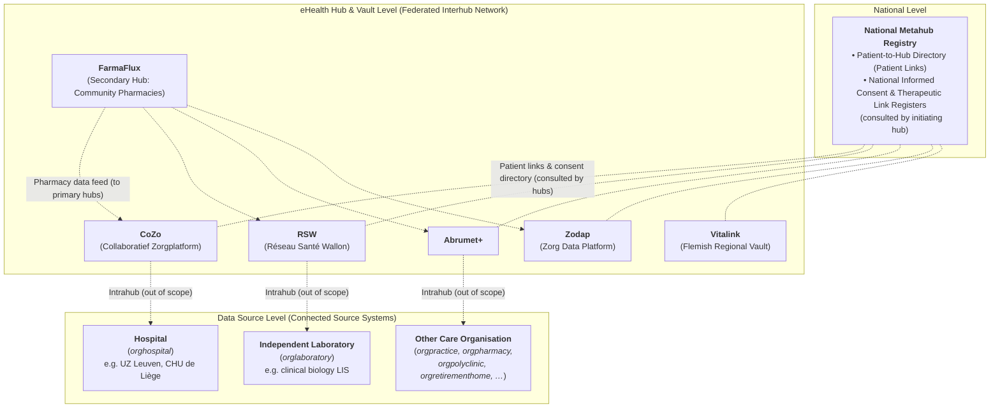
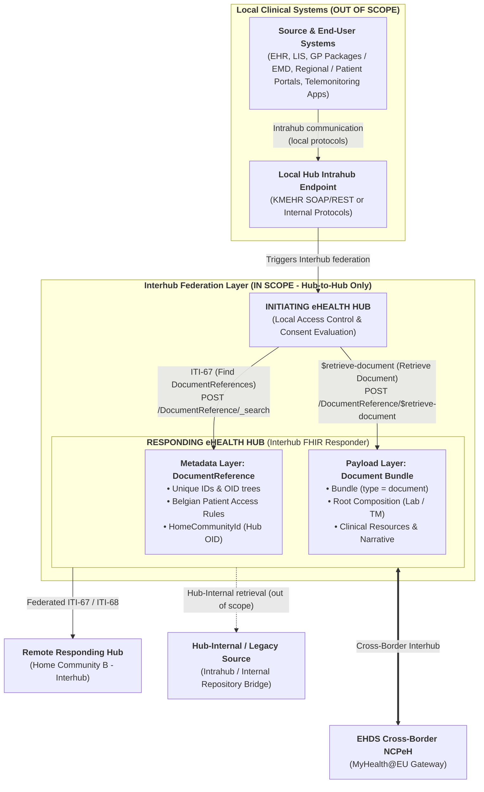
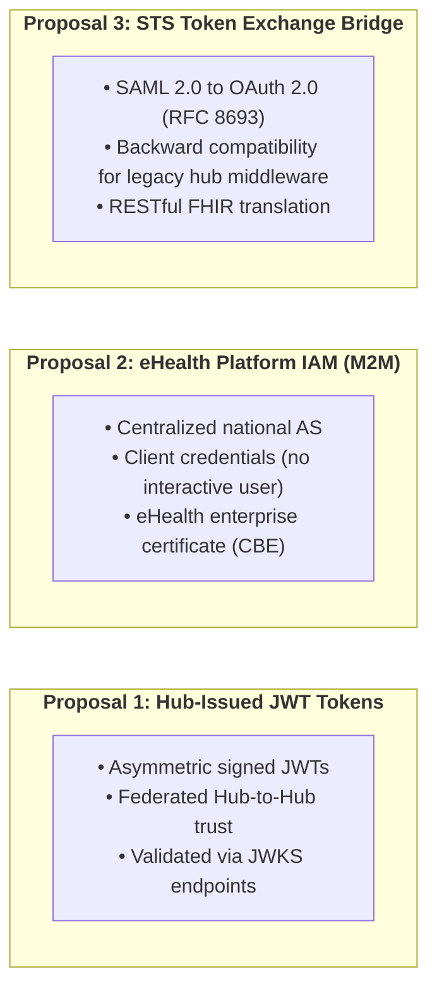

# Belgian Interhub Architecture & Federation Model

> **Where this page sits in the guide** — *Architecture*, page 1 of 2.
> This page is the **map** of the ecosystem; the pages it names are the specification of the individual pieces.
>
> * **Owned by this page:** the metahub / hub / data source model, federated routing and `homeCommunityId`, and the dual-stack transition gateway.
> * **Summarised here, specified in full elsewhere:** the metadata envelope → [Envelope & Metadata](envelope-and-metadata.html); the document transactions and the laboratory observation search → [Transactions](transactions.html); authentication, tamper-proofing and auditing → [Security & Authentication](security.html); payload encryption → [End-to-End Encryption](end-to-end-encryption.html); the SOAP crosswalk behind the dual-stack gateway → [KMEHR to FHIR Mapping](mapping-kmehr-to-hub.html).
> * **Next:** [Design Rationale](resource-considerations.html) — why this architecture shares FHIR *documents* rather than messages or granular resources.

## 1. The Belgian Federated eHealth Ecosystem

### 1.1 Hubs and vaults, the latter mentioned in this section only

Healthcare organizations or individual care providers may make their data available to authorized actors either by making these data accessible from their computer systems, or by uploading a copy of the data onto a central location.
In very simplistic terms, the former approach is the one used with the system of the eHealth hubs, while the latter is used with the healthcare 'vaults'.

This is an overly simplistic view because a hub can also opt to store some data on behalf of its partners, but for a hub the primary operation mode is to provide access to data that resides in a care institution, with local storage at the hub more of an exception.
With a vault the data are always managed locally.

For this document, except in the introductory section, the difference between a hub and a vault is irrelevant.
For simplicity and conciseness, this text talks about 'hubs', but vaults or any future system in-between is included as well.

### 1.2 Intrahub versus interhub communication

For the Belgian eHealth system, the choice was made to not centralize completely.
A first motivation was a matter of principle, that the government should not have excessive control over health data or be able to readily access it.
Thus, the hubs are primarily under control of the working field, be it operating in a highly regulated context.
A second motivation was societal, that there should be sufficient room for separate initiatives to foster progress.

This leads to an architecture in which there can be any number of hubs (even if it was agreed that there must be only one 'formal' vault per political region).
A number of care organizations or other actors arrange amongst them to make their data available, in a health network that is called a hub for largely historical reasons.
There is one metahub that provides basic services (such as management of the citizen's informed consent to this extended data sharing, and enabling the citizen to regulate access) and that enables the hubs to cooperate by keeping track of which hub knows at all about which citizen.

**Fundamental to this architecture is that each hub is free to choose the internal implementation.**
The terms Intrahub and Interhub communication are often used.
Using that wording, Intrahub communication is outside the scope of this guide, as it need not (and must not) be standardized.
With greater nuance:

* The data sources such as the hospitals or clinical laboratories connect to their hub using the Intrahub protocol agreed internally within this health network.
  These actors not only function as a source but also request information from the system.
  They do that using the internally agreed mechanisms as well.
  Broadly speaking, each of such institutions is connected to a single hub, although that is not a formal requirement.
* The hubs cooperate and exchange information between them — in a way that provides a view to the parties that request the information as if there was one single overall system — using the highly standardized Interhub protocol.
  **This Implementation Guide specifies the normative FHIR-based Interhub standard for Hub-to-Hub metadata discovery (ITI-67) and document retrieval (ITI-68).**
* Patients or their representatives in practice use any of a number of web portals or mobile apps to access health data or to interact with the system, potentially multiple systems.
  That can be portals or apps provided by a particular hub, or by a commercial actor or the government.
  In the latter situations, the connections to the hubs in the backend are as in the next bullet.
* Healthcare professionals such as general practitioners (or more in general actors in the first line) may use any portal or app just as patients do, but their computer systems typically have a system-to-system connection with a hub of their choice.
  Such connections can be established using the proprietary facilities provided by a particular hub.
  However, for practical or commercial reasons it is often preferred to retrieve information using a protocol that is independent of the hub.
  Therefore, all (most?) hubs enable such retrieval using (a slight variant of) the Interhub protocol.
  The use of this protocol is a deliberate choice.
  The central patient portal [mijngezondheid.be](https://www.mijngezondheid.belgie.be/) / [masante.belgique.be](https://www.masante.belgique.be/) retrieves data from the different hubs using that common protocol.
  Differences between the communication between the hubs and this standard communication with the system of the end user are related to authentication and authorization.
* Similarly, the way in which the end user's computer systems of the previous bullets can be used to enable that user to add information into the system should probably be standardized to a substantial degree, even if that is not formally imposed.
  The current interhub protocol is primarily about data retrieval, though, as is the focus in this text.

Although a system operated by an end user may (essentially) use the Interhub protocol, communication between that system and this hub will not be considered interhub communication.
The term interhub communication is reserved for the communication between the accredited eHealth Hubs, the metahub, and the future Belgian National Contact Point for eHealth (NCPeH) of the EHDS.

### 1.3 Key Actors & Nodes in the Network

The network consists of three functional layers:

1. **National Metahub**:
   * Acts as a central directory indicating which regional hubs hold information about a particular patient (identified by national **SSIN / INSS**).
   * Holds the national registers of informed consent (IC) and most of the therapeutic links (such as the TR derived from the status of holder of the Global Medical Record / GMD; other therapeutic links, notably those with specialists, are managed internally within the regional care networks to safeguard sensitive personal medical context).
   * These registers are consulted by the **initiating hub** when it performs its own access control before emitting an Interhub request.
2. **eHealth Hubs & Regional Vaults**:
   * The primary hubs (or care networks) are **CoZo** (Collaboratief Zorgplatform), **RSW** (Réseau Santé Wallon), **Abrumet+**, and **ZODAP** (ZOrg DAta Platform).
   * For the purpose of this text, the eHealth vaults of the Walloon and Brussels regions coincide with the hub of those respective regions.
     The Flemish vault is **Vitalink**, which functions as a regional patient-facing vault with its own operational conventions.
   * **FarmaFlux** acts as a secondary hub aggregating medication data collected by community pharmacies (at the time of this writing excluding hospital pharmacies).
     No clinical end-user applications connect directly to FarmaFlux; instead, it provides this data feed to the primary hubs.
   * **Targeted Discovery via Patient Links**: The federation relies on patient links maintained by the Metahub (queried live or resolved from a synchronized local cache by the initiating hub) to ensure that discovery queries are strictly dispatched to hubs holding relevant records for the patient.
     This privacy-by-design approach prevents unnecessary broadcasting of search queries across the federation and ensures that uninvolved regional hubs and vaults are not informed of patient encounters.
     Furthermore, an Interhub implementation MUST treat hub addressing as dynamic configuration resolved from the Metahub directory (using Belgian EHP numbers and assigned `homeCommunityId` OIDs), allowing the network to accommodate institutional evolutions (such as hub mergers or renamings) without requiring code modifications.
   * **Federated Gateway Role**: Each hub acts as a federated gateway for its care network: responding to ITI-67 metadata discovery queries across its regional community, routing and fulfilling ITI-68 document retrievals to the actual storage location of the document bundle, and being addressable via its EHP number and `homeCommunityId`.
     The specific division of responsibilities between initiating and responding hubs is detailed in §5.
3. **Data Sources (Connected Source Systems)**:
   * Data sources (historically referred to as **"hub sources"**) are the systems where clinical documents (medical reports, laboratory results, medical imaging studies, telemonitoring records, discharge summaries) are authored, stored, or made accessible.
   * Within the technical context of this specification, it is irrelevant whether the underlying system is hosted directly by the care organisation or outsourced to an external service provider; legal responsibilities for clinical data quality remain governed by Belgian healthcare law.
   * **Scope across all care organisations**: A data source is **any** connected healthcare organisation — not only a hospital.
     While hospitals and clinical biology laboratories are common examples, the term encompasses independent pharmacies, primary care practices, polyclinics, nursing and retirement homes, rehabilitation centers, and psychiatric facilities.
     The complete crosswalk of Belgian `CD-HCPARTY` organisation types to FHIR is detailed in [KMEHR to FHIR Mapping §3.3](mapping-kmehr-to-hub.html#33-healthcare-party-type-cd-hcparty-to-contained-fhir-resources).
   * **Three Publication Patterns**: A data source connects to its regional hub via Intrahub interfaces using one of three operational models:
     1. *Publishing on the hub*: Documents are deposited and hosted directly within the hub repository.
     2. *Sharing via the hub*: Documents reside in the local institution and are retrieved on demand by the hub.
     3. *Exposing local registries and repositories*: The local institution exposes its own local registry and repository interfaces to the hub.
   * **Architectural Principle**: Because of these diverse local publication models, this Implementation Guide explicitly does *not* prescribe internal hub repository architecture or assume that a uniform central document index exists within each regional hub.
     The Interhub specification solely governs the standardized interface by which a hub discovers metadata (ITI-67) and resolves document retrievals (ITI-68) to whichever authoritative repository hosts the bundle.

---

## 2. Evolution: From SOAP KMEHR to RESTful FHIR MHD

Historically, Interhub communication was specified using SOAP Web Services exchanging XML payloads conforming to Belgian **KMEHR** schemas (`getTransactionList`, `getTransaction`, `putTransaction`, `getTransactionAccessList`).

In contrast, the modernized Interhub specification in this document prescribes **IHE MHD (Mobile access to Health Documents)** on **HL7® FHIR® R4**, using a RESTful architecture.
The choice of **FHIR R4 (4.0.1)** is deliberate and grounded in four ecosystem realities:
1. **Belgian National Baseline**: The Belgian Core profiles (`be-core`) published by the eHealth Platform are established on FHIR R4.
2. **Normative IHE MHD Profiles**: The published, tested IHE MHD actor definitions and profile constraints are anchored to FHIR R4.
3. **European EHDS / MyHealth@EU Alignment**: European cross-border specifications (e.g. EU Laboratory Report, International Patient Summary) are standardized on FHIR R4.
4. **Profile Stability**: Neither FHIR R5 nor R6 provides a stabilized Belgian baseline or formal IHE MHD binding. Furthermore, significant structural differences exist between R4 and R5 in `DocumentReference` (such as the restructuring of `content.attachment`), making FHIR R4 the only viable target for cross-hub consensus.

The diagram provides a high-level conceptual overview of the system boundaries, rather than detailed protocol flows:
* **Source & End-User Systems (Intrahub - Out of Scope)**: Systems operated by data sources and end users (hospital EHRs, laboratory information systems, primary care GP software, regional/patient portals, and telemonitoring platforms) connect to their designated hub via **Intrahub protocols** (out of scope). While primary care GP software and central portals ([mijngezondheid.be](https://www.mijngezondheid.belgie.be/) / [masante.belgique.be](https://www.masante.belgique.be/)) often utilize a standardized retrieval protocol (frequently a variant of the Interhub protocol for hub-independence), their communication with a given hub operates within the regional access, credentialing, and consent evaluation framework of that hub.
* **Interhub Federation Layer (In Scope - Hub-to-Hub Only)**: Interhub transactions are strictly Hub-to-Hub exchanges between accredited eHealth Hubs, regional vaults, and the future cross-border NCPeH. Clinical source systems and end-user applications never participate directly in the Interhub network.

Each layer of the Interhub specification is detailed on its own page: the **metadata layer** element by element in [Envelope & Metadata](envelope-and-metadata.html#2-element-by-element-specification-beinterhubdocumentreference), the **three transactions** (document discovery, document retrieval and laboratory observation search) in [Transactions](transactions.html), the **cross-border branch** in [EHDS Alignment](ehds-alignment.html), and the reasoning behind carrying payloads as document bundles at all in [Design Rationale](resource-considerations.html#2-evaluation-of-candidate-carrier-paradigms).

---

## 3. Cross-Hub Routing & Identifiers

In a cross-hub exchange — which in the current scope consists of federated information retrieval — an **initiating hub** queries for available records (metadata discovery) or fetches a complete document bundle (document retrieval) from a **responding hub**.
The initiating hub performs upstream access control and identity validation, which the responding hub relies upon while enforcing local data filtering, technical verification, and audit policies (see §5).

Federated routing and entity resolution across the network rely on a set of standardized identifiers registered in the Belgian eHealth OID tree (`1.3.6.1.4.1.21297`) and official URI namespaces:

### 3.1 Belgian National Identifiers

| Concept | URI / System | OID Root | Description & Syntax Example |
| :--- | :--- | :--- | :--- |
| **Patient SSIN / INSS** | `https://www.ehealth.fgov.be/standards/fhir/core/NamingSystem/ssin` | `1.3.6.1.4.1.21297.100.1.1` | National Social Security Identification Number (e.g. `79080412345`). |
| **Practitioner NIHDI / RIZIV** | `https://www.ehealth.fgov.be/standards/fhir/core/NamingSystem/nihdi` | `1.3.6.1.4.1.21297.100.9.1` | Healthcare professional license number (11 digits, e.g. `19876543201`). |
| **Care Organisation / Facility NIHDI** | `https://www.ehealth.fgov.be/standards/fhir/core/NamingSystem/nihdi` | `1.3.6.1.4.1.21297.100.11.1` | Healthcare institution accreditation number (8 digits, e.g. `71000012`). |
| **Enterprise CBE / KBO** | `https://www.ehealth.fgov.be/standards/fhir/core/NamingSystem/cbe` | `1.3.6.1.4.1.21297.100.11.2` | Crossroads Bank for Enterprises business number (10 digits, e.g. `0419052173`). |
| **Hub eHealth Platform (EHP) number** | `https://www.ehealth.fgov.be/standards/fhir/core/NamingSystem/ehp` | — | **The identifier by which a hub is actually addressed today**: a `1990……` number carried as `hcparty/id[@S="ID-HCPARTY"]` next to `cd[@S="CD-HCPARTY"] = "hub"`, returned by the Metahub patient-link register, and asserted in the hub's eHealth security token. |
| **Hub Home Community ID** | `urn:ietf:rfc:3986` | `1.3.6.1.4.1.21297.1.X` | URN OID identifying the regional hub (e.g. `urn:oid:1.3.6.1.4.1.21297.1.3` for CoZo). Assigned by this IG **in addition to** the EHP number above, and registered against it — see the note below. |
| **Repository Unique ID** | `urn:ietf:rfc:3986` | `1.3.6.1.4.1.21297.100.2.X` | Identifies the physical document storage repository within a hub network. |
| **CD-TRANSACTION** | `https://www.ehealth.fgov.be/standards/fhir/core/CodeSystem/cd-transaction` | `1.3.6.1.4.1.21297.100.3.1` | Document category coding system (e.g. `sumehr`, `labresult`, `telemonitoring`). |

These identifiers are bound to concrete `BeInterhubDocumentReference` elements in [Envelope & Metadata](envelope-and-metadata.html#2-element-by-element-specification-beinterhubdocumentreference), and to their legacy KMEHR / IHE XDS.b counterparts in [KMEHR to FHIR Mapping](mapping-kmehr-to-hub.html#2-master-metadata-mapping-matrix).

> **Two identifiers for one hub, and the older one is the one in production.**
> Introducing `homeCommunityId` OIDs is the right move for IHE and EHDS alignment, but nothing in the existing ecosystem knows them: hub routing tables, the Metahub patient-link register and the hub's own security token all speak **EHP numbers**.
> This IG therefore requires that every hub OID be registered against the hub's EHP number, that a responding hub be able to answer routing on either, and that `extension[homeCommunityId]` accept both forms ([Envelope & Metadata §3.1](envelope-and-metadata.html#31-home-community-id-beexthomecommunityid)).
> Publishing an OID that cannot be resolved back to an EHP number would make a `DocumentReference` unroutable by every hub in service today.

### 3.2 Routing Mechanics via `homeCommunityId`

1. **Discovery (`getTransactionList` / ITI-67)**:
   * The initiating hub resolves the patient links (consulted from the Metahub registry, either via live query or local synchronized cache) and queries each relevant eHealth Hub for available document references.
   * Every returned `BeInterhubDocumentReference` contains the mandatory extension `homeCommunityId` (e.g. `urn:oid:1.3.6.1.4.1.21297.1.3`).
2. **Retrieval (`getTransaction` / ITI-68)**:
   * The initiating hub inspects `DocumentReference.content.attachment.url` and `homeCommunityId` to dispatch the retrieval request directly to the responding hub repository hosting the document bundle.

The query syntax for step 1 and the retrieval call for step 2 are specified in [Transactions](transactions.html#2-transaction-1-gettransactionlist-mhd-iti-67-find-documentreferences); the `homeCommunityId` extension itself in [Envelope & Metadata](envelope-and-metadata.html#31-home-community-id-beexthomecommunityid).

---

## 4. Dual-Stack Gateway Architecture during the Transition Phase

The hubs do not consider temporarily suspending their societal role while their architecture is upgraded.
Besides, some KMEHR connectors in clinical production systems are expected to outlive this version of the specification.
The primary hubs (see §1.3) will therefore deploy a **dual-stack mediation gateway** that bridges both worlds, handling protocol and message mediation between legacy SOAP KMEHR and modern RESTful FHIR:

* **Legacy KMEHR Interhub / Intrahub → Modern FHIR Hub**: The gateway receives SOAP `getTransactionList` or `getTransaction` requests, queries the internal FHIR registry/repository via MHD ITI-67 / ITI-68, and transforms the resulting `DocumentReference` and `Bundle (type=document)` back into KMEHR `TransactionSummaryType` or `FolderType` XML.
* **Modern FHIR Initiating Hub → Legacy Data Source / Legacy Responding Hub**: The gateway accepts RESTful POST searches and document retrieval requests, translates them into SOAP KMEHR Web Service calls to legacy systems, transforms the returned KMEHR XML / attachments into standardized FHIR Document Bundles, and returns them over Interhub.

The element-by-element mapping and transformation rules the gateway applies in both directions — including how a FHIR Document Bundle is encapsulated inside a KMEHR `<lnk>` element during the transition — are specified in [KMEHR to FHIR Mapping](mapping-kmehr-to-hub.html#4-encapsulation-strategy-fhir-document-inside-kmehr-transition-phase).

---

## 5. Trust Model, Security Architecture & Connection Routes (Proposal)

> **This section is a summary.**
> The normative security specification — the three routes in full, DPoP / RFC 9421 tamper-proofing, the initiating/responding responsibility split, and IHE BALP auditing — is on the [Security & Authentication](security.html) page and takes precedence over the overview below.

### 5.1 Trust Model Between Initiating and Responding Hubs

This section outlines the operational rules and trust model agreed among the federated hubs (with the understanding that specific vault implementations, such as Vitalink, may tailor certain access rules to their patient-facing mandate).

In Interhub communication, there is always an **initiating hub** and a **responding hub**.
A hub never initiates clinical queries on its own behalf; hubs are not healthcare providers and have no independent clinical interest in patient medical data.
Every clinical query is triggered by an authorized practitioner or patient interaction.
(Infrastructural exchanges — such as synchronizing consent lists from the Metahub — are purely administrative and performed for local caching).

* **Practitioner & Institutional Attribution**: Every Interhub request conveys the identity of the responsible healthcare professional.
  If the professional is acting within an affiliated healthcare organisation, that organisation is identified as well.
  While future national policies may allow certain automated or institutional queries where the organisation itself is the responsible actor, such changes will be decided at the national governance level rather than by individual hubs.
* **Initiating Hub Responsibilities**:
  * The **initiating hub** authenticates the calling user and/or organisation, relying on national IAM services or verified institutional credentials within an accredited Circle of Trust (CoT). (The CoT concept reflects the reality that authentication mechanisms suitable for telematics access cannot always be replicated inside enclosed clinical environments like hospital operating rooms without impacting care delivery or security).
  * The initiating hub verifies patient informed consent (IC) and the existence of a valid therapeutic link (TR) — either by consulting the national Metahub registers or via local clinical records (e.g. specialist therapeutic links managed within the regional network to preserve patient privacy).
  * The initiating hub verifies that the patient has not placed an explicit access exclusion or veto against the requesting professional.
  * The initiating hub records the outbound query or retrieval in its local audit trail (recording practitioner identity, patient SSIN, clinical context, and target hub).
* **Responding Hub Responsibilities**:
  * The **responding hub** trusts the initiating hub's access control, consent verification, and therapeutic link checks, as several of these determinations rely on local context known only to the initiating network.
  * The responding hub enforces detailed data filtering and confidentiality rules (filtering metadata entries and document payloads according to patient privacy flags and practitioner specialty, potentially delegating repository filtering to the connected data source).
  * The responding hub performs technical validation on incoming requests, including mutual TLS authentication of the initiating hub, cryptographic signature / tamper-proofing verification, replay prevention, and query syntax validation.
  * The responding hub records the inbound transaction in its local audit trail (recording calling hub identity, asserted practitioner claims, and delivered document identifiers).

### 5.2 Federated Authentication Routes (Proposal)

Three distinct connection routes are on the table for authenticating the calling hub.

> **Important Architectural Note**: The three connection models presented below represent an **architectural proposal**.
> The final Belgian Interhub standard will **select and mandate one of these three methods** as the unified national authentication framework.

1. **Route 1: Hub/Enterprise-Issued JWTs**: Direct peer-to-peer trust federation between regional hubs using asymmetric signed JWT bearer tokens validated against public JWKS endpoints.
2. **Route 2: eHealth Platform IAM (machine-to-machine)**: Centralized authentication of the calling hub through the national eHealth IAM using the **OAuth 2.0 client credentials** grant and the hub's **eHealth enterprise certificate**.
   Interhub is system-to-system traffic, so this route involves **no eID or itsme® authentication**: the token identifies the calling hub organisation (CBE / hub OID), and practitioner details travel only as audit claims.
3. **Route 3: STS Token Exchange Bridge**: Seamless backward compatibility bridge translating legacy SOAP WS-Trust / SAML 2.0 assertions from the eHealth STS into short-lived OAuth 2.0 JWTs (RFC 8693).

Whichever route is chosen, the legacy SOAP SAML request signature still needs a successor.
All three routes are therefore evaluated together with **DPoP (RFC 9449)** and **RFC 9421 (HTTP Message Signatures)**, which close off replay and query-parameter manipulation in the RESTful world.

For complete technical specifications, see **[Security & Authentication](security.html)** (normative) and the **[End-to-End Encryption](end-to-end-encryption.html)** discussion paper (non-normative).

---

## Continue reading

* **Next:** [Design Rationale](resource-considerations.html) — why Interhub shares `Bundle.type = #document` payloads discovered through a `DocumentReference` envelope.
* **Then, in order:** [Envelope & Metadata](envelope-and-metadata.html) → [Transactions](transactions.html) → [Security & Authentication](security.html) → [End-to-End Encryption](end-to-end-encryption.html).
* **Related:** [KMEHR to FHIR Mapping](mapping-kmehr-to-hub.html) for the dual-stack gateway crosswalk (§4 above), [EHDS Alignment](ehds-alignment.html) for how this federation is presented to MyHealth@EU.

