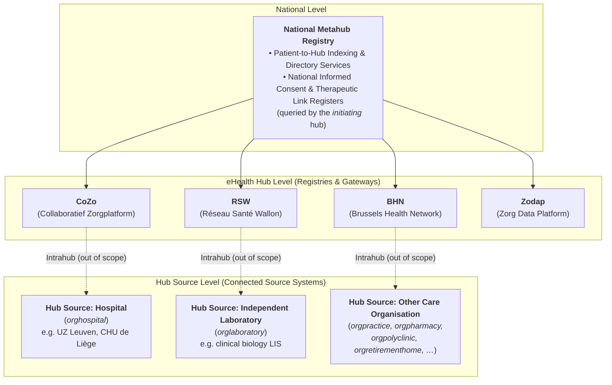
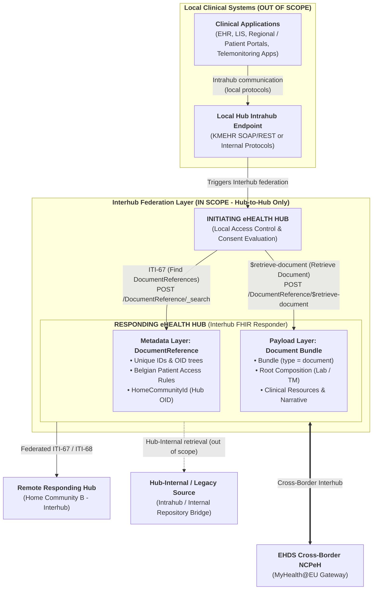
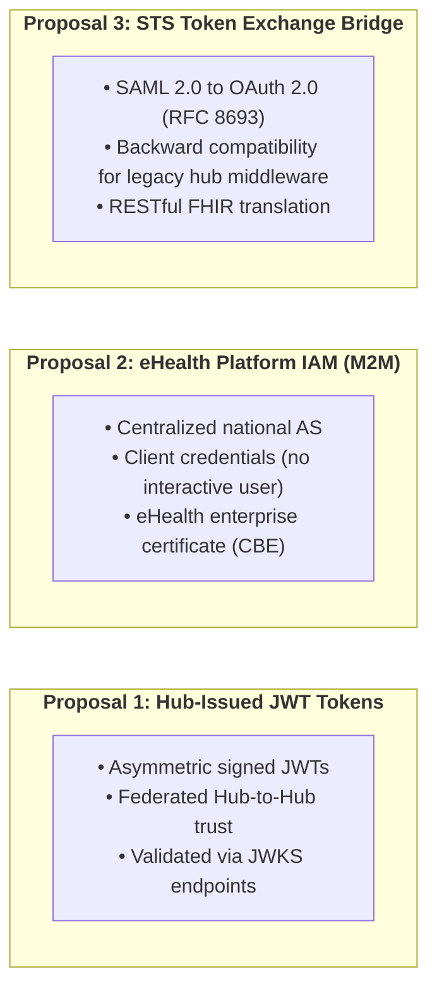

# Belgian Interhub Architecture & Federation Model

> **Where this page sits in the guide** — *Architecture*, page 1 of 2. This page is the **map** of the ecosystem; the pages it names are the specification of the individual pieces.
>
> * **Owned by this page:** the metahub / hub / hub source model, what counts as a hub source, federated routing and `homeCommunityId`, and the dual-stack transition gateway.
> * **Summarised here, specified in full elsewhere:** the metadata envelope → [Envelope & Metadata](envelope-and-metadata.html); the two transactions → [Transactions](transactions.html); authentication, tamper-proofing and auditing → [Security & Authentication](security.html); payload encryption → [End-to-End Encryption](end-to-end-encryption.html); the SOAP crosswalk behind the dual-stack gateway → [KMEHR to FHIR Mapping](mapping-kmehr-to-hub.html).
> * **Next:** [Design Rationale](resource-considerations.html) — why this architecture shares FHIR *documents* rather than messages or granular resources.

## 1. The Belgian Federated Health Ecosystem

Belgium never built a central national repository, and that decision still shapes everything downstream. Under the governance of the eHealth Platform (`ehealth.fgov.be`), clinical data stays where it was produced: in the **hub sources**, meaning the source systems of the care organisations themselves — hospitals, independent laboratories, pharmacies, polyclinics, practice organisations, care homes, and every other organisation type in the KMEHR `CD-HCPARTY` classification. Regional hubs index that metadata or route discovery queries to distributed source registries, routing retrieval requests to the authoritative repositories. They do not hold all clinical data in a single central store.

### 1.1 Scope Boundaries: Intrahub vs. Interhub

To understand the architecture and the normative boundary of this specification, a fundamental distinction must be maintained between **Intrahub** and **Interhub** communication:

* **Intrahub (OUT OF SCOPE)**:
  * Clinical applications (hospital EHRs, laboratory information systems, primary care practice systems, patient/regional portals, and telemonitoring platforms) connect exclusively to their designated regional Hub via **Intrahub endpoints**.
  * Intrahub exchanges utilize local or historical protocols (such as KMEHR SOAP/REST services or proprietary hub-internal APIs).
  * All local practitioner authentication, patient consent evaluation, therapeutic link verification, and translation to/from internal data formats are handled locally by the connected Hub.
  * **Intrahub communication is strictly outside the scope of this Implementation Guide.**

* **Interhub (IN SCOPE)**:
  * **Interhub communication is strictly and exclusively Hub-to-Hub.**
  * Only accredited eHealth Hubs (CoZo, RSW, BHN, Zodap) and the Belgian National Contact Point for eHealth (NCPeH) participate in Interhub exchanges.
  * Clinical applications and source systems **never** connect directly to the Interhub network.
  * **This Implementation Guide specifies the normative FHIR-based Interhub standard for Hub-to-Hub metadata discovery (ITI-67) and document retrieval (ITI-68).**

### 1.2 Key Actors & Nodes in the Network

1. **National Metahub**:
   * Acts as a central directory indicating which regional hubs hold documents for a specific patient (identified by their national **SSIN / INSS**).
   * Holds the national registers of informed consent (IC) and therapeutic links. These registers are consulted by the **initiating hub** when it performs its own access control, before it emits an Interhub request.
2. **eHealth Hubs**:
   * **CoZo** (Collaboratief Zorgplatform).
   * **RSW** (Réseau Santé Wallon).
   * **BHN** (Brussels Health Network).
   * **Zodap** (Zorg Data Platform).
   * Each hub acts as a regional Document Registry and Document Gateway, managing indexing and cross-hub routing. When a hub *initiates* a query, it is also the actor responsible for access control (see §5).
   * **The list is not closed, and not every node behaves identically.** The federation also carries nodes that are not regional document registries in this sense — most notably a **patient-facing vault** (Vitalink), whose content is by definition accessible to the patient and whose request and response conventions differ from a classic hub. Hubs also merge and are renamed over time, and a hub that has cached a patient link to a decommissioned hub identifier must still resolve it. An Interhub implementation therefore MUST treat the hub list as configuration resolved from the Metahub at runtime, never as a constant compiled into the system, and MUST tolerate a patient link pointing at a hub identifier it does not recognise.
3. **Hub Sources (Connected Source Systems & Clinical Repositories)**:
   * Authoritative source systems where clinical documents (laboratory reports, discharge summaries, imaging studies, telemonitoring records) are created, validated, and stored.
   * A hub source connects to its regional hub via Intrahub interfaces — whether by publishing documents on a hub, sharing documents via a hub, or exposing its own local registry and repository to the hub. It is **any** connected care organisation — not only a hospital (see §1.3).

### 1.3 What Counts as a Hub Source

A **hub source** is any care organisation whose source system publishes documents on or shares them via a hub (or exposes its local registry and repository to the hub) and answers retrievals from it. Hospitals are one example among many; the KMEHR `CD-HCPARTY` organisation types give the real range.

| Code | Organisation type | Code | Organisation type |
| :--- | :--- | :--- | :--- |
| `orghospital` | Hospital | `orgprevention` | Prevention organisation |
| `orglaboratory` | Independent laboratory | `orgprimaryhealthcarecenter` | Primary health care center |
| `orgpharmacy` | Independent pharmacy | `orgpsychiatriccarehome` | Psychiatric care home |
| `orgpharmacyinvoicingoffice` | Pharmacy invoicing office | `orgpublichealth` | Public health organisation |
| `orgpolyclinic` | Polyclinic | `orgretirementhome` | Retirement home |
| `orgpractice` | Practice organisation | `orgrevalidationcenter` | Revalidation center |
| `orginsurance` | Insurance | `orgshelteredliving` | Sheltered living |

Throughout this implementation guide, **"hub source"** designates this entire class of systems. Where a hospital, a laboratory or a retirement home is named, it is only ever an *example* of a hub source, never a restriction of the model. The `CD-HCPARTY` codes themselves — and every other KMEHR code table — are crosswalked to FHIR in [KMEHR to FHIR Mapping](mapping-kmehr-to-hub.html#3-code-system--value-set-crosswalks).

---

## 2. Evolution: From SOAP KMEHR to RESTful FHIR MHD

Historically, Interhub communication was specified using SOAP Web Services exchanging XML payloads conforming to Belgian **KMEHR** schemas (`getTransactionList`, `getTransaction`, `putTransaction`, `getTransactionAccessList`).

In their place, the modernized Belgian Interhub specification puts **IHE MHD (Mobile access to Health Documents)** on **HL7® FHIR® R4**, giving the exchange a RESTful shape:

The diagram shows the *shape* of the exchange only. Clinical applications communicate exclusively with their local Hub via Intrahub protocols (out of scope), and the local Hub initiates Interhub transactions across the federation. Each layer of the Interhub specification is detailed on its own page: the **metadata layer** element by element in [Envelope & Metadata](envelope-and-metadata.html#2-element-by-element-specification-beinterhubdocumentreference), the **two transactions** (ITI-67 / ITI-68) in [Transactions](transactions.html), the **cross-border branch** in [EHDS Alignment](ehds-alignment.html), and the reasoning behind carrying payloads as document bundles at all in [Design Rationale](resource-considerations.html#2-evaluation-of-candidate-carrier-paradigms).

---

## 3. Federated Cross-Hub Routing & Identifiers

In a cross-hub exchange, an **initiating hub** queries or retrieves documents from one or more **responding hubs**. The responding hubs trust the caller: access control has already happened locally, at the initiating hub (see §5). What governs the routing itself is a set of standardized identifiers registered in the Belgian eHealth OID tree (`1.3.6.1.4.1.21297`):

### 3.1 Belgian National Identifiers

| Concept | URI / System | OID Root | Description & Syntax Example |
| :--- | :--- | :--- | :--- |
| **Patient SSIN / INSS** | `https://www.ehealth.fgov.be/standards/fhir/core/NamingSystem/ssin` | `1.3.6.1.4.1.21297.100.1.1` | National Social Security Identification Number (e.g. `79080412345`). |
| **Practitioner NIHDI / RIZIV** | `https://www.ehealth.fgov.be/standards/fhir/core/NamingSystem/nihdi` | `1.3.6.1.4.1.21297.100.9.1` | Healthcare professional license number (11 digits, e.g. `19876543201`). |
| **Care Organisation / Facility NIHDI** | `https://www.ehealth.fgov.be/standards/fhir/core/NamingSystem/nihdi` | `1.3.6.1.4.1.21297.100.11.1` | Healthcare institution accreditation number (8 digits, e.g. `71000012`). |
| **Enterprise CBE / KBO** | `https://www.ehealth.fgov.be/standards/fhir/core/NamingSystem/cbe` | `1.3.6.1.4.1.21297.100.11.2` | Crossroads Bank for Enterprises business number (10 digits, e.g. `0419052173`). |
| **Hub eHealth Platform (EHP) number** | `https://www.ehealth.fgov.be/standards/fhir/core/NamingSystem/ehp` | — | **The identifier by which a hub is actually addressed today**: a `1990……` number carried as `hcparty/id[@S="ID-HCPARTY"]` next to `cd[@S="CD-HCPARTY"] = "hub"`, returned by the Metahub patient-link register, and asserted in the hub's eHealth security token. |
| **Hub Home Community ID** | `urn:ietf:rfc:3986` | `1.3.6.1.4.1.21297.1.X` | URN OID identifying the regional hub (e.g. `urn:oid:1.3.6.1.4.1.21297.1.3` for CoZo). Assigned by this IG **in addition to** the EHP number above, and registered against it — see the note below. |
| **Repository Unique ID** | `urn:ietf:rfc:3986` | `1.3.6.1.4.1.21297.100.2.X` | Identifies the physical document storage repository within a hub network. |
| **CD-TRANSACTION** | `https://www.ehealth.fgov.be/standards/fhir/core/CodeSystem/cd-transaction` | `1.3.6.1.4.1.21297.100.3.1` | Document category coding system (e.g. `sumehr`, `labresult`, `telemonitoring`). |

These identifiers are bound to concrete `BeInterhubDocumentReference` elements in [Envelope & Metadata](envelope-and-metadata.html#2-element-by-element-specification-beinterhubdocumentreference), and to their legacy KMEHR / IHE XDS.b counterparts in [KMEHR to FHIR Mapping](mapping-kmehr-to-hub.html#2-master-metadata-mapping-matrix).

> **Two identifiers for one hub, and the older one is the one in production.** Introducing `homeCommunityId` OIDs is the right move for IHE and EHDS alignment, but nothing in the existing ecosystem knows them: hub routing tables, the Metahub patient-link register and the hub's own security token all speak **EHP numbers**. This IG therefore requires that every hub OID be registered against the hub's EHP number, that a responding hub be able to answer routing on either, and that `extension[homeCommunityId]` accept both forms ([Envelope & Metadata §3.1](envelope-and-metadata.html#31-home-community-id-beexthomecommunityid)). Publishing an OID that cannot be resolved back to an EHP number would make a `DocumentReference` unroutable by every hub in service today.

### 3.2 Routing Mechanics via `homeCommunityId`

1. **Discovery (`getTransactionList` / ITI-67)**:
   * The initiating hub retrieves the patient links (originally stored in the metahub) and queries each of the eHealth Hubs for the list.
   * Every returned `BeInterhubDocumentReference` contains the mandatory extension `homeCommunityId` (e.g. `urn:oid:1.3.6.1.4.1.21297.1.3`).
2. **Retrieval (`getTransaction` / ITI-68)**:
   * The initiating hub inspects `DocumentReference.content.attachment.url` and `homeCommunityId` to dispatch the retrieval request directly to the authoritative responding hub repository hosting the document bundle.

The query syntax for step 1 and the retrieval call for step 2 are specified in [Transactions](transactions.html#2-transaction-1-gettransactionlist-mhd-iti-67-find-documentreferences); the `homeCommunityId` extension itself in [Envelope & Metadata](envelope-and-metadata.html#31-home-community-id-beexthomecommunityid).

---

## 4. Dual-Stack Gateway Architecture (Transition Phase)

Migration cannot be a flag day. KMEHR connectors in production will outlive the specification that replaces them, so Belgian hubs deploy a **dual-stack mediation gateway** that speaks both protocols at once:

* **Legacy KMEHR Interhub / Intrahub → Modern FHIR Hub**: The gateway receives SOAP `getTransactionList` or `getTransaction` requests, queries the internal FHIR registry/repository via MHD ITI-67 / ITI-68, and transforms the resulting `DocumentReference` and `Bundle (type=document)` back into KMEHR `TransactionSummaryType` or `FolderType` XML.
* **Modern FHIR Initiating Hub → Legacy Hub Source / Legacy Responding Hub**: The gateway accepts RESTful POST searches and document retrieval requests, translates them into SOAP KMEHR Web Service calls to legacy systems, transforms the returned KMEHR XML / attachments into standardized FHIR Document Bundles, and returns them over Interhub.

The field-by-field transformation rules the gateway applies in both directions — including how a FHIR Document Bundle is encapsulated inside a KMEHR `<lnk>` element during the transition — are specified in [KMEHR to FHIR Mapping](mapping-kmehr-to-hub.html#4-encapsulation-strategy-fhir-document-inside-kmehr-transition-phase).

---

## 5. Trust Model, Security Architecture & Connection Routes (Proposal)

> **This section is a summary.** The normative security specification — the three routes in full, DPoP / RFC 9421 tamper-proofing, the initiating/responding responsibility split, and IHE BALP auditing — is on the [Security & Authentication](security.html) page and takes precedence over the overview below.

Every Interhub transaction takes place under Belgian healthcare law, the Patient Rights Act and the GDPR.

### 5.1 Trust Model: the Initiating Hub Owns Access Control

Interhub is a **federation of mutually trusted hubs**. A responding hub establishes *which hub* is calling and then answers the request. It does not re-open the question of whether the end user behind that call is entitled to the patient's data.

* The **initiating hub** performs all access control before emitting an Interhub request — for example by querying the **Metahub** to confirm that an informed consent (IC) and/or therapeutic link exists, or by resolving the same facts from its own local database. The mechanism is a local matter and out of scope for this specification.
* The **responding hub** performs technical validation only (mTLS and calling-hub authentication, replay/tamper-proofing, query syntax) and writes its audit trail. It does not verify consent, therapeutic links, or practitioner entitlement.

### 5.2 Connection Routes

Three distinct connection routes are on the table for authenticating the calling hub.

> **Important Architectural Note**: The three connection models presented below represent an **architectural proposal**. The final Belgian Interhub standard will **select and mandate one of these three methods** as the unified national authentication framework.

1. **Route 1: Hub/Enterprise-Issued JWTs**: Direct peer-to-peer trust federation between regional hubs using asymmetric signed JWT bearer tokens validated against public JWKS endpoints.
2. **Route 2: eHealth Platform IAM (machine-to-machine)**: Centralized authentication of the calling hub through the national eHealth IAM using the **OAuth 2.0 client credentials** grant and the hub's **eHealth enterprise certificate**. Interhub is system-to-system traffic, so this route involves **no eID or itsme® authentication**: the token identifies the calling hub organisation (CBE / hub OID), and practitioner details travel only as audit claims.
3. **Route 3: STS Token Exchange Bridge**: Seamless backward compatibility bridge translating legacy SOAP WS-Trust / SAML 2.0 assertions from the eHealth STS into short-lived OAuth 2.0 JWTs (RFC 8693).

Whichever route is chosen, the legacy SOAP SAML request signature still needs a successor. All three routes are therefore evaluated together with **DPoP (RFC 9449)** and **RFC 9421 (HTTP Message Signatures)**, which close off replay and query-parameter manipulation in the RESTful world.

For complete technical specifications, see **[Security & Authentication](security.html)** (normative) and the **[End-to-End Encryption](end-to-end-encryption.html)** discussion paper (non-normative).

---

## Continue reading

* **Next:** [Design Rationale](resource-considerations.html) — why Interhub shares `Bundle.type = #document` payloads discovered through a `DocumentReference` envelope.
* **Then, in order:** [Envelope & Metadata](envelope-and-metadata.html) → [Transactions](transactions.html) → [Security & Authentication](security.html) → [End-to-End Encryption](end-to-end-encryption.html).
* **Related:** [KMEHR to FHIR Mapping](mapping-kmehr-to-hub.html) for the dual-stack gateway crosswalk (§4 above), [EHDS Alignment](ehds-alignment.html) for how this federation is presented to MyHealth@EU.
