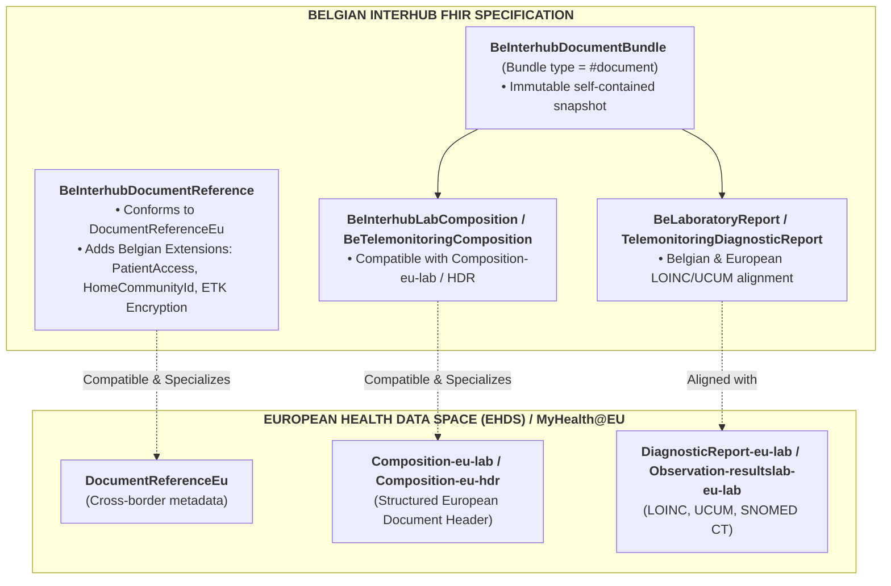
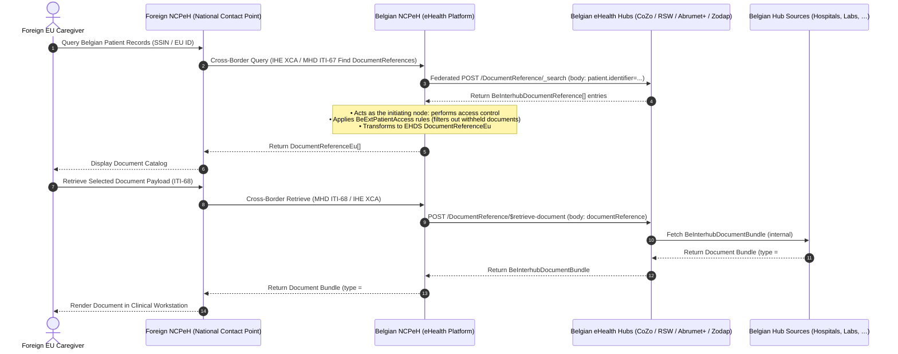

# European Health Data Space (EHDS) Alignment & Interoperability

> **Where this page sits in the guide** — *Migration & Alignment*, page 2 of 2. It looks outward: how everything specified earlier in this guide maps onto European cross-border exchange.
>
> * **Owned by this page:** the Belgian ↔ EHDS profile alignment matrix, the Belgian capabilities that go beyond baseline EHDS, and the MyHealth@EU gateway translation flow.
> * **Assumes:** [Envelope & Metadata](envelope-and-metadata.html) (the extensions compared here) and [Laboratory Reports](lab-report-sharing.html) (the EU lab document type).
> * **Previous:** [KMEHR to FHIR Mapping](mapping-kmehr-to-hub.html) · **Next:** [Artifacts](artifacts.html) — the machine-readable profiles, extensions and examples behind every page of this guide.

## 1. Context & Strategic Alignment

The **European Health Data Space (EHDS)** regulation lays down common standards, technical architectures and interoperability profiles for the cross-border primary use of health data between EU Member States, delivered through **MyHealth@EU / eHDSI**. The European Commission and HL7 Europe have named a set of priority clinical domains:
* **Laboratory Results (EU Lab)**: Laboratory test reports, panels, observations, and specimens.
* **Hospital Discharge Reports (EU HDR)**: Episode summaries and hospitalization reports.
* **Patient Summaries (EU PS)**: Core longitudinal health summaries.
* **Medical Imaging Studies (EU Imaging / MADO)**: DICOM manifest studies and imaging reports.
* **ePrescription & eDispensation (EU eP/eD)**: Pharmaceutical prescriptions and dispensing records.

Belgian Interhub modernization is bound by a firm requirement: **strict alignment and semantic compatibility with the EHDS profiles**, without giving up the governance, federated routing and privacy controls the Belgian system already has — that is, the extensions specified in [Envelope & Metadata §3](envelope-and-metadata.html#3-belgian-extensions-deep-dive) and the federation model described in [Architecture](architecture.html).

---

## 2. Structural Alignment: Belgian Interhub vs. EHDS Profiles



### 2.1 Profile Alignment Matrix

| EHDS Profile / Element | Belgian Interhub Profile / Element | Interoperability & Conformance Notes |
| :--- | :--- | :--- |
| **`DocumentReferenceEu`** | **`BeInterhubDocumentReference`** | `BeInterhubDocumentReference` satisfies all mandatory elements of `DocumentReferenceEu` (subject, status, type, category, date, author, attachment) while conforming to `IHE.MHD.Comprehensive.DocumentReference`. It embeds contained resources and adds Belgian-specific extensions for `homeCommunityId`, `patientAccess`, and `recordDateTime`. |
| **`Composition-eu-lab`** | **`BeInterhubLabComposition`** | Both profiles require LOINC `11502-2` ("Laboratory report"), mandatory patient subject, author attribution, and structured narrative sections containing laboratory observation entries. |
| **`DiagnosticReport-eu-lab`** | **`BeLaboratoryReport`** (HL7 Belgium) | Sliced category containing `v2-0074#LAB`, mandatory `code`, `performer`, `issued`, and referenced `Observation` and `Specimen` resources. |
| **`Observation-resultslab-eu-lab`** | **`BeObservationLaboratory`** / Core Observation | Standard LOINC test coding, UCUM unit representation, and reference ranges. |
| **`Document Bundle (type = document)`** | **`BeInterhubDocumentBundle`** | Both architectures mandate that structured documents are exchanged as **self-contained FHIR Bundles of type `document`**, rooted by a `Composition`. |

---

## 3. Belgian Advancements Beyond Baseline EHDS

Belgium carries several capabilities that the European baseline does not require, each of them driven by day-to-day care delivery rather than by cross-border exchange. None of them breaks downstream compatibility:

### 3.1 Federated Multi-Hub Routing (`homeCommunityId`)
* **EHDS**: Typically models exchanges through a single National Contact Point for eHealth (NCPeH) per Member State.
* **Belgium**: Operates a federated multi-hub network (CoZo, RSW, Abrumet+, Zodap, Metahub). The Belgian profile incorporates `BeExtHomeCommunityId` and `repositoryUniqueId` to support distributed multi-hub queries, deduplication, and direct peer-to-peer document retrieval.

### 3.2 Granular Patient Access Governance (`BeExtPatientAccess`)
* **EHDS**: Patient access is generally handled out-of-band at the portal level.
* **Belgium**: Metadata explicitly encodes patient portal visibility permissions (`yes`, `no`, `never`), release delay dates (`accessDate`), and clinical withholding justifications (`deniedReason`), enforcing Belgian patient rights legislation directly within the metadata layer.

### 3.3 End-to-End Application Encryption (ETEE / ETK Depot)
* **EHDS**: Primarily relies on transport-layer security (TLS) between gateways.
* **Belgium**: Supports payload-level end-to-end encryption using the recipient's public key from the national eHealth ETK Depot (`BeExtEndToEndEncryption`), ensuring document confidentiality across untrusted intermediaries. This capability is precisely where Belgian and European models pull apart: encrypted payloads cannot be mediated by a National Contact Point, which is why this IG recommends restricting it to a sealed-records tier — see [End-to-End Encryption §5](end-to-end-encryption.html#5-recommended-strategic-solution-the-tiered-hybrid-architecture).

### 3.4 Strict Document Typing (`Bundle.type = #document`)
* **EHDS**: Allows various exchange modalities (FHIR documents, RESTful searches on individual resources, CDA XML).
* **Belgium**: Standardizes Interhub sharing strictly on **FHIR Bundles of type `document`** (`MHD ITI-68`), ensuring complete clinical immutability, attestability, and ease of archiving.

---

## 4. Cross-Border Gateway Translation (MyHealth@EU and Belgian Hubs)

The flow below traces what happens when a healthcare provider elsewhere in Europe queries a Belgian patient's records through MyHealth@EU:



1. The Belgian NCPeH receives the cross-border query and, acting as the **initiating hub** inside the Belgian network, performs its access control (consent and cross-border eligibility) before running an Interhub discovery search (`POST /DocumentReference/_search`) across Belgian eHealth hubs. The responding Belgian hubs trust the NCPeH and do not repeat those checks.
2. The regional hubs return `BeInterhubDocumentReference` entries.
3. The Belgian NCPeH filters out documents marked `PatientAccess = never` or sealed, strips internal Belgian-only routing extensions if necessary, and serves the compliant `BeInterhubDocumentBundle` payload to the foreign healthcare provider.

In Interhub terms the NCPeH is simply another **initiating hub**: it performs the access control and the Belgian hubs answer on trust, exactly as specified in [Security & Authentication §1.1](security.html#11-trust-model-access-control-is-the-initiating-hubs-responsibility). The two calls it makes are the ordinary `POST _search` and `POST $retrieve-document` transactions of [Transactions](transactions.html), and the access flags it filters on are specified in [Envelope & Metadata §3.2](envelope-and-metadata.html#32-belgian-patient-access-metadata-beextpatientaccess).

---

## 5. Architectural Alignment: Belgian POST-Everywhere API & IHE MHD / XDS Gateway Adaptation

### 5.1 The Privacy Imperative: Zero-GET at the National Boundary
In HTTP GET interactions, request paths and query parameters are logged in plaintext across intermediate web servers, reverse proxies, API gateways, load balancers, SIEM systems, browser histories, and enterprise monitoring logs (`access.log`). Placing sensitive patient identifiers (such as Belgian SSINs) or clinical search criteria in GET query strings or URLs creates significant data leakage risks.

To enforce strict medical confidentiality and GDPR data minimization, Belgian Interhub mandates **HTTP POST everywhere** across all consumer-facing and hub-to-hub boundaries.

### 5.2 Three-Tier Conformance Architecture

To ensure seamless interoperability with European MyHealth@EU endpoints and existing IHE MHD / XDS.b document sharing infrastructure while maintaining a strict POST-only national boundary, the architecture is structured into three conformance tiers:

```
                National Belgian API
                         │
                         │ FHIR R4
                         │ POST only
                         ▼
        ┌─────────────────────────────────┐
        │  Belgian Document Access Gateway │
        │         & Protocol Adapter      │
        └────────────────┬────────────────┘
                         │
          ┌──────────────┼──────────────┐
          │              │              │
          ▼              ▼              ▼
       IHE MHD        IHE XDS.b    Native FHIR
    (ITI-67/ITI-68) (ITI-18/ITI-43)  Repository
```

#### 1. Belgian Consumer API (National Boundary)
Initiating hubs and Belgian consumers **SHALL execute all transactions using HTTP POST**:
* **Document Discovery**: `POST [base]/DocumentReference/_search` (request parameters in `application/x-www-form-urlencoded` body).
* **Document Retrieval**: `POST [base]/DocumentReference/$retrieve-document` (request parameters in `application/fhir+json` `Parameters` body).

Consumers do not need to know whether the backend repository uses IHE MHD, XDS.b, or local storage.

#### 2. Belgian Gateway / Façade Translation
The gateway acts as a stable national façade, translating the Belgian POST operations onto the appropriate underlying document-sharing standard:

```
Belgian Transaction                   Downstream IHE MHD Transaction
───────────────────                   ──────────────────────────────
POST DocumentReference/_search  ───►  MHD ITI-67 Find DocumentReferences
(form-urlencoded body)                (MHD ITI-67 explicitly permits POST search)

POST DocumentReference/$retrieve-document ──► MHD ITI-68 Retrieve Document
(Parameters body: documentReference)          (GET <DocumentReference.content.attachment.url>)
```

For an XDS.b repository backend, the gateway resolves the transactions to **ITI-18 (Registry Stored Query)** and **ITI-43 (Retrieve Document Set)**.

#### 3. IHE Interoperability Boundary
Whenever an endpoint directly claims conformance to an IHE profile (such as cross-border communication with European NCPeH nodes), it complies with the normative IHE specification at that boundary:
* `POST $retrieve-document` is a **Belgian FHIR Operation**, while the downstream gateway call `GET <attachment.url>` is standard **IHE ITI-68**.
* The gateway preserves HTTP status codes and error semantics across the translation boundary:

| Belgian API Response | Downstream IHE Status | Condition / Meaning |
| :--- | :--- | :--- |
| **`200 OK`** | `200 OK` | Document successfully retrieved. |
| **`404 Not Found`** | `404 Not Found` | Document not found. |
| **`410 Gone`** | `410 Gone` | Document withdrawn / deprecated by source repository. |
| **`406 Not Acceptable`** | `406 Not Acceptable` | Requested MIME type in `Accept` not supported. |
| **`403 Forbidden`** | `403 Forbidden` | Access forbidden by downstream security policy. |
| **`502 Bad Gateway`** | `502 Bad Gateway` / Timeout | Downstream repository unreachable. |

### 5.3 Security Advantage of Gateway-Mediated Retrieval
By routing document retrieval through `POST /DocumentReference/$retrieve-document`, the gateway eliminates the need to expose raw internal repository URLs directly to consumers. The gateway validates authorization, resolves the repository endpoint, audits the transaction, and fetches the document without turning the retrieval interface into an open Server-Side Request Forgery (SSRF) vector.

> **Normative Standards Statement**:  
> *The Belgian Document Access API defines a FHIR R4 POST-based interface. Implementations MAY use IHE MHD to fulfill these transactions. Where IHE MHD is used, the infrastructure SHALL map the Belgian transactions to the corresponding IHE transactions while maintaining the semantics and conformance requirements of those transactions.*

---

## Continue reading

* **Previous:** [KMEHR to FHIR Mapping](mapping-kmehr-to-hub.html) — the inward-facing migration crosswalk.
* **Next:** [Artifacts](artifacts.html) — the profiles, extensions, value sets, capability statements and examples referenced throughout this guide.
* **Related:** [Envelope & Metadata](envelope-and-metadata.html) for the Belgian extensions compared in §3; [End-to-End Encryption](end-to-end-encryption.html) for why payload encryption complicates cross-border exchange; [Laboratory Reports](lab-report-sharing.html) for the EU lab document type in practice.
