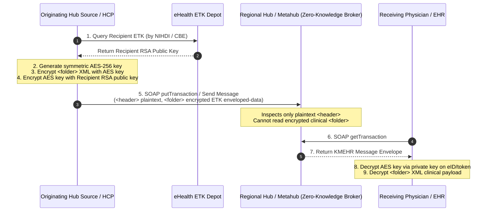
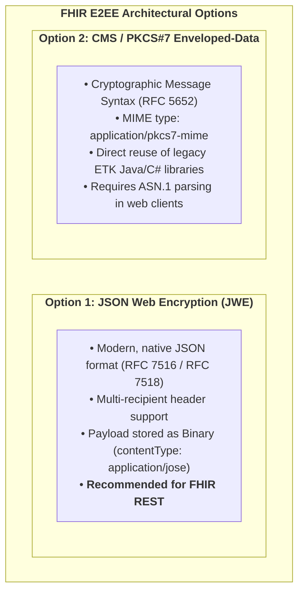
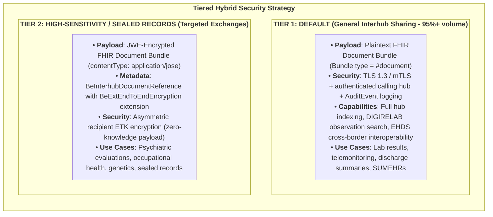

# Architectural Discussion: End-to-End Encryption (E2EE) in FHIR Interhub Sharing

> **Where this page sits in the guide** — *Specification*, page 4 of 4. **This page is a discussion paper, not a normative specification.** It answers a single open question: should Belgium keep KMEHR-style payload encryption in the FHIR world? The security that *is* normative today — TLS 1.3 / mTLS, hub authentication, tamper-proofing and auditing — is specified in [Security & Authentication](security.html).
>
> * **Owned by this page:** the ETEE / ETK background, the JWE and CMS payload-encryption options, the trade-off analysis, and the recommended tiered hybrid strategy.
> * **Related, specified elsewhere:** the metadata extension that flags an encrypted payload → [Envelope & Metadata](envelope-and-metadata.html#33-end-to-end-encryption-metadata-beextendtoendencryption); transport and hub authentication → [Security & Authentication](security.html); the cross-border consequences → [EHDS Alignment](ehds-alignment.html#33-end-to-end-application-encryption-etee--etk-depot).
> * **Previous:** [Security & Authentication](security.html) · **Next:** [Laboratory Reports](lab-report-sharing.html)

## 1. Executive Summary & Discussion Context

**End-to-End Encryption (ETEE)** was one of the defining features of the legacy **KMEHR** ecosystem. Sending a medical transaction across regional hubs or through the eHealthBox meant encrypting the `<folder>` payload with the recipient's public key, fetched from the national **eHealth ETK (Encryption Token Key) Depot**. The regional hubs and the Metahub routed those messages as zero-knowledge brokers: they read the plaintext `<header>` and `<transactionSummary>`, and the clinical content stayed closed to them.

The move to **HL7® FHIR® R4** and the **IHE MHD** profile family puts that design back on the table. This paper addresses one question:

> **Should Belgium continue doing End-to-End Payload Encryption in the FHIR Interhub world, and if so, how would it look and what are the trade-offs?**

---

## 2. How KMEHR ETEE Used to Work



The KMEHR structures named in this flow (`<header>`, `<folder>`, `<transactionSummary>`) are mapped to their FHIR counterparts in [KMEHR to FHIR Mapping](mapping-kmehr-to-hub.html#2-master-metadata-mapping-matrix).

### 2.1 ETEE in Interhub Retrieval: the Caller Nominates the Recipient

The flow above is the *messaging* flow — a sender encrypts for a known recipient and hands the result to a broker. Interhub **retrieval** works the other way round, and the difference decides where the encryption metadata has to live.

In a hub `getTransaction` / `getTransactionSet` call, the requester declares in its own request who the payload should be sealed for, inside `request/author/hcparty`:

```xml
<core:author>
    <kmehr:hcparty>
        <kmehr:id S="ID-HCPARTY" SV="1.0">1990000827</kmehr:id>
        <kmehr:id S="ID-ENCRYPTION-ACTOR" SV="1.0">1990000827</kmehr:id>
        <kmehr:cd S="CD-HCPARTY" SV="1.1">hub</kmehr:cd>
        <kmehr:cd S="CD-ENCRYPTION-ACTOR" SV="1.0">EHP</kmehr:cd>
        <!-- optional, when the ETK certificate is application-scoped -->
        <kmehr:id S="ID-ENCRYPTION-APPLICATION" SV="1.0">my-application</kmehr:id>
        <kmehr:name>UZ Leuven Hub</kmehr:name>
    </kmehr:hcparty>
</core:author>
```

The responding hub fetches that actor's ETK, seals the `<folder>` **at response time**, and returns it as `kmehrmessage/Base64EncryptedData/Base64EncryptedValue`, whose `@encoding` attribute names the character encoding of the plaintext inside.

Three consequences for any FHIR design that keeps payload encryption:

1. **Encryption is negotiated per retrieval, not fixed per document.** The same stored document is sealed differently for each caller. A design that treats "is this document encrypted, and for whom" as static metadata on the `DocumentReference` describes only the response, never the request.
2. **The request needs somewhere to carry the actor.** The retrieve request (invoked via `POST [base]/DocumentReference/$retrieve-document` as specified in [Transactions §3](transactions.html#3-transaction-2-gettransaction-belgian-fhir-retrieve-document-operation)) must carry the actor parameter in the `Parameters` body or in the access token. Whichever mechanism is chosen — a parameter on `$retrieve-document`, a request header, or a claim in the access token — it must convey the actor **id**, its **type** (`EHP`, `NIHII`, `CBE`, `SSIN`, …) and optionally an **application id**, and it must be covered by the request signature of [Security & Authentication §3](security.html#3-replay-attack-prevention--query-tamper-proofing-dpop-rfc-9449--rfc-9421) — otherwise an intermediary could redirect the sealing to a key of its own choosing. **This IG does not yet specify it**; see the project TODO.
3. **The requester is often an organisation, not a person.** In hub-to-hub traffic the ETK actor is typically the calling hub itself (actor type `EHP`), which means "end-to-end" here ends at the initiating hub, not at the clinician's workstation. That is worth being explicit about before calling the channel end-to-end encrypted, and it is one of the trade-offs weighed in [§4](#4-architectural-analysis-should-belgium-continue-e2ee-in-fhir).

---

## 3. How Would End-to-End Encryption Look in the FHIR World?

Two concrete mechanisms are available if application-layer payload encryption is retained in FHIR Interhub sharing:



### 3.1 Option 1: JSON Web Encryption (JWE - RFC 7516) *(Recommended for FHIR)*

JWE keeps payload encryption inside the JSON world the rest of the exchange already inhabits:
1. The originating system serializes the complete FHIR Document Bundle (`Bundle.type = #document`).
2. The JSON string is encrypted into a **JWE (RFC 7516)** compact or general JSON serialization using AES-GCM (e.g. `A256GCM`) with the recipient's public key (RSA-OAEP-256 or ECDH-ES) fetched from the eHealth ETK depot.
3. The encrypted JWE is stored as a FHIR **`Binary`** resource (`contentType = application/jose`) or encrypted document endpoint, retrievable via `BeInterhubDocumentReference.content.attachment.url` (element specified in [Envelope & Metadata §2](envelope-and-metadata.html#2-element-by-element-specification-beinterhubdocumentreference)).

#### Structure in `BeInterhubDocumentReference`:
```json
{
  "resourceType": "DocumentReference",
  "id": "docref-encrypted-example-01",
  "meta": {
    "profile": [
      "https://www.ehealth.fgov.be/standards/fhir/interhub/StructureDefinition/be-interhub-documentreference"
    ]
  },
  "extension": [
    {
      "url": "https://www.ehealth.fgov.be/standards/fhir/interhub/StructureDefinition/be-ext-end-to-end-encryption",
      "extension": [
        { "url": "actorId", "valueString": "19876543201" },
        { "url": "actorType", "valueCode": "NIHII" },
        { "url": "keyId", "valueString": "ETK-2026-UZL-091" }
      ]
    }
  ],
  "status": "current",
  "category": [
    {
      "coding": [
        {
          "system": "https://www.ehealth.fgov.be/standards/fhir/core/CodeSystem/cd-transaction",
          "code": "note",
          "display": "Clinical Note"
        }
      ]
    }
  ],
  "subject": {
    "identifier": {
      "system": "https://www.ehealth.fgov.be/standards/fhir/core/NamingSystem/ssin",
      "value": "79080412345"
    }
  },
  "content": [
    {
      "attachment": {
        "contentType": "application/jose",
        "url": "https://hub.cozo.be/fhir/Binary/binary-jwe-payload-01",
        "title": "Encrypted Clinical Consultation Note"
      },
      "format": {
        "system": "https://www.ehealth.fgov.be/standards/fhir/interhub/CodeSystem/be-cs-interhub-format-codes",
        "code": "urn:be:fgov:ehealth:etee:jwe:1.0",
        "display": "Belgian JWE-Encrypted FHIR Document Bundle"
      }
    }
  ]
}
```

### 3.2 Option 2: CMS / PKCS#7 (`application/pkcs7-mime`)

Alternatively, the FHIR Document Bundle is encoded into a standard ASN.1 Cryptographic Message Syntax (CMS / PKCS#7) enveloped-data structure using the recipient's X.509 certificate from the ETK depot.
* **MIME Type**: `application/pkcs7-mime`.
* **Advantage**: Reuses existing eHealth Java/C# cryptographic libraries without modification.
* **Disadvantage**: Binary ASN.1 format requires custom parsing in modern web/JavaScript-based EHR clients.

---

## 4. Architectural Analysis: Should Belgium Continue E2EE in FHIR?

The national decision turns on a trade-off between **zero-knowledge payload encryption** and **transport-layer security (TLS 1.3 / mTLS) between mutually trusted hubs**:

| Dimension | Model A: E2EE Payload Encryption (KMEHR / JWE Zero-Knowledge) | Model B: Transport Security (mTLS + authenticated hubs) (Standard FHIR/EHDS) |
| :--- | :--- | :--- |
| **1. Intermediary Hub Trust** | Zero-knowledge; hubs cannot read data | Hubs can process plaintext data |
| **2. Search & Indexing** | Metadata only; no payload querying | Deep querying on Observations |
| **3. Clinical Decision Support** | Impossible at hub/gateway level | Fully supported |
| **4. Multi-Disciplinary Care** | High complexity (multi-key management) | Simple (handled locally by the initiating hub) |
| **5. EHDS Cross-Border Interop** | Incompatible without central decrypt | Natively compatible |
| **6. Tooling & Ecosystem** | Requires custom cryptographic plugins | Standard FHIR parsers & apps |

### 4.1 Detailed Breakdown of Challenges with E2EE in FHIR:

1. **Loss of Discrete Querying & Indexing (e.g. DIGIRELAB)**:
   * Under the Belgian **DIGIRELAB Phase 3** vision, clinicians and applications need to query specific lab observations across time (e.g., `GET /Observation?code=1558-6&patient.identifier=...`).
   * If document bundles are encrypted end-to-end, hubs cannot index internal observations. Consumers are forced to download and decrypt dozens of full documents to extract a single trend curve.

2. **The "Care Team" Multi-Recipient Dilemma**:
   * KMEHR ETEE worked well for point-to-point mailings (eHealthBox doctor-to-doctor).
   * Hub document sharing serves something quite different: **multidisciplinary care teams**, departments and services spread across every kind of hub source, from a solo practice to an emergency room.
   * Encrypting at publish time means naming, in advance, every clinician who will ever need to read the document. Emergency care makes that impossible by definition.

3. **European Health Data Space (EHDS) Incompatibility**:
   * EHDS / MyHealth@EU mandates that National Contact Points (NCPeH) inspect, validate, and mediate standard FHIR Document Bundles across borders.
   * Encrypted JWE/CMS blobs cannot be processed by European gateways without a centralized decryption proxy, defeating the purpose of end-to-end encryption.

4. **Client Tooling Overhead**:
   * Standard SMART on FHIR apps, mobile health applications and cloud EHRs have no native support for Belgian ETK depot decryption, and would each need a bespoke cryptographic plugin.

---

## 5. Recommended Strategic Solution: The Tiered Hybrid Architecture

The choice need not be all or nothing. This Implementation Guide proposes a **tiered hybrid architecture**, matching the protection to the sensitivity of the document:



1. **Tier 1 (General Exchange - 95%+ of volume)**:
   * Laboratory results, telemonitoring summaries, discharge letters, and SUMEHRs are exchanged as **plaintext FHIR Document Bundles** over mutually authenticated, encrypted TLS 1.3 connections between trusted hubs, with comprehensive IHE BALP audit logging on both sides. Access control itself is performed by the initiating hub before the request is emitted. That keeps clinical querying, decision support and EHDS cross-border exchange available.
2. **Tier 2 (Sensitive / Sealed Consultations)**:
   * For highly sensitive documents intended strictly for a named individual or confidential department, systems use **JWE payload encryption** with the recipient's ETK key. The `BeInterhubDocumentReference` provides the unencrypted discovery metadata, while the `content.attachment.url` delivers the encrypted JWE payload.

In both tiers the transport and authentication layer is the one specified in [Security & Authentication](security.html); a Tier 2 document additionally carries the `BeExtEndToEndEncryption` extension specified in [Envelope & Metadata §3.3](envelope-and-metadata.html#33-end-to-end-encryption-metadata-beextendtoendencryption). Documents intended for cross-border exchange should stay in Tier 1 — see [EHDS Alignment §3.3](ehds-alignment.html#33-end-to-end-application-encryption-etee--etk-depot).

---

## Continue reading

* **Previous:** [Security & Authentication](security.html) — the normative security layer (mTLS, hub authentication, tamper-proofing, auditing) that this discussion sits on top of.
* **Next:** [Laboratory Reports](lab-report-sharing.html) — the first of the two document types, and a Tier 1 payload in the strategy recommended above.
* **Related:** [Envelope & Metadata §3.3](envelope-and-metadata.html#33-end-to-end-encryption-metadata-beextendtoendencryption) for the `BeExtEndToEndEncryption` extension used by Tier 2; [EHDS Alignment §3.3](ehds-alignment.html#33-end-to-end-application-encryption-etee--etk-depot) for the cross-border impact; [KMEHR to FHIR Mapping](mapping-kmehr-to-hub.html) for the legacy structures described in §2.
