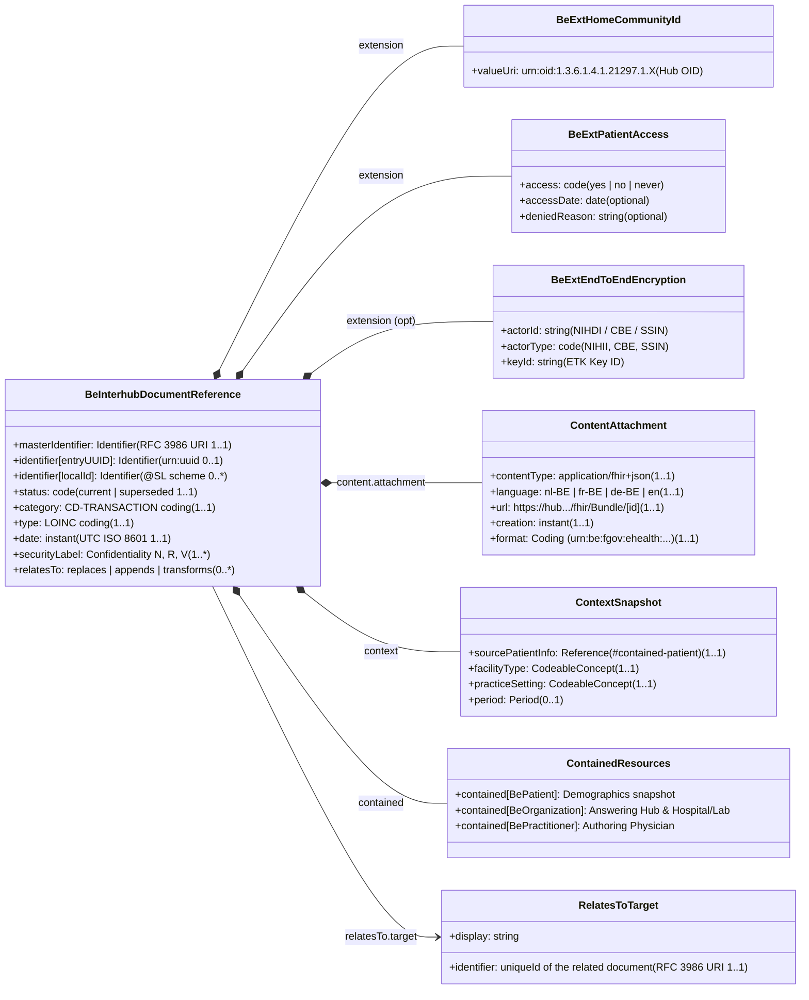

# Document Envelope & Metadata Specification

> **Where this page sits in the guide** — *Specification*, page 1 of 4. This page is the **single source of truth for `BeInterhubDocumentReference`**. Every other page that mentions a metadata field, extension or identifier links back here instead of restating it.
>
> * **Owned by this page:** all `DocumentReference` elements, the four Belgian extensions (`homeCommunityId`, `patientAccess`, `endToEndEncryption`, `recordDateTime`), and the UTC normalization rule.
> * **Not covered here:** how the envelope is queried and returned → [Transactions](transactions.html); who may call and how the call is authenticated → [Security & Authentication](security.html); whether the payload behind `content.attachment.url` should itself be encrypted → [End-to-End Encryption](end-to-end-encryption.html); the KMEHR / XDS.b origin of each field → [KMEHR to FHIR Mapping](mapping-kmehr-to-hub.html); deep dive into IHE MHD profile choices and open discussions → [IHE MHD Alignment](ihe-mhd-alignment.html).
> * **Previous:** [Design Rationale](resource-considerations.html) · **Next:** [Transactions](transactions.html)

## 1. Overview of the Metadata Model

Discovery and retrieval are strictly separated in Interhub; the reasoning behind that separation is recorded in [Design Rationale §3](resource-considerations.html#3-the-role-of-contained-mhd-comprehensive-documentreference). An initiating hub querying for available health records (`getTransactionList`, specified in [Transactions §2](transactions.html#2-transaction-1-gettransactionlist-mhd-iti-67-find-documentreferences)) receives no clinical content at all. What comes back is a lightweight metadata envelope, the **`BeInterhubDocumentReference`**, conforming to **`IHE.MHD.Comprehensive.DocumentReference`** with **Contained References**.



This metadata envelope provides:
1. **Clinical Context & Classification**: Mandatory document category (`CD-TRANSACTION`), precise clinical type (LOINC), facility type, practice setting, and confidentiality level (`securityLabel`).
2. **Author & Institutional Attribution (Contained Pattern)**: Every authoring party the legacy transaction named — answering hub, hub source organisation, department, practitioner, and end-user software — embedded as `#contained` Belgian core resources and typed inline with `CD-HCPARTY`.
3. **Retrieval & Routing Endpoints**: The direct RESTful URL to fetch the full FHIR Document Bundle (`type = #document`), accompanied by the repository Home Community ID.
4. **Technical Payload Characteristics**: MIME content type (`application/fhir+json`), document language, format specification code, and document creation instant.
5. **Belgian Governance & Access Rules**: Granular patient portal access permissions, release dates, and end-to-end encryption metadata.

Filled-in examples of this envelope are given in [Laboratory Reports §4](lab-report-sharing.html#4-metadata-mapping-for-gettransactionlist-mhd-iti-67) and [Telemonitoring §4](mapping-telemonitoring-to-hub.html#4-metadata-mapping-for-gettransactionlist-mhd-iti-67).

---

## 2. Element-by-Element Specification (`BeInterhubDocumentReference`)

The `BeInterhubDocumentReference` profile derives directly from **`IHE.MHD.Comprehensive.DocumentReference`** and mandates the **Contained References** pattern.

### Why Contained Resources Are Mandated
1. **Multi-Author Representation**: The federal `BeDocumentReference` profile restricts `author` to `1..1`. Inheriting from `IHE.MHD.Comprehensive.DocumentReference` allows `author 1..*`, enabling the envelope to capture the full Belgian author chain (Answering Hub, Source Institution, Practitioner, and Application) simultaneously.
2. **Elimination of N+1 Network Latency**: In a federated multi-hub network, resolving external practitioner and organization references across distinct regional gateways degrades performance. Embedding parties as `#contained` resources allows client applications to render the document catalog immediately with zero secondary HTTP round-trips.
3. **Point-in-Time Demographics (`context.sourcePatientInfo`)**: Captures the immutable demographic state of the patient at the exact instant of publication.

### Element Mapping & Conformance Matrix

| Element | Card. | Type | Conformance & Belgian Rule |
| :--- | :--- | :--- | :--- |
| **`masterIdentifier`** | `1..1` | `Identifier` | Mandatory document unique ID (RFC 3986 URI, e.g. `urn:oid:...` or `urn:uuid:...`). |
| **`identifier[uniqueId]`** | `0..1` | `Identifier` | Mirrors `masterIdentifier` (RFC 3986 URI). |
| **`identifier[entryUUID]`** | `0..1` | `Identifier` | Business identifier for the metadata entry (`urn:uuid:...`). |
| **`identifier[localId]`** | `0..*` | `Identifier` | Local hub source identifier (`system` = `@SL` scheme, `value` = local id). |
| **`status`** | `1..1` | `code` | `current` \| `superseded` (from `DocumentReferenceStats`). |
| **`category`** | `1..1` | `CodeableConcept` | Mandatory national `CD-TRANSACTION` code (`sumehr`, `labresult`, `discharge`, etc.). |
| **`type`** | `1..1` | `CodeableConcept` | Mandatory LOINC document type code (e.g. `11502-2`). |
| **`subject`** | `1..1` | `Reference(BePatient)` | Patient reference carrying inline SSIN identifier (`subject.identifier`). |
| **`contained`** | `1..*` | `Resource` | Contained `BePatient`, `BePractitioner`, `BeOrganization`, or `Device` resources. |
| **`author`** | `1..*` | `Reference` | References contained authors (`#contained-id`). Typed inline via `extension[hcPartyType]`. |
| **`authenticator`** | `0..1` | `Reference` | References contained legal validator (`#contained-id`). |
| **`custodian`** | `0..1` | `Reference` | References contained or external custodian organisation. |
| **`context.sourcePatientInfo`**| `1..1`| `Reference(BePatient)` | References contained patient demographic snapshot (`#contained-patient`). |
| **`context.facilityType`** | `1..1` | `CodeableConcept` | SNOMED CT / Belgian facility classification. |
| **`context.practiceSetting`**| `1..1` | `CodeableConcept` | SNOMED CT / Belgian practice setting classification. |
| **`context.period`** | `0..1` | `Period` | Start and end datetime of clinical encounter or monitoring session. |
| **`securityLabel`** | `1..*` | `CodeableConcept` | Confidentiality level (`V3-Confidentiality`: `N`, `R`, `V`). |
| **`content.attachment.contentType`**| `1..1` | `code` | MIME type (`application/fhir+json` or `application/pdf`). |
| **`content.attachment.language`** | `1..1` | `code` | BCP-47 / RFC 5646 language tag (`nl-BE`, `fr-BE`, `de-BE`, `en`). |
| **`content.attachment.url`** | `1..1` | `url` | Direct retrieve endpoint for the document bundle (resolved by `$retrieve-document` or downstream ITI-68). |
| **`content.attachment.creation`** | `1..1` | `instant` | Document creation timestamp (UTC). |
| **`content.format`** | `1..1` | `Coding` | Coded format URI (e.g. `urn:be:fgov:ehealth:lab:document:1.0`). |
| **`relatesTo`** | `0..*` | `BackboneElement` | Logical reference to related document (`relatesTo.target.identifier`). |

> **Note on Removed Elements**: Elements **`docStatus`** and **`content.attachment.data`** are constrained to `0..0` by IHE MHD Minimal and Comprehensive profiles and are **prohibited** in `BeInterhubDocumentReference`. Document lifecycle status is governed by `status` and `relatesTo`, while payload retrieval is performed out-of-band via `$retrieve-document` (or downstream `content.attachment.url` / ITI-68).

### 2.1 Relationship to IHE MHD & Federal Profiles

`BeInterhubDocumentReference` derives from **`IHE.MHD.Comprehensive.DocumentReference`** rather than `hl7.fhir.be.core` `BeDocumentReference`. For an in-depth architectural comparison of profile options (Minimal vs Comprehensive, Contained vs UnContained, and open working group discussions), see the dedicated **[IHE MHD Alignment](ihe-mhd-alignment.html)** page.

All embedded resources within `contained` target the official Belgian core profiles:
* **`contained[BePatient]`**: Conforms to `BePatient` with the official national SSIN/INSS identifier.
* **`contained[BeOrganization]`**: Conforms to `BeOrganization` with NIHDI / CBE identifiers and `CD-HCPARTY` classification.
* **`contained[BePractitioner]`**: Conforms to `BePractitioner` with practitioner NIHDI and full name.

---

## 3. Belgian Extensions Deep-Dive

### 3.1 Home Community ID (`BeExtHomeCommunityId`)
* **URL**: `https://www.ehealth.fgov.be/standards/fhir/interhub/StructureDefinition/be-ext-home-community-id` (or `urn:ihe:iti:xds:2023:homeCommunityId`)
* **Cardinality**: `1..1` (Mandatory for Interhub exchanges)
* **Value**: `uri` (e.g., `urn:oid:1.3.6.1.4.1.21297.1.3` for CoZo, `urn:oid:1.3.6.1.4.1.21297.1.1` for Abrumet+), **or** `Identifier` carrying the hub's **eHealth Platform (EHP) number**
* **Purpose**: Identifies the regional hub responsible for managing the document.

> **Alignment note — hubs are identified by their EHP number today.** In the live KMEHR ecosystem a hub is not addressed by an OID but by its **eHealth Platform number**, a 10-digit `1990……` identifier. Any `homeCommunityId` OID assigned by this IG is therefore an *additional* identifier registered against the hub's EHP number. Essential for cross-community federation, allowing initiating gateways to route retrieve calls to the correct responding hub.

### 3.2 Belgian Patient Access Metadata (`BeExtPatientAccess`)
Belgian patients hold a legal right of access to their own medical records through certified national and regional portals such as MaSanté and MijnGezondheid. That right is not unconditional: a physician may delay or withhold a document under therapeutic exception.

* **URL**: `https://www.ehealth.fgov.be/standards/fhir/interhub/StructureDefinition/be-ext-patient-access`
* **Sub-extensions**:
  1. `access` (`code`, `1..1`, ValueSet: `BeVSPatientAccess`):
     * `yes`: Document is accessible to the patient (subject to optional release date).
     * `no`: Document is temporarily not accessible to the patient.
     * `never`: Document is permanently restricted from patient access.
  2. `accessDate` (`date`, `0..1`): Release date (inclusive) after which the document becomes visible on patient portals.
  3. `deniedReason` (`string`, `0..1`): Textual explanation why the document is withheld from the patient.

| KMEHR | FHIR | Rule |
| :--- | :--- | :--- |
| `transaction/cd[@S="LOCAL" @SL="PatientAccess"]` with text `TRUE` or `YES` | `access = yes` | The KMEHR flag is a **boolean**, not a three-valued code. |
| flag absent, empty, or any other text | `access = no` | Absence means "not released to the patient". |
| *(no equivalent)* | `access = never` | `never` is a forward-looking addition of this IG. |
| `transaction/cd[@S="LOCAL" @SL="PatientAccessDate"]` | `accessDate` | Threshold date: visible once passed. Formats `dd/MM/yyyy`, `dd-MM-yyyy`, `yyyy-MM-dd` normalized to FHIR `date`. |

### 3.3 End-to-End Encryption Metadata (`BeExtEndToEndEncryption`)
* **URL**: `https://www.ehealth.fgov.be/standards/fhir/interhub/StructureDefinition/be-ext-end-to-end-encryption`
* **Sub-extensions**:
  1. `actorId` (`string`, `1..1`): Identifier of the encryption recipient (NIHDI number, CBE number, or SSIN).
  2. `actorType` (`code`, `1..1`, ValueSet: `BeVSETKEncryptionActor`): `NIHII`, `NIHII-HOSPITAL`, `NIHII-PHARMACY`, `CBE`, `SSIN`, `EHP`.
  3. `applicationId` (`string`, `0..1`): IT application identifier registered in the eHealth ETK depot.
  4. `keyId` (`string`, `0..1`): Encryption Token Key (ETK) identifier.

### 3.4 Source System Recording Timestamp (`BeExtRecordDateTime`)
* **URL**: `https://www.ehealth.fgov.be/standards/fhir/interhub/StructureDefinition/be-ext-record-datetime`
* **Cardinality**: `0..1`
* **Value**: `instant` (UTC ISO 8601)
* **Purpose**: Records the exact timestamp when the document was persisted in the originating hub source system (corresponds to KMEHR `recorddatetime`).

### 3.5 Healthcare Party Type (`BeExtHcPartyType`)
Carries the `CD-HCPARTY` code inline next to the contained reference so consumers know the party type without unpacking the resource:

* **URL**: `https://www.ehealth.fgov.be/standards/fhir/interhub/StructureDefinition/be-ext-hcparty-type`
* **Context**: `DocumentReference.author`, `DocumentReference.authenticator`, `DocumentReference.custodian`, `Composition.author`, `Composition.attester.party`, `Composition.custodian`
* **Cardinality**: `0..1` per referenced party (`MS`)
* **Value**: `Coding`, bound to `https://www.ehealth.fgov.be/standards/fhir/core/ValueSet/be-vs-cd-hcparty`

```json
"author": [
  {
    "extension": [
      {
        "url": "https://www.ehealth.fgov.be/standards/fhir/interhub/StructureDefinition/be-ext-hcparty-type",
        "valueCoding": {
          "system": "https://www.ehealth.fgov.be/standards/fhir/core/CodeSystem/cd-hcparty",
          "code": "persphysician",
          "display": "physician"
        }
      }
    ],
    "reference": "#ContainedDrGovaerts"
  }
]
```

---

## 4. Technical Algorithms & Developer Rules

### 4.1 Timezone Normalization to UTC (Z)
1. Concatenate date and time strings from KMEHR `<date>` and `<time>`.
2. Apply local Belgian offset (CET `+01:00` / CEST `+02:00`).
3. Standardize into **UTC ISO 8601 (`YYYY-MM-DDThh:mm:ssZ`)**.

### 4.2 Multiple Codings: National and Local Codes for the Same Concept
* **Rule 1 (Add codings)**: `category` and `type` accept additional codings. Responding hubs MUST NOT drop local codings (`@SL` / local scheme) when relaying metadata.
* **Rule 2 (Distinct concepts)**: Distinct clinical categories belong in separate `category` elements.
* **Rule 3 (No code)**: Use `text` for un-coded local labels; never synthesize invalid `CD-TRANSACTION` codes.

### 4.3 Logical References & Contained Pattern
Belgian Interhub combines **Contained References** for actors with **Logical References** for document associations:
1. **Contained Actors (`author`, `authenticator`, `context.sourcePatientInfo`)**: Direct `#contained-id` pointers eliminate network latency.
2. **Document Version Relationships (`relatesTo`)**: `relatesTo.target.identifier` is mandatory (`system = "urn:ietf:rfc:3986"`), referencing the `uniqueId` of the related document without requiring immediate dereferencing.

```json
"relatesTo": [
  {
    "code": "replaces",
    "target": {
      "identifier": {
        "system": "urn:ietf:rfc:3986",
        "value": "urn:oid:1.3.6.1.4.1.21297.100.2.1.815933566"
      },
      "display": "Preliminary laboratory report of 2026-03-15 08:40"
    }
  }
]
```

---

## Continue reading

* **Previous:** [Design Rationale](resource-considerations.html) — why discovery metadata is decoupled from the payload.
* **Next:** [Transactions](transactions.html) — how this envelope is searched (ITI-67) and how the payload it points to is retrieved (ITI-68).
* **Related:** [IHE MHD Alignment](ihe-mhd-alignment.html) for deep-dive profile discussions and open WG items; [KMEHR to FHIR Mapping](mapping-kmehr-to-hub.html) for the legacy mapping matrix; [Laboratory Reports](lab-report-sharing.html) and [Telemonitoring](mapping-telemonitoring-to-hub.html) for filled-in examples.
