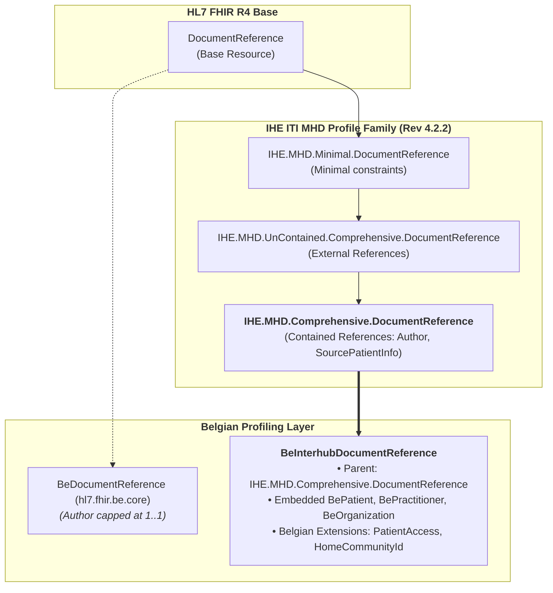

# IHE MHD Alignment & Federated Architecture Options

> **Where this page sits in the guide** — *Migration & Alignment*, page 2 of 3. This page provides the **in-depth architectural analysis, profile selection rationale, and open working group discussions** regarding the alignment of Belgian Interhub with **IHE MHD (Mobile access to Health Documents)**.
>
> * **Owned by this page:** Comparison between IHE MHD Minimal vs Comprehensive vs UnContained vs Contained profiles, the N+1 network latency rationale, resolution of the federal `author 1..1` cap, and open discussion topics to be resolved by the national technical committee.
> * **Normative definitions live in:** [Envelope & Metadata](envelope-and-metadata.html) for normative profile elements; [Transactions](transactions.html) for RESTful interactions; [KMEHR to FHIR Mapping](mapping-kmehr-to-hub.html) for legacy translation matrices.
> * **Previous:** [KMEHR to FHIR Mapping](mapping-kmehr-to-hub.html) · **Next:** [EHDS Alignment](ehds-alignment.html)

---

## 1. Executive Summary & Context

The Belgian federated hub ecosystem (connecting regional hubs **CoZo**, **RSW**, **Abrumet+**, and **Zodap** via the national **Metahub**) is modernizing its communication interfaces from legacy SOAP/KMEHR Web Services to RESTful HL7® FHIR®.

To guarantee global interoperability, cross-border compatibility with the **European Health Data Space (EHDS)**, and seamless bridging to existing **IHE XDS.b / XCA** document registries, Belgian Interhub metadata discovery is explicitly based on the **IHE MHD (Mobile access to Health Documents)** specification family.

Rather than deriving directly from the unconstrained HL7 core `DocumentReference` or the federal `BeDocumentReference`, this guide mandates that **`BeInterhubDocumentReference` derives from `IHE.MHD.Comprehensive.DocumentReference`** using the **Contained Resource Pattern**.



---

## 2. Analysis of IHE MHD Profile Families

IHE MHD defines several variants of `DocumentReference` to cater to different operational environments. The table below details the evaluation of these options for the Belgian Interhub network:

| Profile Option | Structural Characteristics | Suitability for Belgian Interhub | Selection Status |
| :--- | :--- | :--- | :--- |
| **IHE MHD Minimal** (`IHE.MHD.Minimal.DocumentReference`) | Loosely constrained; optional `type`, `category`, `facilityType`, `practiceSetting`, `securityLabel`, `creation`. | **Insufficient**: Omits critical clinical and governance metadata required for federated filtering, security categorization, and XDS gateway bridging. | **Rejected** |
| **IHE MHD Comprehensive (UnContained)** (`IHE.MHD.UnContained.Comprehensive.DocumentReference`) | Strictly constrained; mandates all XDS-equivalent attributes; uses **external URL references** (`Reference(Practitioner)`) for authors and patient demographics. | **Sub-optimal**: Forces initiating hubs and gateways into high network latency due to the **N+1 query problem** across federated regional gateways. | **Rejected** |
| **IHE MHD Comprehensive (Contained)** (`IHE.MHD.Comprehensive.DocumentReference`) | Strictly constrained; mandates XDS metadata; mandates **contained resources** (`#contained-id`) for `author`, `authenticator`, and `context.sourcePatientInfo`. | **Optimal**: Solves multi-author attribution, eliminates secondary network lookups, captures demographic snapshots, and complies fully with IHE and EHDS. | **SELECTED (Mandated)** |

### 2.1 Why MHD Minimal Was Insufficient
In the Belgian federated health ecosystem, document discovery (`getTransactionList`) is heavily reliant on structured metadata filters. The Minimal profile leaves `category`, `type`, `facilityType`, and `practiceSetting` optional, which would prevent initiating gateways from performing reliable clinical queries (e.g. finding all cardiology telemonitoring reports or clinical biology lab results). Furthermore, Minimal lacks mandatory document creation timestamps and confidentiality labels (`securityLabel`), which are legally mandatory under Belgian healthcare legislation.

### 2.2 Why Contained Resources Are Mandated over UnContained
In a centralized repository, referencing external resources (`Practitioner/123`, `Organization/456`) is standard practice. However, in a **federated, multi-hub ecosystem**, the UnContained pattern creates severe architectural and operational hurdles:

1. **The N+1 Network Query Problem**:
   If a `getTransactionList` search returns 50 document entries, and each entry points to external Practitioner, Organization, and Patient endpoints across separate regional hubs (CoZo, RSW, Abrumet+), the initiating hub would need to execute up to **150+ additional HTTP GET requests** across regional gateways just to assemble and render the search result with physician names and hospital identifiers.
2. **Cross-Hub Gateway Authentication Overhead**:
   Dereferencing external endpoints across different hubs requires establishing authenticated, token-bearing sessions with multiple distinct regional security gateways, dramatically increasing failure rates and latency.
3. **Resolution of the Federal `BeDocumentReference` `author 1..1` Constraint**:
   The Belgian federal profile `BeDocumentReference` (`hl7.fhir.be.core`) constrains `DocumentReference.author` to `1..1`. However, legacy KMEHR transactions routinely carry multiple `<author><hcparty>` elements (the answering regional hub, the originating hospital/laboratory, and the authoring physician). Deriving from `IHE.MHD.Comprehensive.DocumentReference` enables `author 1..*` with contained references, allowing complete multi-author chains to be expressed without violating federal rules.
4. **Point-in-Time Demographic Snapshot (`context.sourcePatientInfo`)**:
   Patient demographics (name, birth date, address) can change over time. Mandating a contained `BePatient` in `context.sourcePatientInfo` preserves the exact demographic snapshot of the patient at the time of document publication, without relying on live Master Patient Index (MPI) lookups.

---

## 3. Key Technical Directives & Conformance Rules

To ensure strict compliance with `IHE.MHD.Comprehensive.DocumentReference`, the following technical rules are enforced across all Belgian Interhub implementations:

### 3.1 Mandatory Document Unique Identifier (`masterIdentifier`)
* `masterIdentifier` is **`1..1 MS`** and MUST be formatted as an RFC 3986 URI (e.g. `urn:oid:...` or `urn:uuid:...`).
* For legacy KMEHR transactions lacking a global UUID, the responding hub mints this URI idempotently from the tuple: *(hub EHP number, local ID, `@SL` scheme)*.
* `identifier[uniqueId]` mirrors `masterIdentifier`.
* `identifier[entryUUID]` (`0..1 MS`) carries the metadata entry UUID (`urn:uuid:...`).
* `identifier[localId]` (`0..* MS`) carries the source hospital/laboratory identifier with its `@SL` scheme.

### 3.2 Removal of Prohibited Elements (`docStatus` and `attachment.data`)
* **`docStatus` is `0..0` (Forbidden)**: In conformance with IHE MHD, `docStatus` is removed. Document clinical lifecycle and amendments are expressed through Composition status and FHIR document relationships (`relatesTo` with `#replaces`, `#transforms`, `#appends`).
* **`content.attachment.data` is `0..0` (Forbidden)**: Discovery metadata returned by `getTransactionList` (MHD ITI-67) NEVER carries inline Base64 payload data. Payloads are retrieved strictly out-of-band via `content.attachment.url` using MHD ITI-68.

### 3.3 Mandatory Comprehensive Classifications
* **`category` (`1..1 MS`)**: Bound to Belgian `CD-TRANSACTION` (`sumehr`, `labresult`, `discharge`, `telemonitoring`, etc.).
* **`type` (`1..1 MS`)**: Bound to LOINC document classification codes.
* **`securityLabel` (`1..* MS`)**: Mandatory confidentiality code (`V3-Confidentiality`: `N`, `R`, `V`).
* **`context.facilityType` (`1..1 MS`)**: Healthcare facility type.
* **`context.practiceSetting` (`1..1 MS`)**: Clinical specialty / practice setting.
* **`content.attachment.creation` (`1..1 MS`)**: Document creation timestamp (UTC).
* **`content.format` (`1..1 MS`)**: Formal format coding (e.g. `urn:be:fgov:ehealth:lab:document:1.0`).

---

## 4. Open Working Group Discussions & Architectural Options

This section documents open architectural choices, trade-offs, and design proposals currently under consideration by the Belgian Interhub Technical Committee.

```
┌─────────────────────────────────────────────────────────────────────────────┐
│                    OPEN ARCHITECTURAL DISCUSSIONS SUMMARY                   │
├─────────────────────────────────────────────────────────────────────────────┤
│ 1. Federal Profile Harmonization (hl7.fhir.be.core BeDocumentReference).    │
│ 2. Contained Demographics Snapshot vs. Live Master Patient Index (MPI).     │
│ 3. Multi-Author Typing: Inline BeExtHcPartyType vs. Native Roles.           │
│ 4. Document Deprecation & Supersession Handling across Federated Hubs.      │
│ 5. Search Result Payload Size & Optimization Strategies.                    │
│ 6. Publication Roadmap (IHE MHD ITI-65 Provide Document Bundle).            │
└─────────────────────────────────────────────────────────────────────────────┘
```

---

### 4.1 Topic 1: Harmonization with `hl7.fhir.be.core` (`BeDocumentReference`)

#### Current Problem
The federal profile `BeDocumentReference` caps `author` at `1..1` and derives from the HL7 FHIR base `DocumentReference`. Because FHIR profiling rules permit only narrowing cardinality, `BeInterhubDocumentReference` cannot derive from `BeDocumentReference` without restricting the Belgian multi-author chain.

#### Proposed Resolution Options
* **Option A (Recommended)**: Submit a formal Change Request to the HL7 Belgium Core WG to relax `BeDocumentReference.author` to `1..*` and incorporate IHE MHD Comprehensive alignment at the federal level.
* **Option B**: Maintain `BeInterhubDocumentReference` as an independent national interhub profile inheriting directly from `IHE.MHD.Comprehensive.DocumentReference`.
* **Option C**: Create a federal specialization `BeInterhubDocumentReference` that satisfies `BeDocumentReference` whenever a single author is present, but documents the extension for multi-hub exchanges.

*Working Group Status: Option A has been formally submitted; Option B serves as the normative baseline in this release.*

---

### 4.2 Topic 2: Contained Demographics Snapshot vs. Master Patient Index (MPI)

#### Context & Discussion
`context.sourcePatientInfo` mandates an embedded `#contained` `BePatient` capturing the patient demographics at the time of document publication.

#### Trade-Off Analysis
* **Advantages of Contained Snapshot**:
  * Guarantees legal non-repudiation: proves what the publishing clinician saw at the time of authoring.
  * Zero network dependencies: client does not need to query Metahub / RN / INSZ lookup services during document discovery.
* **Open Questions**:
  * How should clients handle minor demographic discrepancies (e.g. address updates, name spelling corrections) between the historical `sourcePatientInfo` and the current `PatientPeeters` record in the regional MPI?
  * Guidance: Clients SHOULD display `sourcePatientInfo` in historical document provenance views, but use the live Metahub / MPI record for patient identity validation and current portal display.

---

### 4.3 Topic 3: Multi-Author Attribution Typing: Inline Extension vs. Native Roles

#### Context & Discussion
Legacy KMEHR transactions type each author using `CD-HCPARTY` (e.g. `hub`, `orghospital`, `persphysician`, `application`).

#### Evaluation of Options
* **Approach in this IG**: Uses `BeExtHcPartyType` directly on `author[].extension[hcPartyType]`, pointing to `#contained` `BePractitioner` or `BeOrganization` resources.
  * *Pros*: Extremely lightweight; instant inspection by client parsers without unpacking the contained resource structure.
* **Alternative IHE Approach**: Populate `PractitionerRole.code` or `Organization.type` inside the contained resource.
  * *Pros*: Pure FHIR resource modeling.
  * *Cons*: Requires inspecting inside the `#contained` resource to determine the party category.
* **Consensus**: Both are supported. The inline extension is recommended for rapid filtering, while the contained resource carries the corresponding `CD-HCPARTY` coding in `Organization.type` or `PractitionerRole.code`.

---

### 4.4 Topic 4: Document Deprecation, Replacement & Versioning Lifecycle

#### Context & Discussion
With `docStatus` set to `0..0`, legacy KMEHR `iscomplete="false"` (preliminary) and `iscomplete="true"` + `isvalidated="true"` (final) flags must be mapped cleanly into FHIR constructs.

#### Lifecycle Pattern
1. **Document Status (`DocumentReference.status`)**:
   * `current`: The active, valid version of the metadata record.
   * `superseded`: A replaced or obsolete version.
2. **Clinical Composition Status (`Composition.status`)**:
   * Carried inside the FHIR Document Bundle (`preliminary`, `final`, `amended`, `entered-in-error`).
3. **Document Replacement (`relatesTo`)**:
   * When an amended document is published, it carries `relatesTo.code = #replaces` with `relatesTo.target.identifier` pointing to the `uniqueId` of the prior document.
   * The responding hub updates the prior document's metadata entry to `status = #superseded`.

---

### 4.5 Topic 5: Search Response Optimization & Result Set Pagination

#### Discussion
Because `IHE.MHD.Comprehensive.DocumentReference` embeds contained resources (`BePatient`, `BePractitioner`, `BeOrganization`), the byte size of each `DocumentReference` search entry increases from ~1.5 KB to ~4-6 KB.

#### Recommended Hub Strategies
1. **Paging (`_count`)**: Responding hubs SHOULD enforce a default page size (e.g. `_count=50`, maximum `_count=200`) on `getTransactionList` queries.
2. **Deduplication of Contained Resources**: Where multiple authors or patients share identical details across a single searchset entry, they reference a single contained instance.
3. **Client-Side Caching**: Client applications cache retrieved Practitioner and Organization details keyed by NIHDI / CBE identifiers to speed up subsequent rendering.

---

### 4.6 Topic 6: Future Publication Roadmap (`IHE MHD ITI-65 / Provide Document Bundle`)

#### Context
Currently, Belgian Interhub focuses on metadata discovery (`getTransactionList` / MHD ITI-67) and document retrieval (`getTransaction` / MHD ITI-68).

#### Future Roadmap
* Future versions of this IG will specify **IHE MHD ITI-65 (`Provide Document Bundle`)** for publishing and sharing new documents from hospital EHRs and laboratory systems to/via regional hubs.
* ITI-65 will utilize `IHE.MHD.Comprehensive.ProvideBundle` to submit the `BeInterhubDocumentBundle` alongside its `BeInterhubDocumentReference` metadata envelope in a single transaction.

---

### 4.7 Topic 7: POST Search & FHIR `$retrieve-document` Operation Alignment with IHE MHD

#### Context & Discussion
To prevent patient identifiers (such as Belgian SSINs) and query criteria from leaking into web server access logs, reverse proxies, and browser histories, Belgian Interhub mandates **HTTP POST everywhere** across consumer-to-hub interfaces:
1. **Document Discovery**: Clients send `POST [base]/DocumentReference/_search` with `application/x-www-form-urlencoded` body content. This is natively conformant with **IHE MHD ITI-67**, which explicitly permits Document Consumers to use either GET or POST search.
2. **Document Retrieval**: Because FHIR R4 defines standard `read` as an HTTP GET interaction, Belgian Interhub specifies a national FHIR operation: **`POST [base]/DocumentReference/$retrieve-document`**.
3. **Gateway Adaptation**: Where an IHE MHD responder sits behind the hub gateway, the gateway translates `POST $retrieve-document` into downstream **IHE MHD ITI-68 (`GET <attachment.url>`)**. This decouples Belgian clients from raw repository endpoints and prevents SSRF vulnerabilities. See [EHDS Alignment §5](ehds-alignment.html#5-architectural-alignment-belgian-post-everywhere-api--ihe-mhd--xds-gateway-adaptation) for the complete gateway translation matrix.

---

### 4.8 Topic 8: Laboratory Results Beyond the Document (IHE QEDm & mXDE)

#### Context & Discussion
MHD shares whole documents. For trend follow-up of individual lab results (DIGIRELAB), IHE offers two companion profiles, and the Interhub reuses both in their simplest form:
1. **[IHE QEDm](https://profiles.ihe.net/PCC/QEDm/) PCC-44** is the query for individual `Observation` resources by patient, code and date. The Interhub laboratory observation search is PCC-44 over HTTP POST, with the patient identified by SSIN.
2. **[IHE mXDE](https://profiles.ihe.net/ITI/mXDE/)** traces each extracted data element back to its source document, using a separate `Provenance` resource. The Interhub carries that same link inline on the Observation (`derivedFrom` = document uniqueId, `homeCommunityId` = hub holding the document), so no Provenance resource or additional endpoint is needed.

All references in the returned Observation are logical references by business identifier (SSIN, NIHDI, CBE, document uniqueId). This is the same principle as contained resources in MHD Comprehensive: nothing needs to be dereferenced across hubs. See [Transactions §4.8](transactions.html#48-relationship-to-ihe-qedm-and-ihe-mxde) for the element-by-element mapping.

---

## 5. Summary Conformance Matrix

| Metadata Field | IHE MHD Comprehensive Profile | Belgian Interhub Specification | Legacy KMEHR Source |
| :--- | :--- | :--- | :--- |
| **`masterIdentifier`** | `1..1 MS` (RFC 3986 URI) | `1..1 MS` (Idempotent URI) | `id[@S="ID-KMEHR"]` / Composite key |
| **`identifier[entryUUID]`**| `0..*` (UUID) | `0..1 MS` (`urn:uuid:...`) | `request/id[@S="ID-KMEHR"]` |
| **`identifier[localId]`** | `0..*` | `0..* MS` (`system` = `@SL`) | `transaction/id[@S="LOCAL"]` |
| **`status`** | `1..1` (`current` \| `superseded`) | `1..1 MS` | Hub index availability |
| **`docStatus`** | **`0..0` (Prohibited)** | **`0..0` (Prohibited)** | `iscomplete` / `isvalidated` |
| **`category`** | `1..1 MS` | `1..1 MS` (`CD-TRANSACTION`) | `transaction/cd[@S="CD-TRANSACTION"]` |
| **`type`** | `1..1 MS` | `1..1 MS` (LOINC) | Derived document type |
| **`subject`** | `1..1 MS` | `1..1 MS` (Patient with SSIN) | `folder/patient/id[@S="INSS"]` |
| **`context.sourcePatientInfo`**| `1..1 MS` (Contained) | `1..1 MS` (Contained `BePatient`)| `folder/patient` demographics |
| **`author`** | `1..* MS` (Contained) | `1..* MS` (Contained parties) | `transaction/author/hcparty[]` |
| **`authenticator`** | `0..1 MS` (Contained) | `0..1 MS` (Contained party) | Validator `hcparty` (`isvalidated`) |
| **`securityLabel`** | `1..* MS` | `1..* MS` (`V3-Confidentiality`)| `transaction/confidentiality/cd` |
| **`content.attachment.contentType`**| `1..1 MS` | `1..1 MS` (`application/fhir+json`)| `lnk/@MEDIATYPE` |
| **`content.attachment.url`**| `1..1 MS` | `1..1 MS` (Direct ITI-68 URL / `$retrieve-document` target) | Repository endpoint locator |
| **`content.attachment.creation`**| `1..1 MS` | `1..1 MS` (UTC Instant) | `transaction/date` + `time` |
| **`content.attachment.data`**| **`0..0` (Prohibited)** | **`0..0` (Prohibited)** | N/A (Out-of-band retrieval) |
| **`context.facilityType`**| `1..1 MS` | `1..1 MS` | Facility classification |
| **`context.practiceSetting`**| `1..1 MS` | `1..1 MS` | Specialty / practice setting |

---

## Continue reading

* **Previous:** [KMEHR to FHIR Mapping](mapping-kmehr-to-hub.html) — field-by-field legacy crosswalk.
* **Next:** [EHDS Alignment](ehds-alignment.html) — alignment with European cross-border profiles.
* **Related:** [Envelope & Metadata](envelope-and-metadata.html) for normative profile elements; [Transactions](transactions.html) for search and retrieval operations.
