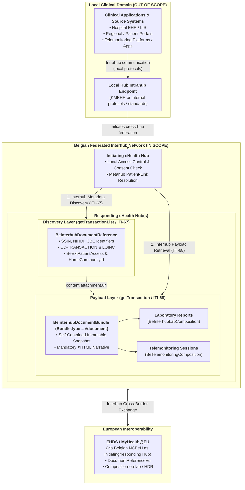
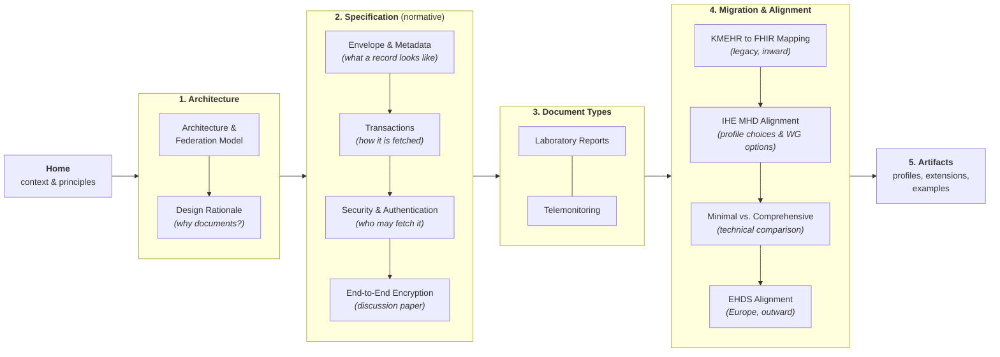

# Belgian Interhub FHIR Document Sharing Implementation Guide

## 1. Executive Summary & Context

For two decades, patient records have moved between Belgian care organisations — hospitals, independent laboratories, pharmacies, practice organisations, care homes and every other kind of hub source — and the national registers as **KMEHR** (Kind Messages for Electronic Healthcare Records) XML, carried by SOAP-based Interhub Web Services. KMEHR has served the country well. It gave Belgium a working federated exchange long before most member states had one, and the model it established still underpins the **Hub and Metahub** infrastructure that connects the regional eHealth hubs — **CoZo** (Collaboratief Zorgplatform), **RSW** (Réseau Santé Wallon), **BHN** (Brussels Health Network) and **Zodap** (Zorg Data Platform) — to the healthcare repositories behind them.

The argument for moving that infrastructure onto **HL7® FHIR® Release 4**, and specifically onto the **IHE MHD (Mobile access to Health Documents)** profile family, is now a practical one rather than an aspirational one. Integrators arriving today expect REST and JSON, and the **European Health Data Space (EHDS)** assumes them.

This Implementation Guide (IG) sets out that modernization as a normative **proposal and technical specification** strictly for **Belgian Interhub communications**: the federated, Hub-to-Hub communication layer connecting regional eHealth hubs to one another and to cross-border gateways. 

> **Important Scope Boundary**: **Interhub communication is strictly for Hub-to-Hub connections.** Clinical applications (EHRs, LIS, regional or patient portals, telemonitoring platforms) connect to their respective local Hub via **Intrahub endpoints** using Intrahub protocols (such as KMEHR or internal standards). Everything outside Hub-to-Hub communication is **out of scope** for this Implementation Guide.

Section 3 explains how the guide is organised and in which order to read it.

---

## 2. Core Architectural Principles

1. **Document-Centric Sharing** *(rationale: [Design Rationale](resource-considerations.html))*:
   Interhub is, before anything else, a **document sharing network**. Following national architecture decisions, structured clinical payloads travel as **FHIR Bundles of type `document`** (`Bundle.type = #document`). Each document bundle contains a root `Composition` resource (providing document metadata, authorship, and human-readable narrative sections) followed by all discrete clinical resources (e.g. `DiagnosticReport`, `Observation`, `Specimen`, `Device`, `CarePlan`, `Patient`, `Practitioner`, `Organization`). **PDF files**, **DICOM objects** and **pre-existing KMEHR documents** remain shareable throughout, so nothing already in circulation has to be re-authored to stay visible.

2. **Decoupled Metadata Discovery Envelope (`DocumentReference`)** *(specified in [Envelope & Metadata](envelope-and-metadata.html))*:
   Document discovery across the federated hubs is powered by the **`BeInterhubDocumentReference`** profile. This metadata envelope provides the modern equivalent of the KMEHR `TransactionSummaryType` and ebXML RIM `XDSDocumentEntry`, carrying essential discovery parameters, Belgian national identifiers (SSIN/INSS, NIHDI, CBE), Belgian patient access rules, and endpoint URIs for retrieving the document payload.

3. **Interhub Transactions & Operations** *(specified in [Transactions](transactions.html); secured as described in [Security & Authentication](security.html))*:
   * **`getTransactionList`** is mapped to **IHE MHD ITI-67 (`Find DocumentReferences`)** via `POST [base]/DocumentReference/_search`, allowing an initiating hub to query for available document metadata summaries matching patient identity and filter criteria across partner hubs using POST request bodies to prevent patient identifier leakage in network access logs.
   * **`getTransaction`** is mapped to the Belgian FHIR **`$retrieve-document`** operation (`POST [base]/DocumentReference/$retrieve-document`), returning the complete immutable FHIR Document Bundle (`type = #document`) or binary/encapsulated document to the initiating hub, with gateway resolution to IHE MHD ITI-68.
   * **Strict Hub-to-Hub Boundary**: Only hubs execute Interhub transactions. Clinical clients connect to their local Hub via Intrahub endpoints (out of scope), and the local Hub initiates Interhub requests as required.

4. **EHDS (European Health Data Space) Alignment** *(analysed in [EHDS Alignment](ehds-alignment.html))*:
   The Belgian Interhub profiles are built to align with EHDS cross-border specifications: **EU Laboratory Results**, **EU Hospital Discharge Reports**, **EU Patient Summaries** and **EU Imaging**. Belgium carries more than the European baseline asks for — routing across several federated hubs, national consent registers, document-level patient access metadata — but never less, and every shared structure stays readable at both ends.

5. **Key Domain Coverage**:
   * **Laboratory Reports (`labresult`)**: Full specification for laboratory report document bundles conforming to HL7 Belgium `BeLaboratoryReport` and EHDS `Composition-eu-lab` — see [Laboratory Reports](lab-report-sharing.html).
   * **Telemonitoring (`telemonitoring`)**: Specification for remote patient monitoring sessions, holter studies, carepaths, and telemonitoring diagnostic reports — see [Telemonitoring](mapping-telemonitoring-to-hub.html).

---

## 3. How to Read This Guide

The navigation bar groups this specification into **five sections**, ordered so that each one only depends on the ones to its left. Within the guide, **every topic is owned by exactly one page**: where a page mentions something it does not own, it links to the owning page at that point, and every page ends with a *Continue reading* box listing its previous, next and related pages.

* **Reading the guide end to end** — follow the navigation bar left to right, in the order shown above.
* **Already familiar with the Belgian hub architecture?** Start at [Envelope & Metadata](envelope-and-metadata.html) and [Transactions](transactions.html); they are the normative core. [Design Rationale](resource-considerations.html) answers *"why not FHIR messaging or `GET /Observation`?"* if that is your first question.
* **Migrating an existing KMEHR connector?** Read [Architecture §4 (dual-stack gateway)](architecture.html#4-dual-stack-gateway-architecture-transition-phase), then [KMEHR to FHIR Mapping](mapping-kmehr-to-hub.html).
* **Implementing one document type?** Read [Envelope & Metadata](envelope-and-metadata.html) and [Transactions](transactions.html) once, then only your domain page: [Laboratory Reports](lab-report-sharing.html) or [Telemonitoring](mapping-telemonitoring-to-hub.html).

### 3.1 Architecture — the ecosystem, and the reasoning behind it

| Page | What it covers | Topics this page owns |
| :--- | :--- | :--- |
| **[Architecture & Federation Model](architecture.html)** | The Belgian Hub/Metahub network, regional eHealth hubs, what counts as a hub source, federated routing, and the dual-stack transition gateway. | Hub / metahub / hub source model · `homeCommunityId` routing · dual-stack gateway. Security and transactions appear here only in summary. |
| **[Design Rationale](resource-considerations.html)** | Why Interhub shares FHIR *documents* discovered through a `DocumentReference` envelope, and why FHIR messaging and granular resource access were rejected. | Carrier-paradigm evaluation · document immutability · rationale for decoupled discovery. |

### 3.2 Specification — the normative contract

| Page | What it covers | Topics this page owns |
| :--- | :--- | :--- |
| **[Envelope & Metadata](envelope-and-metadata.html)** | `BeInterhubDocumentReference` element by element: national identifiers, Belgian extensions, MIME and language rules, UTC normalization. | **Every metadata field and extension in the guide.** Other pages give values; this page gives definitions. |
| **[Transactions](transactions.html)** | `getTransactionList` (`POST _search`) and `getTransaction` (`POST $retrieve-document`): wire contracts, search parameters, response bundles, partial-failure handling, error crosswalk. | The wire-level contract · `OperationOutcome` on downstream failure · HTTP status codes. |
| **[Security & Authentication](security.html)** | The Interhub trust model (the initiating hub owns access control), the three hub authentication routes, mTLS, DPoP (RFC 9449) / RFC 9421 tamper-proofing, and IHE BALP auditing. | **All security topics.** [Architecture §5](architecture.html#5-trust-model-security-architecture--connection-routes-proposal) is a two-paragraph summary of this page; this page takes precedence. |
| **[End-to-End Encryption](end-to-end-encryption.html)** | *Discussion paper.* KMEHR ETEE versus FHIR E2EE, JWE and CMS payload encryption, zero-knowledge hubs, and the recommended tiered hybrid strategy. | The open question of payload encryption. **Non-normative** — it does not change what [Security & Authentication](security.html) mandates. |

### 3.3 Document Types — the payloads in practice

| Page | What it covers | Topics this page owns |
| :--- | :--- | :--- |
| **[Laboratory Reports](lab-report-sharing.html)** | End-to-end sharing of laboratory reports as FHIR Document Bundles, with a complete worked JSON example. | `BeInterhubLabComposition` · LOINC section codes per laboratory specialty. |
| **[Telemonitoring](mapping-telemonitoring-to-hub.html)** | End-to-end sharing of telemonitoring and remote patient monitoring sessions, with a complete worked JSON example. | `BeTelemonitoringComposition` · `TelemonitoringDiagnosticReport` · TMP JSON transformation. Its source message is shown in [TMP Base Message](tmp-base-message.html). |

Both pages assume [Envelope & Metadata](envelope-and-metadata.html) and [Transactions](transactions.html); they specify only what is domain-specific.

### 3.4 Migration & Alignment — legacy KMEHR and Europe

| Page | What it covers | Topics this page owns |
| :--- | :--- | :--- |
| **[KMEHR to FHIR Mapping](mapping-kmehr-to-hub.html)** | Field-by-field crosswalk between KMEHR XML, IHE XDS.b ebXML and FHIR MHD, plus the KMEHR encapsulation strategy for the transition period. | All KMEHR ↔ FHIR field and code-system mappings, referenced from every other page. |
| **[IHE MHD Alignment](ihe-mhd-alignment.html)** | Comparison of MHD Minimal vs Comprehensive vs UnContained vs Contained profiles, N+1 rationale, resolution of federal `author 1..1` cap, and open working group topics. | All IHE MHD profile comparison debates, contained resource rationale, and unresolved working group discussion items. |
| **[Minimal vs. Comprehensive](minimal-vs-comprehensive.html)** | Direct side-by-side element comparison table and use case suitability matrix between `BeInterhubMinimalDocumentReference` and `BeInterhubDocumentReference`. | Technical comparison between Minimal and Comprehensive Belgian DocumentReference profiles. |
| **[EHDS Alignment](ehds-alignment.html)** | Alignment with European Health Data Space profiles and the MyHealth@EU cross-border exchange flow. | Belgian ↔ EU profile matrix · what Belgium adds beyond baseline EHDS · NCPeH translation. |

### 3.5 Reference

| Page | What it covers |
| :--- | :--- |
| **[Artifacts](artifacts.html)** | Machine-readable directory of all FHIR profiles, extensions, value sets, code systems, capability statements and examples defined by this guide. |

---

## 4. Key Artifacts Overview

* **Profiles**:
  * `BeInterhubDocumentReference`: Metadata discovery envelope for search results (`getTransactionList`), deriving from `IHE.MHD.Comprehensive.DocumentReference` with contained references.
  * `BeInterhubMinimalDocumentReference`: Lightweight metadata discovery envelope deriving from `IHE.MHD.Minimal.DocumentReference` for edge/mobile ingest.
  * `BeInterhubDocumentBundle`: Canonical FHIR Document Bundle (`type = #document`) for document retrieval (`getTransaction`).
  * `BeInterhubLabComposition`: Root Composition for Laboratory Reports.
  * `BeTelemonitoringComposition`: Root Composition for Telemonitoring and remote monitoring sessions.
  * `TelemonitoringDiagnosticReport`: DiagnosticReport profile carrying telemonitoring session parameters and results.
* **Extensions**:
  * `BeExtPatientAccess`: Belgian patient access permissions (`yes`, `no`, `never`), release dates, and withholding reasons.
  * `BeExtHomeCommunityId`: Hub Home Community ID for cross-hub routing.
  * `BeExtEndToEndEncryption`: Belgian eHealth ETK depot encryption metadata for end-to-end secure transmission.
  * `BeExtRecordDateTime`: Source repository recording timestamp.
  * `BeExtHcPartyType`: KMEHR `CD-HCPARTY` type of an author, authenticator or custodian, carried inline in the metadata envelope.
  * `TelemonitoringId`, `Carepath`, `PrescriberApplication`, `SourceTelemonitoringReport`: Telemonitoring metadata extensions.
* **Capability Statements**:
  * `BeInterhubDocumentResponder`: Server requirements for eHealth Hubs and Document Registries/Repositories.
  * `BeInterhubDocumentConsumer`: Client requirements for initiating eHealth hubs and cross-border gateways in Interhub federated communication.

* **National profiles this guide builds on** (not redefined here):
  * [`BePatient`](https://www.ehealth.fgov.be/standards/fhir/core/StructureDefinition/be-patient), [`BePractitioner`](https://www.ehealth.fgov.be/standards/fhir/core/StructureDefinition/be-practitioner), [`BePractitionerRole`](https://www.ehealth.fgov.be/standards/fhir/core/StructureDefinition/be-practitionerrole), [`BeOrganization`](https://www.ehealth.fgov.be/standards/fhir/core/StructureDefinition/be-organization) and [`BeAddress`](https://www.ehealth.fgov.be/standards/fhir/core/StructureDefinition/be-address) from **`hl7.fhir.be.core`** — embedded as `#contained` resources inside the metadata envelope.
  * [`BeObservation`](https://www.ehealth.fgov.be/standards/fhir/core-clinical/StructureDefinition/be-observation) from **`hl7.fhir.be.core-clinical`**, used for every clinical measurement carried inside a document bundle.
  * Derivation from `IHE.MHD.Comprehensive.DocumentReference` enables `author 1..*` with contained references while maintaining full national identity semantics (see [IHE MHD Alignment](ihe-mhd-alignment.html)).

The full, machine-readable index of every profile, extension, value set and example is on the [Artifacts](artifacts.html) page. To start reading the specification itself, continue with **[Architecture & Federation Model](architecture.html)**.
