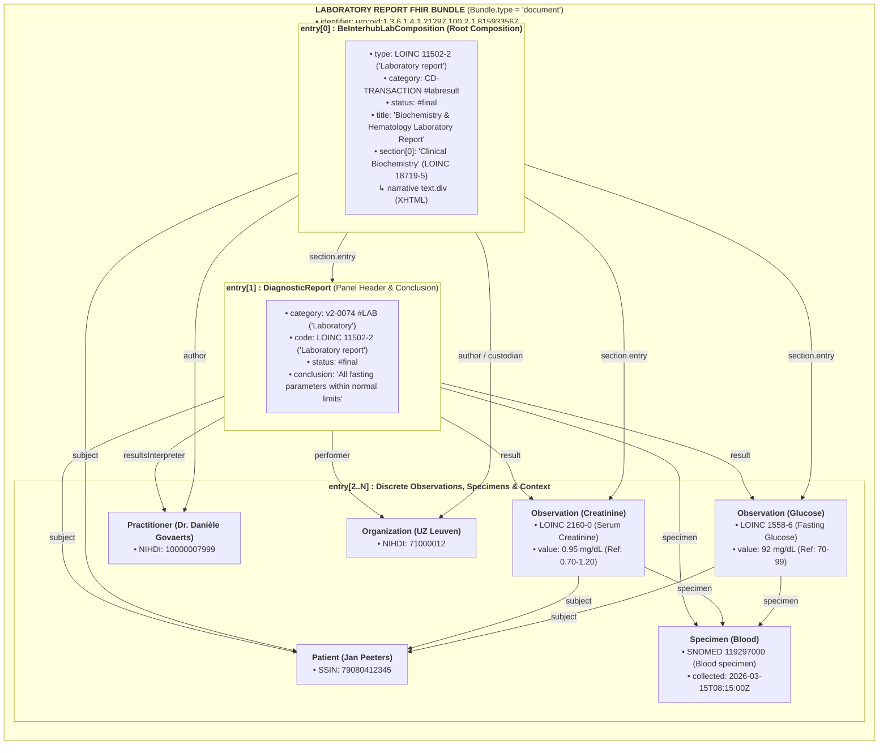
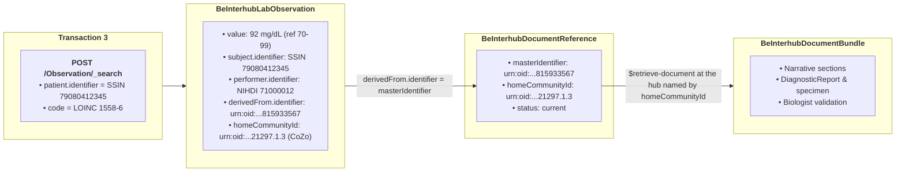

# Laboratory Report Document Sharing (LabReport)

> **Where this page sits in the guide** — *Document Types*, page 1 of 2. This page shows **one concrete payload end to end**; it deliberately does not restate the envelope or the transactions, it only gives the laboratory-specific values for them.
>
> * **Read first:** [Envelope & Metadata](envelope-and-metadata.html) and [Transactions](transactions.html).
> * **Owned by this page:** the laboratory document architecture (`BeInterhubLabComposition`), LOINC section codes per laboratory specialty, and a complete worked JSON example.
> * **Related:** EU lab profile alignment → [EHDS Alignment](ehds-alignment.html#21-profile-alignment-matrix); legacy `labresult` KMEHR transactions → [KMEHR to FHIR Mapping](mapping-kmehr-to-hub.html).
> * **Previous:** [End-to-End Encryption](end-to-end-encryption.html) · **Next:** [Telemonitoring](mapping-telemonitoring-to-hub.html)

## 1. Overview & Business Context

To query individual laboratory results by patient and LOINC analyte code, see [Laboratory Observation Search (Transaction 3)](transactions.html#lab-observation-search), including its [request encoding and search parameters](transactions.html#lab-observation-search-parameters).

Laboratory results are the highest-volume document category in Belgian hub traffic, and usually the first one an integrator meets. Legacy KMEHR exchanges carried them under the `CD-TRANSACTION` code `labresult`, either as structured KMEHR `<item>` elements or as base64-encoded PDF and text files (the full legacy crosswalk, including the `CD-TRANSACTION` value set, is in [KMEHR to FHIR Mapping](mapping-kmehr-to-hub.html#3-code-system--value-set-crosswalks)).

Under the modernized Interhub FHIR specification, every laboratory report is shared via or published on the hub network as a **self-contained FHIR Document Bundle (`Bundle.type = #document`)**, a paradigm justified in [Design Rationale](resource-considerations.html#2-evaluation-of-candidate-carrier-paradigms) and constrained normatively in [Transactions §3.3](transactions.html#33-payload-structure-strictly-fhir-bundles-of-type-document). Nothing here is invented from scratch: the specification builds directly on **HL7 Belgium (`BeLaboratoryReport`)**, the Belgian **DIGIRELAB Phase 3** initiative and the **EHDS EU Laboratory Report (`Composition-eu-lab`)** standard — the profile-by-profile correspondence with the European specifications is in [EHDS Alignment §2.1](ehds-alignment.html#21-profile-alignment-matrix).

---

## 2. Document Architecture & Composition Structure

A Belgian Laboratory Report FHIR Document is structured as follows:



---

## 3. Key Clinical Coding & Laboratory Disciplines

### 3.1 Standard Document & Category Identifiers
* **`Bundle.type`**: `#document` (Mandatory).
* **`Composition.category`**: `https://www.ehealth.fgov.be/standards/fhir/core/CodeSystem/cd-transaction#labresult` ("Laboratory Result").
* **`Composition.type`**: `http://loinc.org#11502-2` ("Laboratory report").
* **`DiagnosticReport.category`**: `http://terminology.hl7.org/CodeSystem/v2-0074#LAB` ("Laboratory").

### 3.2 Laboratory Specialties & Section Codes
Sections inside the Composition group results by laboratory specialty:

| Specialty / Panel | LOINC Code | LOINC Display Name |
| :--- | :--- | :--- |
| **Clinical Biochemistry / Chemistry** | `18719-5` | Chemistry studies (set) |
| **Hematology & Coagulation** | `18723-7` | Hematology studies (set) |
| **Microbiology & Bacteriology** | `18725-2` | Microbiology studies (set) |
| **Immunology & Serology** | `18727-8` | Serology studies (set) |
| **Therapeutic Drug Monitoring (TDM)** | `18721-1` | Therapeutic drug monitoring studies (set) |
| **Urinalysis** | `18729-4` | Urinalysis studies (set) |
| **Molecular Diagnostics & Genetics** | `18728-6` | Molecular pathology studies (set) |

---

## 4. Metadata Mapping for `getTransactionList` (MHD ITI-67)

When the laboratory document is registered or indexed in the hub registry, the corresponding `BeInterhubDocumentReference` is populated as follows. Only the laboratory-specific *values* are given here; the cardinality and meaning of each element are specified in [Envelope & Metadata §2](envelope-and-metadata.html#2-element-by-element-specification-beinterhubdocumentreference), and the search that returns it in [Transactions §2](transactions.html#2-transaction-1-gettransactionlist-mhd-iti-67-find-documentreferences):

* `category`: `https://www.ehealth.fgov.be/standards/fhir/core/CodeSystem/cd-transaction#labresult`
* `type`: `http://loinc.org#11502-2`
* `subject`: Reference to Patient with SSIN (`79080412345`)
* `content.attachment.contentType`: `application/fhir+json`
* `content.attachment.url`: `https://hub.cozo.be/fhir/Bundle/bundle-lab-report-example-01`
* `content.format`: `urn:be:fgov:ehealth:lab:document:1.0`
* `extension[patientAccess].access`: `yes` (or `no` if results are pending consultation with the prescribing physician).

---

## 5. Complete JSON Document Walkthrough

Below is a complete, valid example of a shared Laboratory Report FHIR Document Bundle (`BundleLabReportExample`):

```json
{
  "resourceType": "Bundle",
  "id": "bundle-lab-report-example-01",
  "meta": {
    "profile": [
      "https://www.ehealth.fgov.be/standards/fhir/interhub/StructureDefinition/be-interhub-document-bundle"
    ]
  },
  "identifier": {
    "system": "urn:ietf:rfc:3986",
    "value": "urn:oid:1.3.6.1.4.1.21297.100.2.1.815933567"
  },
  "type": "document",
  "timestamp": "2026-03-15T10:30:00Z",
  "entry": [
    {
      "fullUrl": "http://example.org/Composition/CompLabReportExample",
      "resource": {
        "resourceType": "Composition",
        "id": "CompLabReportExample",
        "meta": {
          "profile": [
            "https://www.ehealth.fgov.be/standards/fhir/interhub/StructureDefinition/be-interhub-lab-composition"
          ]
        },
        "identifier": {
          "system": "https://uzleuven.be/lab/compositions",
          "value": "COMP-LAB-2026-815933567"
        },
        "status": "final",
        "type": {
          "coding": [
            {
              "system": "http://loinc.org",
              "code": "11502-2",
              "display": "Laboratory report"
            }
          ]
        },
        "category": {
          "coding": [
            {
              "system": "https://www.ehealth.fgov.be/standards/fhir/core/CodeSystem/cd-transaction",
              "code": "labresult",
              "display": "Laboratory Result"
            }
          ]
        },
        "subject": { "reference": "Patient/PatientPeeters" },
        "date": "2026-03-15T10:30:00Z",
        "author": [
          { "reference": "Practitioner/DrDanieleGovaerts" },
          { "reference": "Organization/OrgUZLeuven" }
        ],
        "title": "Biochemistry & Hematology Laboratory Report",
        "custodian": { "reference": "Organization/OrgUZLeuven" },
        "section": [
          {
            "title": "Clinical Biochemistry",
            "code": {
              "coding": [
                {
                  "system": "http://loinc.org",
                  "code": "18719-5",
                  "display": "Chemistry studies (set)"
                }
              ]
            },
            "text": {
              "status": "generated",
              "div": "<div xmlns=\"http://www.w3.org/1999/xhtml\"><p><b>Clinical Biochemistry:</b> Fasting glucose: 92 mg/dL (Normal). Serum creatinine: 0.95 mg/dL (Normal).</p></div>"
            },
            "entry": [
              { "reference": "DiagnosticReport/DiagnosticReportLabExample" },
              { "reference": "Observation/ObsGlucoseExample" },
              { "reference": "Observation/ObsCreatinineExample" }
            ]
          }
        ]
      }
    },
    {
      "fullUrl": "http://example.org/DiagnosticReport/DiagnosticReportLabExample",
      "resource": {
        "resourceType": "DiagnosticReport",
        "id": "DiagnosticReportLabExample",
        "status": "final",
        "category": [
          {
            "coding": [
              {
                "system": "http://terminology.hl7.org/CodeSystem/v2-0074",
                "code": "LAB",
                "display": "Laboratory"
              }
            ]
          }
        ],
        "code": {
          "coding": [
            {
              "system": "http://loinc.org",
              "code": "11502-2",
              "display": "Laboratory report"
            }
          ]
        },
        "subject": { "reference": "Patient/PatientPeeters" },
        "effectiveDateTime": "2026-03-15T08:15:00Z",
        "issued": "2026-03-15T10:30:00Z",
        "performer": [{ "reference": "Organization/OrgUZLeuven" }],
        "resultsInterpreter": [{ "reference": "Practitioner/DrDanieleGovaerts" }],
        "result": [
          { "reference": "Observation/ObsGlucoseExample" },
          { "reference": "Observation/ObsCreatinineExample" }
        ],
        "specimen": [{ "reference": "Specimen/SpecimenBloodExample" }],
        "conclusion": "All fasting biochemistry parameters within normal reference limits."
      }
    },
    {
      "fullUrl": "http://example.org/Observation/ObsGlucoseExample",
      "resource": {
        "resourceType": "Observation",
        "id": "ObsGlucoseExample",
        "status": "final",
        "category": [
          {
            "coding": [
              {
                "system": "http://terminology.hl7.org/CodeSystem/v2-0074",
                "code": "LAB",
                "display": "Laboratory"
              }
            ]
          }
        ],
        "code": {
          "coding": [
            {
              "system": "http://loinc.org",
              "code": "1558-6",
              "display": "Fasting glucose [Mass/volume] in Serum or Plasma"
            }
          ]
        },
        "subject": { "reference": "Patient/PatientPeeters" },
        "effectiveDateTime": "2026-03-15T08:15:00Z",
        "performer": [{ "reference": "Practitioner/DrDanieleGovaerts" }],
        "valueQuantity": {
          "value": 92,
          "unit": "mg/dL",
          "system": "http://unitsofmeasure.org",
          "code": "mg/dL"
        },
        "referenceRange": [
          {
            "low": { "value": 70, "unit": "mg/dL", "system": "http://unitsofmeasure.org", "code": "mg/dL" },
            "high": { "value": 99, "unit": "mg/dL", "system": "http://unitsofmeasure.org", "code": "mg/dL" }
          }
        ],
        "specimen": { "reference": "Specimen/SpecimenBloodExample" }
      }
    },
    {
      "fullUrl": "http://example.org/Observation/ObsCreatinineExample",
      "resource": {
        "resourceType": "Observation",
        "id": "ObsCreatinineExample",
        "status": "final",
        "category": [
          {
            "coding": [
              {
                "system": "http://terminology.hl7.org/CodeSystem/v2-0074",
                "code": "LAB",
                "display": "Laboratory"
              }
            ]
          }
        ],
        "code": {
          "coding": [
            {
              "system": "http://loinc.org",
              "code": "2160-0",
              "display": "Creatinine [Mass/volume] in Serum or Plasma"
            }
          ]
        },
        "subject": { "reference": "Patient/PatientPeeters" },
        "effectiveDateTime": "2026-03-15T08:15:00Z",
        "performer": [{ "reference": "Practitioner/DrDanieleGovaerts" }],
        "valueQuantity": {
          "value": 0.95,
          "unit": "mg/dL",
          "system": "http://unitsofmeasure.org",
          "code": "mg/dL"
        },
        "referenceRange": [
          {
            "low": { "value": 0.70, "unit": "mg/dL", "system": "http://unitsofmeasure.org", "code": "mg/dL" },
            "high": { "value": 1.20, "unit": "mg/dL", "system": "http://unitsofmeasure.org", "code": "mg/dL" }
          }
        ],
        "specimen": { "reference": "Specimen/SpecimenBloodExample" }
      }
    },
    {
      "fullUrl": "http://example.org/Specimen/SpecimenBloodExample",
      "resource": {
        "resourceType": "Specimen",
        "id": "SpecimenBloodExample",
        "type": {
          "coding": [
            {
              "system": "http://snomed.info/sct",
              "code": "119297000",
              "display": "Blood specimen"
            }
          ]
        },
        "subject": { "reference": "Patient/PatientPeeters" },
        "collection": {
          "collectedDateTime": "2026-03-15T08:15:00Z"
        }
      }
    },
    {
      "fullUrl": "http://example.org/Patient/PatientPeeters",
      "resource": {
        "resourceType": "Patient",
        "id": "PatientPeeters",
        "identifier": [
          {
            "system": "https://www.ehealth.fgov.be/standards/fhir/core/NamingSystem/ssin",
            "value": "79080412345"
          }
        ],
        "name": [{ "family": "Peeters", "given": ["Jan"] }],
        "gender": "male",
        "birthDate": "1979-08-04"
      }
    },
    {
      "fullUrl": "http://example.org/Practitioner/DrDanieleGovaerts",
      "resource": {
        "resourceType": "Practitioner",
        "id": "DrDanieleGovaerts",
        "identifier": [
          {
            "system": "https://www.ehealth.fgov.be/standards/fhir/core/NamingSystem/nihdi",
            "value": "10000007999"
          }
        ],
        "name": [{ "family": "Govaerts", "given": ["Danièle"] }]
      }
    },
    {
      "fullUrl": "http://example.org/Organization/OrgUZLeuven",
      "resource": {
        "resourceType": "Organization",
        "id": "OrgUZLeuven",
        "identifier": [
          {
            "system": "https://www.ehealth.fgov.be/standards/fhir/core/NamingSystem/nihdi",
            "value": "71000012"
          }
        ],
        "name": "UZ Leuven"
      }
    }
  ]
}
```

---

## 6. Individual Lab Results: The Laboratory Observation Search (Transaction 3)

### 6.1 Two Ways to Reach the Same Result

The same laboratory report can be reached in two ways across the federation:

1. **The document** (Transactions 1 & 2): `BeInterhubDocumentReference` and `BeInterhubDocumentBundle`, rooted in `BeInterhubLabComposition`. This is the legal, immutable report, with narrative, specimen, requesting physician, biologist validation and conclusion.
2. **The individual results** (Transaction 3): `BeInterhubLabObservation`, returned by `POST [base]/Observation/_search` with `patient.identifier` (SSIN) and `code` (LOINC, e.g. `1558-6`). This serves trend curves and follow-up across reports, laboratories and hubs, without downloading every document.

The result is never a replacement for the report: every observation points to the report it was extracted from. The normative specification is [Transactions §4](transactions.html#4-transaction-3-laboratory-observation-search-digirelab).

---

### 6.2 How an Observation Relates to Its Report

Every result extracted from the report of [§5](#5-complete-json-document-walkthrough) is returned with **logical references only**: business identifiers that say *who* or *what* is meant, with no URL to fetch. The responding hub therefore needs no Patient, Practitioner or Organization endpoint.



What a hub does when extracting a result from this report:

| Observation element | Taken from the report |
| :--- | :--- |
| `code`, `value[x]`, `interpretation`, `referenceRange`, `effective[x]`, `note` | The `Observation` entry in the document bundle, unchanged |
| `category` | `observation-category#laboratory` (a `v2-0074#LAB` coding in the source may be kept alongside) |
| `subject.identifier` | The patient SSIN (`DocumentReference.subject.identifier`) |
| `performer.identifier` | NIHDI / CBE number of the laboratory or biologist in the source `Observation.performer` |
| `derivedFrom.identifier` | `DocumentReference.masterIdentifier` |
| `extension[homeCommunityId]` | `DocumentReference.extension[homeCommunityId]` |

The result is only available while the report is: same access decision, only `current` documents, and nothing extracted from end-to-end encrypted documents ([Transactions §4.4](transactions.html#44-responder-rules)). The link from result to report plays the role of the source-document Provenance of [IHE mXDE](https://profiles.ihe.net/ITI/mXDE/), carried inline instead of as a separate resource ([Transactions §4.8](transactions.html#48-relationship-to-ihe-qedm-and-ihe-mxde)).

The complete searchset response for this report is shown in [Transactions §4.7](transactions.html#47-wire-example-response-searchset-bundle) and as the example `BundleLabObservationSearchsetExample`.

---

## Continue reading

* **Previous:** [End-to-End Encryption](end-to-end-encryption.html) — whether this payload travels in plaintext (Tier 1) or encrypted (Tier 2).
* **Next:** [Telemonitoring](mapping-telemonitoring-to-hub.html) — the second document type, structured the same way.
* **Related:** [Envelope & Metadata](envelope-and-metadata.html) and [Transactions](transactions.html) for the envelope and calls used above; [EHDS Alignment](ehds-alignment.html#21-profile-alignment-matrix) for `Composition-eu-lab` conformance; [Artifacts](artifacts.html) for the machine-readable profiles and examples.
