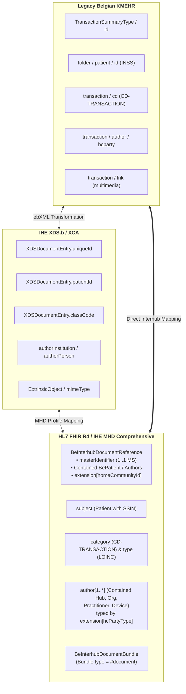

# KMEHR to FHIR MHD Interhub Mapping Matrix

> **Where this page sits in the guide** — *Migration & Alignment*, page 1 of 3. This is the crosswalk that makes the dual-stack gateway of [Architecture §4](architecture.html#4-dual-stack-gateway-architecture-transition-phase) implementable. Read it when you are migrating an existing KMEHR connector, not when you are learning the target model.
>
> * **Owned by this page:** KMEHR ↔ IHE XDS.b ↔ FHIR field mappings, code-system crosswalks, and the KMEHR encapsulation strategy for the transition period.
> * **The target definitions live elsewhere:** the FHIR elements in the right-hand columns are specified in [Envelope & Metadata](envelope-and-metadata.html); the SOAP operations being replaced are specified in [Transactions](transactions.html); open architectural alignment discussions are in [IHE MHD Alignment](ihe-mhd-alignment.html).
> * **Previous:** [Telemonitoring](mapping-telemonitoring-to-hub.html) · **Next:** [IHE MHD Alignment](ihe-mhd-alignment.html)

## 1. Executive Summary & Mapping Scope

This page holds the normative, bi-directional mapping between three representations of the same information: legacy Belgian **KMEHR** XML as used in the SOAP Interhub Web Services (`getTransactionList`, `getTransaction`), the intermediate **IHE XDS.b / XCA** constructs, and the target **HL7® FHIR® R4 / IHE MHD Comprehensive** profiles.



The mapping encompasses:
1. **Metadata Envelope Mapping**: `TransactionSummaryType` ↔ `XDSDocumentEntry` ↔ `BeInterhubDocumentReference` (IHE MHD Comprehensive with Contained Resources).
2. **Payload Encapsulation Mapping**: KMEHR `<folder>/<transaction>` ↔ `BeInterhubDocumentBundle` (`Bundle.type = #document`).
3. **Terminology & Code System Crosswalks**: Belgian national code tables (`CD-TRANSACTION`, `CD-HCPARTY`, `CD-CONFIDENTIALITY`, `CD-SEX`).

This page maps *between* representations; it does not define the target. The FHIR elements in the right-hand columns below are specified in [Envelope & Metadata](envelope-and-metadata.html#2-element-by-element-specification-beinterhubdocumentreference), the RESTful operations replacing the SOAP services in [Transactions](transactions.html), and the runtime component that applies these mappings — the dual-stack gateway — in [Architecture §4](architecture.html#4-dual-stack-gateway-architecture-transition-phase).

---

## 2. Master Metadata Mapping Matrix (KMEHR ↔ IHE MHD Comprehensive)

| KMEHR Schema Element | IHE XDS.b Attribute | FHIR MHD Comprehensive Element | Mapping & Implementation Rule |
| :--- | :--- | :--- | :--- |
| `transaction/id[@S="ID-KMEHR"]` or composite key | `XDSDocumentEntry.uniqueId` | `masterIdentifier`<br/>`identifier[uniqueId]` | RFC 3986 URI minted idempotently (`1..1 MS`). |
| `request/id[@S="ID-KMEHR"]` | ebXML message ID | `identifier[entryUUID]` | Unique metadata UUID (`urn:uuid:...`) (`0..1 MS`). |
| `transaction/id[@S="LOCAL"]` + `@SL` | Local entry ID | `identifier[localId]` | Hub source local identifier (`system` = `@SL`, `value` = text) (`0..* MS`). |
| `folder/patient/id[@S="INSS"]` | `XDSDocumentEntry.patientId` | `subject.identifier` | Belgian SSIN / INSS (`1..1 MS`). |
| `folder/patient` demographics | `sourcePatientInfo` (PID) | `context.sourcePatientInfo` | **Contained `BePatient` resource** providing demographic snapshot (`1..1 MS`). |
| `transaction/cd[@S="CD-TRANSACTION"]` | `classCode` | `category` | Belgian `CD-TRANSACTION` code (`1..1 MS`). |
| Derived LOINC type | `typeCode` | `type` | Document LOINC classification (`1..1 MS`). |
| `transaction/author/hcparty[]` | `authorInstitution` / `authorPerson` | `author[]` | **Contained references** (`#id`) to `BePractitioner`, `BeOrganization`, or `Device` (`1..* MS`). |
| `author/hcparty/cd[@S="CD-HCPARTY"]` | `authorRole` slot | `author.extension[hcPartyType]` | Belgian party type code preserved inline. |
| `iscomplete` / `isvalidated` | Document status | `relatesTo` / Composition status | Handled via document versioning (`docStatus` removed per MHD). |
| `transaction/confidentiality/cd` | `confidentialityCode` | `securityLabel` | `N` (Normal), `R` (Restricted), `V` (Very Restricted) (`1..* MS`). |
| `lnk/@MEDIATYPE` | `mimeType` | `content.attachment.contentType` | `application/fhir+json` (`1..1 MS`). |
| Schema format | `formatCode` | `content.format` | Format URI (`1..1 MS`). |
| Internal retrieval key | Repository endpoint | `content.attachment.url` | Direct RESTful retrieve URL for `$retrieve-document` / ITI-68 (`1..1 MS`). |
| `transaction/date` + `time` | `creationTime` | `content.attachment.creation` | Creation instant normalized to UTC (`1..1 MS`). |

### 2.1 What Actually Identifies a Transaction in KMEHR

This is the single most consequential difference between the legacy model and the FHIR one, and getting it wrong makes a gateway unimplementable.

**A KMEHR hub transaction cannot be assumed to carry a globally unique identifier.** A `getTransactionList` entry looks like this:

```xml
<transaction>
    <id S="LOCAL" SL="labo" SV="1.0">815933567</id>
    <cd S="CD-TRANSACTION" SV="1.0">labresult</cd>
    <cd S="LOCAL" SL="uzl-catalogue" SV="1.0" DN="Klinische biologie - volledig">CB-FULL</cd>
    <date>2026-03-15</date><time>10:30:00</time>
    <recorddatetime>2026-03-15T10:31:12</recorddatetime>
    <author>
        <hcparty><id S="ID-HCPARTY">71000012</id><cd S="CD-HCPARTY" SV="1.1">orglaboratory</cd><name>Klinisch labo</name></hcparty>
        <hcparty><id S="ID-HCPARTY">10000007999</id><cd S="CD-HCPARTY" SV="1.1">persphysician</cd><firstname>Danièle</firstname><familyname>Govaerts</familyname></hcparty>
    </author>
</transaction>
```

To retrieve that document, the caller must send back a `select/transaction` element containing **the local id with its `@SL` scheme *and* the complete `author` block copied verbatim from the list entry**. The retrieval key is therefore the tuple:

> **(responding hub EHP number, `id[@S="LOCAL"]` value, `@SL` scheme, the full list of author `hcparty` elements)**

Three consequences for the FHIR model:

1. **`masterIdentifier` (and `identifier[uniqueId]`) is minted where it is not given.** When the responding hub publishes no transaction-level unique id, it derives a stable RFC 3986 URI from that tuple. Either way the value MUST be idempotent — the same transaction must yield the same URI on every query, or `relatesTo`, deduplication across hubs and client-side bookmarks all break.
2. **`content.attachment.url` is the retrieval contract.** A consumer that keeps the URL never needs to reconstruct the tuple. This is why the URL is `1..1` and absolute in [Envelope & Metadata §2](envelope-and-metadata.html#2-element-by-element-specification-beinterhubdocumentreference), and why a hub MUST NOT expect a consumer to re-assemble a composite key.
3. **The author list is not decoration.** A gateway that drops author entries when translating a list entry to `DocumentReference` — or reorders them, or merges the department into the organisation — can no longer build a valid `GetTransaction` request for that document. Every `hcparty` must survive the round trip as a `#contained` resource with its party type carried inline ([Envelope & Metadata §3.5](envelope-and-metadata.html#35-healthcare-party-type-beexthcpartytype)).

One trap deserves naming: the `id[@S="ID-KMEHR"]` that appears on the `request` and `response` elements of the SOAP envelope identifies the **message**, and is regenerated on every call. It is not the document's identifier. It maps to `identifier[entryUUID]`, never to `masterIdentifier`.

---

## 3. Code System & Value Set Crosswalks

### 3.1 Document Category: `CD-TRANSACTION` to FHIR Coding

| KMEHR `CD-TRANSACTION` Code | Display Name | Target FHIR `category.coding` |
| :--- | :--- | :--- |
| `sumehr` | Summarized Electronic Health Record | `https://www.ehealth.fgov.be/standards/fhir/core/CodeSystem/cd-transaction#sumehr` |
| `labresult` | Laboratory Result | `https://www.ehealth.fgov.be/standards/fhir/core/CodeSystem/cd-transaction#labresult` |
| `discharge` | Hospital Discharge Summary | `https://www.ehealth.fgov.be/standards/fhir/core/CodeSystem/cd-transaction#discharge` |
| `telemonitoring` | Telemonitoring Report | `https://www.ehealth.fgov.be/standards/fhir/core/CodeSystem/cd-transaction#telemonitoring` |
| `note` | Clinical Contact Note | `https://www.ehealth.fgov.be/standards/fhir/core/CodeSystem/cd-transaction#note` |
| `referral` | Referral Letter | `https://www.ehealth.fgov.be/standards/fhir/core/CodeSystem/cd-transaction#referral` |
| `prescription` | Pharmaceutical Prescription | `https://www.ehealth.fgov.be/standards/fhir/core/CodeSystem/cd-transaction#prescription` |
| `radiology` | Radiology / Imaging Report | `https://www.ehealth.fgov.be/standards/fhir/core/CodeSystem/cd-transaction#radiology` |
| `vaccination` | Vaccination Record | `https://www.ehealth.fgov.be/standards/fhir/core/CodeSystem/cd-transaction#vaccination` |

### 3.2 Confidentiality: `CD-CONFIDENTIALITY` to HL7 v3 Confidentiality

| KMEHR Confidentiality Value | HL7 v3 Code | Display | Belgian Access Policy (applied by the initiating hub) |
| :--- | :--- | :--- | :--- |
| `normal` / (omitted) | `N` | Normal | No additional restriction beyond the initiating hub's standard access control. |
| `restricted` | `R` | Restricted | The initiating hub restricts disclosure to specialty care providers / explicit therapeutic links. |
| `secret` | `V` | Very Restricted | Sealed document; the initiating hub restricts disclosure to the original author and their delegates. |

### 3.3 Healthcare Party Type: `CD-HCPARTY` to Contained FHIR Resources

| `CD-HCPARTY` class | KMEHR examples | Contained FHIR Resource | Where the code is preserved |
| :--- | :--- | :--- | :--- |
| Person types (`pers…`) | `persphysician`, `persnurse`, `persdentist`, `perspharmacist`, `persmidwife`, `persphysiotherapist` | Contained `BePractitioner` / `BePractitionerRole` | `extension[hcPartyType]`, and `PractitionerRole.code` |
| Organisation types (`org…`) | `orghospital`, `orglaboratory`, `orgpharmacy`, `orgpractice`, `orgpolyclinic`, `orgretirementhome` | Contained `BeOrganization` | `extension[hcPartyType]`, and `Organization.type` |
| Department / specialty types (`dept…`) | `deptclinicalbiology`, `deptcardiology`, `deptemergency` | Contained `BeOrganization` (`partOf`) or `PractitionerRole.specialty` | `extension[hcPartyType]` |
| Application / system parties | `application`, `certificateholder` | Contained `Device` (or `BeOrganization` for a hub) | `extension[hcPartyType]` |
| Patient / related persons | patient-authored content, informal caregiver | Contained `BePatient`, `RelatedPerson` | `extension[hcPartyType]` |

---

## 4. Encapsulation Strategy: FHIR Document inside KMEHR (Transition Phase)

Some systems will not be ready for native RESTful FHIR when the migration begins. Throughout the transition, a FHIR Document Bundle can be delivered inside an ordinary KMEHR message, encapsulated in a `<lnk>` multimedia element:

```xml
<transaction>
    <id S="ID-KMEHR">1.3.6.1.4.1.21297.100.2.1.815933567</id>
    <cd S="CD-TRANSACTION">labresult</cd>
    <date>2026-03-15</date>
    <time>10:30:00</time>
    <author>
        <hcparty>
            <id S="ID-HCPARTY" SV="1.0">10000007999</id>
            <cd S="CD-HCPARTY" SV="1.0">persphysician</cd>
            <firstname>Danièle</firstname>
            <familyname>Govaerts</familyname>
        </hcparty>
    </author>
    <iscomplete>true</iscomplete>
    <isvalidated>true</isvalidated>
    
    <!-- Encapsulated FHIR Document Bundle (Base64-encoded JSON) -->
    <lnk TYPE="multimedia" 
         MEDIATYPE="application/fhir+json">
        ewogICAgInJlc291cmNlVHlwZSI6ICJCdW5kbGUiLAogICAgInR5cGUiOiAiZG9jdW1lbnQiLA...
    </lnk>
</transaction>
```

---

## 5. Character Encoding of Legacy Payloads

Legacy KMEHR payloads are not reliably UTF-8, whereas a FHIR gateway must emit valid UTF-8 in every `application/fhir+json` response:
1. **Declared vs. actual encoding**: ETEE-sealed folders arrive as `<Base64EncryptedValue encoding="…">`. If parsing fails, fall back to `ISO-8859-1`.
2. **Mis-encoded names**: Normalize `firstname`, `familyname`, and `name` diacritics before rendering in FHIR.

---

## Continue reading

* **Previous:** [Telemonitoring](mapping-telemonitoring-to-hub.html) — the second of the two document types being mapped.
* **Next:** [IHE MHD Alignment](ihe-mhd-alignment.html) — architectural analysis, Contained pattern rationale, and open WG topics.
* **Related:** [EHDS Alignment](ehds-alignment.html) for European cross-border mapping; [Envelope & Metadata](envelope-and-metadata.html) for the normative definition of every target element.
