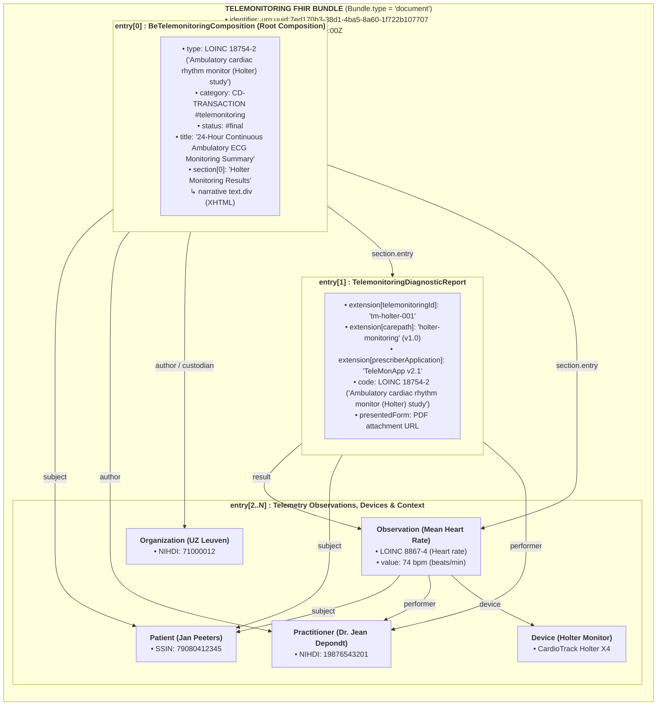
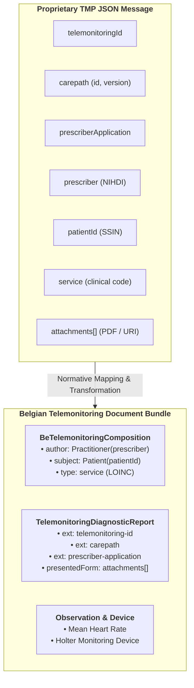

# Telemonitoring Document Sharing (Remote Patient Monitoring)

> **Where this page sits in the guide** — *Document Types*, page 2 of 2. Same structure as [Laboratory Reports](lab-report-sharing.html): one concrete payload end to end, using the envelope and transactions specified earlier in the guide.
>
> * **Read first:** [Envelope & Metadata](envelope-and-metadata.html) and [Transactions](transactions.html). The raw source message this transformation starts from is shown in [TMP Base Message](tmp-base-message.html).
> * **Owned by this page:** the telemonitoring document architecture (`BeTelemonitoringComposition`, `TelemonitoringDiagnosticReport`), the TMP JSON → FHIR mapping, and a complete worked JSON example.
> * **Previous:** [Laboratory Reports](lab-report-sharing.html) · **Next:** [KMEHR to FHIR Mapping](mapping-kmehr-to-hub.html)

## 1. Overview & Business Context

Telemonitoring, or remote patient monitoring (TMP), is growing quickly in Belgium: chronic care programmes, post-discharge follow-up, ambulatory Holter monitoring in cardiology, diabetes care, oncology. The platforms behind them produce a steady stream of continuous and episodic sensor data, patient-reported outcome measures (PROMs) and automated diagnostic evaluations.

None of that is clinically useful while it stays inside the monitoring platform. To make telemonitoring results part of the longitudinal patient record, readable by every treating physician across the Belgian federated hubs (CoZo, RSW, BHN, Zodap — see [Architecture §1](architecture.html#1-the-belgian-federated-health-ecosystem)), telemonitoring data is shared via or published on hubs as **self-contained FHIR Document Bundles (`Bundle.type = #document`)** categorized under `CD-TRANSACTION` code `telemonitoring`. The document-bundle paradigm is justified in [Design Rationale](resource-considerations.html#2-evaluation-of-candidate-carrier-paradigms) and constrained normatively in [Transactions §3.3](transactions.html#33-payload-structure-strictly-fhir-bundles-of-type-document).

---

## 2. Telemonitoring Document Architecture



---

## 3. Mapping from Proprietary TMP JSON to FHIR Document

The Belgian Telemonitoring Project (TMP) moves proprietary JSON messages between device vendors, monitoring applications and hub source platforms such as hospitals, home-care organisations and monitoring centres; a complete example of one is shown in [TMP Base Message](tmp-base-message.html). The normative transformation into FHIR structures runs as follows:



| Proprietary TMP JSON Field | Target FHIR Element | FHIR Datatype & Profile |
| :--- | :--- | :--- |
| `telemonitoringId` | `DiagnosticReport.extension[telemonitoringId]` | `Extension(Identifier)` |
| `carepath.id` & `version` | `DiagnosticReport.extension[carepath]` | Complex `Extension(carepathId, version)` |
| `prescriberApplication` | `DiagnosticReport.extension[prescriberApplication]` | `Extension(string)` |
| `prescriber` (NIHDI) | `Composition.author` & `DiagnosticReport.performer` | `Reference(BePractitioner)` (be.core NIHDI identifier slice) |
| `patientId` (SSIN) | `Composition.subject` & `DiagnosticReport.subject` | `Reference(BePatient)` (be.core SSIN identifier slice) |
| `service` / clinical code | `Composition.type` & `DiagnosticReport.code` | `CodeableConcept` (LOINC / SNOMED) |
| `attachments[].uri` | `DiagnosticReport.presentedForm[].url` | `Attachment.url` |
| `attachments[].contentType`| `DiagnosticReport.presentedForm[].contentType` | `Attachment.contentType` (`application/pdf`) |

---

## 4. Metadata Mapping for `getTransactionList` (MHD ITI-67)

When shared via or published on the regional hub, the telemonitoring session is discoverable via `BeInterhubDocumentReference`. Only the telemonitoring-specific *values* are given here; the cardinality and meaning of each element are specified in [Envelope & Metadata §2](envelope-and-metadata.html#2-element-by-element-specification-beinterhubdocumentreference), and the search that returns it in [Transactions §2](transactions.html#2-transaction-1-gettransactionlist-mhd-iti-67-find-documentreferences):

* `category`: `https://www.ehealth.fgov.be/standards/fhir/core/CodeSystem/cd-transaction#telemonitoring`
* `type`: `http://loinc.org#18754-2` ("Ambulatory cardiac rhythm monitor (Holter) study")
* `subject`: Patient SSIN (`79080412345`)
* `content.attachment.contentType`: `application/fhir+json`
* `content.attachment.url`: `https://hub.cozo.be/fhir/Bundle/bundle-telemonitoring-example-01`
* `content.format`: `urn:be:fgov:ehealth:telemonitoring:document:1.0`
* `extension[patientAccess].access`: `yes`

---

## 5. Complete JSON Document Walkthrough

Below is a complete, valid example of a shared Telemonitoring FHIR Document Bundle (`BundleTelemonitoringExample`):

```json
{
  "resourceType": "Bundle",
  "id": "bundle-telemonitoring-example-01",
  "meta": {
    "profile": [
      "https://www.ehealth.fgov.be/standards/fhir/interhub/StructureDefinition/be-interhub-document-bundle"
    ]
  },
  "identifier": {
    "system": "urn:ietf:rfc:3986",
    "value": "urn:uuid:7ed170b3-38d1-4ba5-8a60-1f722b107707"
  },
  "type": "document",
  "timestamp": "2026-01-02T08:30:00Z",
  "entry": [
    {
      "fullUrl": "http://example.org/Composition/CompTelemonitoringExample",
      "resource": {
        "resourceType": "Composition",
        "id": "CompTelemonitoringExample",
        "meta": {
          "profile": [
            "https://www.ehealth.fgov.be/standards/fhir/interhub/StructureDefinition/be-telemonitoring-composition"
          ]
        },
        "identifier": {
          "system": "https://uzleuven.be/telemonitoring/compositions",
          "value": "COMP-TM-2026-001"
        },
        "status": "final",
        "type": {
          "coding": [
            {
              "system": "http://loinc.org",
              "code": "18754-2",
              "display": "Ambulatory cardiac rhythm monitor (Holter) study"
            }
          ]
        },
        "category": {
          "coding": [
            {
              "system": "https://www.ehealth.fgov.be/standards/fhir/core/CodeSystem/cd-transaction",
              "code": "telemonitoring",
              "display": "Telemonitoring / Remote Patient Monitoring"
            }
          ]
        },
        "subject": { "reference": "Patient/PatientPeeters" },
        "date": "2026-01-02T08:30:00Z",
        "author": [
          { "reference": "Practitioner/DrJeanDepondt" },
          { "reference": "Organization/OrgUZLeuven" }
        ],
        "title": "24-Hour Continuous Ambulatory ECG Monitoring Summary",
        "custodian": { "reference": "Organization/OrgUZLeuven" },
        "section": [
          {
            "title": "Holter Monitoring Results",
            "text": {
              "status": "generated",
              "div": "<div xmlns=\"http://www.w3.org/1999/xhtml\"><p><b>24h Holter Monitoring:</b> Mean Heart Rate: 74 bpm. Normal sinus rhythm maintained. No malignant ventricular arrhythmias observed.</p></div>"
            },
            "entry": [
              { "reference": "DiagnosticReport/TelemonitoringFromHolterExample" },
              { "reference": "Observation/ObsHeartRateSummary" }
            ]
          }
        ]
      }
    },
    {
      "fullUrl": "http://example.org/DiagnosticReport/TelemonitoringFromHolterExample",
      "resource": {
        "resourceType": "DiagnosticReport",
        "id": "TelemonitoringFromHolterExample",
        "meta": {
          "profile": [
            "https://www.ehealth.fgov.be/standards/fhir/interhub/StructureDefinition/telemonitoring-diagnostic-report"
          ]
        },
        "extension": [
          {
            "url": "https://www.ehealth.fgov.be/standards/fhir/interhub/StructureDefinition/telemonitoring-id",
            "valueIdentifier": {
              "system": "http://example.org/telemonitoring-id",
              "value": "tm-holter-001"
            }
          },
          {
            "url": "https://www.ehealth.fgov.be/standards/fhir/interhub/StructureDefinition/carepath",
            "extension": [
              { "url": "carepathId", "valueString": "holter-monitoring" },
              { "url": "version", "valueString": "1.0" }
            ]
          },
          {
            "url": "https://www.ehealth.fgov.be/standards/fhir/interhub/StructureDefinition/prescriber-application",
            "valueString": "TeleMonApp v2.1"
          }
        ],
        "status": "final",
        "code": {
          "coding": [
            {
              "system": "http://loinc.org",
              "code": "18754-2",
              "display": "Ambulatory cardiac rhythm monitor (Holter) study"
            }
          ]
        },
        "subject": { "reference": "Patient/PatientPeeters" },
        "performer": [{ "reference": "Practitioner/DrJeanDepondt" }],
        "presentedForm": [
          {
            "contentType": "application/pdf",
            "url": "https://storage.example.org/reports/holter-001.pdf",
            "title": "Holter Monitoring Report"
          }
        ]
      }
    },
    {
      "fullUrl": "http://example.org/Observation/ObsHeartRateSummary",
      "resource": {
        "resourceType": "Observation",
        "id": "ObsHeartRateSummary",
        "status": "final",
        "code": {
          "coding": [
            {
              "system": "http://loinc.org",
              "code": "8867-4",
              "display": "Heart rate"
            }
          ]
        },
        "subject": { "reference": "Patient/PatientPeeters" },
        "effectivePeriod": {
          "start": "2026-01-01T08:00:00Z",
          "end": "2026-01-02T08:00:00Z"
        },
        "performer": [{ "reference": "Practitioner/DrJeanDepondt" }],
        "valueQuantity": {
          "value": 74,
          "unit": "beats/minute",
          "system": "http://unitsofmeasure.org",
          "code": "/min"
        }
      }
    },
    {
      "fullUrl": "http://example.org/Patient/PatientPeeters",
      "resource": {
        "resourceType": "Patient",
        "id": "PatientPeeters",
        "identifier": [
          {
            "system": "https://www.ehealth.fgov.be/standards/fhir/core/NamingSystem/ssin",
            "value": "79080412345"
          }
        ],
        "name": [{ "family": "Peeters", "given": ["Jan"] }],
        "gender": "male",
        "birthDate": "1979-08-04"
      }
    },
    {
      "fullUrl": "http://example.org/Practitioner/DrJeanDepondt",
      "resource": {
        "resourceType": "Practitioner",
        "id": "DrJeanDepondt",
        "identifier": [
          {
            "system": "https://www.ehealth.fgov.be/standards/fhir/core/NamingSystem/nihdi",
            "value": "19876543201"
          }
        ],
        "name": [{ "family": "Depondt", "given": ["Jean"] }]
      }
    },
    {
      "fullUrl": "http://example.org/Organization/OrgUZLeuven",
      "resource": {
        "resourceType": "Organization",
        "id": "OrgUZLeuven",
        "identifier": [
          {
            "system": "https://www.ehealth.fgov.be/standards/fhir/core/NamingSystem/nihdi",
            "value": "71000012"
          }
        ],
        "name": "UZ Leuven"
      }
    }
  ]
}
```

---

## Continue reading

* **Previous:** [Laboratory Reports](lab-report-sharing.html) — the same pattern applied to laboratory results.
* **Next:** [KMEHR to FHIR Mapping](mapping-kmehr-to-hub.html) — the migration crosswalk for existing KMEHR connectors.
* **Related:** [TMP Base Message](tmp-base-message.html) for the raw source message; [Envelope & Metadata](envelope-and-metadata.html) and [Transactions](transactions.html) for the envelope and calls used above; [Artifacts](artifacts.html) for the telemonitoring profiles and extensions.
