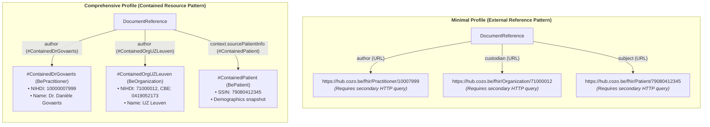

# IHE MHD Minimal vs. Comprehensive DocumentReference: Technical Comparison

> **Where this document sits in the guide** — *Migration & Alignment*, page 3 of 4. This document provides a direct **side-by-side technical comparison** between the two Belgian metadata profiles:
> * **`BeInterhubMinimalDocumentReference`** (deriving from `IHE.MHD.Minimal.DocumentReference`)
> * **`BeInterhubDocumentReference`** (deriving from `IHE.MHD.Comprehensive.DocumentReference` with Contained Resources)
>
> * **Related reading:** [Envelope & Metadata](envelope-and-metadata.html) for normative comprehensive definitions; [IHE MHD Alignment](ihe-mhd-alignment.html) for working group discussions and federation architecture.

---

## 1. Executive Summary

The **IHE Mobile access to Health Documents (MHD)** profile family offers two main tiers for metadata carrier envelopes: **Minimal** and **Comprehensive**.

* **Comprehensive (National Standard)**: Selected as the normative envelope for all federated Belgian Interhub discovery and retrieval transactions (`getTransactionList` / `getTransaction`). It enforces strict clinical classifications, mandatory creation timestamps, confidentiality labels, and the **Contained Resource pattern** for multi-author attribution and demographic snapshots.
* **Minimal (Lightweight / Edge Extension)**: Maintained for edge ingest, mobile applications, IoT devices, simplified publishing (`ITI-105`), or non-clinical document references where Comprehensive metadata is either unavailable or unnecessary.

```
┌────────────────────────────────────────────────────────────────────────────────────────┐
│                                ARCHITECTURAL COMPARISON                                │
├────────────────────────────────────────────────────────────────────────────────────────┤
│ • MINIMAL:       Loose constraints, optional classifications, external references.     │
│ • COMPREHENSIVE: Strict constraints, mandatory context, contained Belgian core actors. │
└────────────────────────────────────────────────────────────────────────────────────────┘
```

---

## 2. Element-by-Element Comparison Matrix

| FHIR Element | `BeInterhubMinimalDocumentReference` (Minimal) | `BeInterhubDocumentReference` (Comprehensive) | Impact & Architectural Rationale |
| :--- | :--- | :--- | :--- |
| **`Parent`** | `IHE.MHD.Minimal.DocumentReference` | `IHE.MHD.Comprehensive.DocumentReference` | Derivation base in IHE MHD (Rev 4.2.2). |
| **`masterIdentifier`** | `1..1 MS` (RFC 3986 URI) | `1..1 MS` (RFC 3986 URI) | Unique document entry ID (`urn:oid:...` or `urn:uuid:...`). |
| **`identifier[entryUUID]`** | `0..1 MS` | `0..1 MS` | Business identifier for the metadata entry. |
| **`identifier[localId]`** | `0..* MS` | `0..* MS` | Local hub source repository identifier (`@SL` scheme). |
| **`status`** | `1..1 MS` (`current` \| `superseded`) | `1..1 MS` (`current` \| `superseded`) | Restricted to `DocumentReferenceStats` value set. |
| **`docStatus`** | **`0..0` (Prohibited)** | **`0..0` (Prohibited)** | Removed in MHD; lifecycle managed via `relatesTo`. |
| **`category`** | `0..1 MS` (Optional) | **`1..1 MS` (Mandatory `CD-TRANSACTION`)** | Comprehensive guarantees national document category filtering. |
| **`type`** | `0..1 MS` (Optional) | **`1..1 MS` (Mandatory LOINC)** | Comprehensive guarantees LOINC document classification. |
| **`subject`** | `1..1 MS` (SSIN identifier) | `1..1 MS` (SSIN identifier) | Mandatory Belgian patient reference with inline SSIN. |
| **`contained`** | Optional | **`1..* MS` (Mandatory Contained Resources)** | Comprehensive embeds `BePatient`, `BePractitioner`, `BeOrganization`. |
| **`author`** | `0..* MS` (External or contained) | **`1..* MS` (Contained `#contained-id`)** | Comprehensive mandates contained author chain (Hub, Org, Clinician). |
| **`authenticator`** | `0..1 MS` (Optional) | **`0..1 MS` (Contained `#contained-id`)** | Comprehensive embeds legal validator resource. |
| **`context.sourcePatientInfo`** | `0..1 MS` (Optional) | **`1..1 MS` (Contained `Reference(BePatient)`)**| Comprehensive captures demographic snapshot at publication time. |
| **`context.facilityType`** | `0..1 MS` (Optional) | **`1..1 MS` (Mandatory SNOMED CT)** | Mandatory healthcare facility classification in Comprehensive. |
| **`context.practiceSetting`** | `0..1 MS` (Optional) | **`1..1 MS` (Mandatory SNOMED CT)** | Mandatory clinical specialty / practice setting in Comprehensive. |
| **`securityLabel`** | `0..* MS` (Optional) | **`1..* MS` (Mandatory `V3-Confidentiality`)** | Confidentiality level (`N`, `R`, `V`) is mandatory in Comprehensive. |
| **`content.attachment.contentType`**| `1..1 MS` | `1..1 MS` | `application/fhir+json` (or `application/pdf`). |
| **`content.attachment.url`** | `1..1 MS` | `1..1 MS` | Direct retrieve URL (resolved by `$retrieve-document` or downstream ITI-68). |
| **`content.attachment.creation`** | `0..1 MS` (Optional) | **`1..1 MS` (Mandatory UTC Instant)** | Mandatory creation timestamp in Comprehensive. |
| **`content.attachment.language`** | `0..1 MS` (Optional) | **`1..1 MS` (Mandatory BCP-47)** | Mandatory language code (`nl-BE`, `fr-BE`, `de-BE`, `en`). |
| **`content.attachment.data`** | **`0..0` (Prohibited)** | **`0..0` (Prohibited)** | Inline Base64 payload forbidden; retrieved via URL. |
| **`content.format`** | `0..1 MS` (Optional) | **`1..1 MS` (Mandatory Format URI)** | Mandatory format specification URI in Comprehensive. |
| **`relatesTo`** | `0..* MS` | `0..* MS` | Logical business reference to related document. |

---

## 3. Deep Dive: Contained Resources vs. External References

The most significant structural distinction between the two profiles lies in **how actors and patient demographics are referenced**:



### 3.1 The Multi-Author Challenge
* **The Federal Limitation**: The Belgian federal core profile `BeDocumentReference` (`hl7.fhir.be.core`) caps `author` at `1..1`.
* **The Interhub Reality**: A Belgian hospital document involves multiple authoring entities:
  1. The **Answering Regional Hub** (e.g. CoZo, RSW, Abrumet+).
  2. The **Originating Institution** (e.g. UZ Leuven, Grand Hôpital de Charleroi).
  3. The **Clinical Department** (e.g. Clinical Biology, Cardiology).
  4. The **Authoring Physician** (e.g. Dr. Govaerts).
  5. The **Software Application** (e.g. LIS, EHR).
* **Solution**: `BeInterhubDocumentReference` (Comprehensive) inherits from `IHE.MHD.Comprehensive.DocumentReference`, enabling `author 1..*` with `#contained` resources so all parties are conveyed without violating federal single-reference cardinality constraints.

### 3.2 The N+1 Network Query Problem
In a federated network of independent regional hubs:
* With **Minimal (External References)**: Assembling and displaying a list of 50 search results requires executing up to **150+ secondary HTTP queries** across regional gateways to retrieve physician names, institution identifiers, and demographic snapshots.
* With **Comprehensive (Contained References)**: All display names, NIHDI numbers, and CBE enterprise numbers are delivered **inline** inside the searchset Bundle. The search table renders instantly with **zero secondary network round-trips**.

---

## 4. Use Case Suitability Matrix

| Use Case Scenario | Recommended Profile | Rationale |
| :--- | :--- | :--- |
| **Federated Interhub Discovery (`getTransactionList`)** | **Comprehensive** | Requires rich metadata for filtering by category, clinical type, facility, and specialty, plus instant rendering via contained actors. |
| **Cross-Border EHDS Primary Use (MyHealth@EU)** | **Comprehensive** | Mandatory European metadata fields (`facilityType`, `practiceSetting`, `creation`, `format`, `securityLabel`) align strictly with `DocumentReferenceEu`. |
| **Hospital LIS / RIS Document Publication** | **Comprehensive** | Clinical reports must preserve legal author chains, validator identity, and institutional accountability. |
| **Mobile Patient App / Edge Sensor Ingest (`ITI-105`)** | **Minimal** | Mobile apps publishing simple attachments (e.g. PDF diary, wearable export) may not have facility or practice setting metadata. |
| **Third-Party Telehealth Platform Upload** | **Minimal** | Lightweight upload where external systems lack full Belgian institutional identifiers at submission time. |
| **Administrative / Billing Attachment Discovery** | **Minimal** | Non-clinical records where clinical specialty and demographic snapshots are not legally mandated. |

---

## 5. Comparative JSON Instances

### 5.1 Minimal Profile Instance (`BeInterhubMinimalDocumentReference`)

```json
{
  "resourceType": "DocumentReference",
  "id": "docref-minimal-example",
  "meta": {
    "profile": [
      "https://www.ehealth.fgov.be/standards/fhir/interhub/StructureDefinition/be-interhub-minimal-documentreference"
    ]
  },
  "extension": [
    {
      "url": "https://www.ehealth.fgov.be/standards/fhir/interhub/StructureDefinition/be-ext-home-community-id",
      "valueUri": "urn:oid:1.3.6.1.4.1.21297.1.3"
    }
  ],
  "masterIdentifier": {
    "system": "urn:ietf:rfc:3986",
    "value": "urn:oid:1.3.6.1.4.1.21297.100.2.1.999000111"
  },
  "status": "current",
  "subject": {
    "reference": "Patient/PatientPeeters",
    "identifier": {
      "system": "https://www.ehealth.fgov.be/standards/fhir/core/NamingSystem/ssin",
      "value": "79080412345"
    }
  },
  "content": [
    {
      "attachment": {
        "contentType": "application/fhir+json",
        "url": "https://hub.cozo.be/fhir/Bundle/bundle-minimal-example-01"
      }
    }
  ]
}
```

### 5.2 Comprehensive Profile Instance (`BeInterhubDocumentReference`)

```json
{
  "resourceType": "DocumentReference",
  "id": "docref-comprehensive-example",
  "meta": {
    "profile": [
      "https://www.ehealth.fgov.be/standards/fhir/interhub/StructureDefinition/be-interhub-documentreference"
    ]
  },
  "contained": [
    {
      "resourceType": "Patient",
      "id": "ContainedPatient",
      "identifier": [
        {
          "system": "https://www.ehealth.fgov.be/standards/fhir/core/NamingSystem/ssin",
          "value": "79080412345"
        }
      ],
      "name": [ { "family": "Peeters", "given": [ "Jan" ] } ],
      "gender": "male",
      "birthDate": "1979-08-04"
    },
    {
      "resourceType": "Organization",
      "id": "ContainedOrgUZLeuven",
      "identifier": [
        {
          "system": "https://www.ehealth.fgov.be/standards/fhir/core/NamingSystem/nihdi",
          "value": "71000012"
        }
      ],
      "type": [
        {
          "coding": [
            {
              "system": "https://www.ehealth.fgov.be/standards/fhir/core/CodeSystem/cd-hcparty",
              "code": "orghospital"
            }
          ]
        }
      ],
      "name": "UZ Leuven"
    },
    {
      "resourceType": "Practitioner",
      "id": "ContainedDrGovaerts",
      "identifier": [
        {
          "system": "https://www.ehealth.fgov.be/standards/fhir/core/NamingSystem/nihdi",
          "value": "10000007999"
        }
      ],
      "name": [ { "family": "Govaerts", "given": [ "Danièle" ] } ]
    }
  ],
  "extension": [
    {
      "url": "https://www.ehealth.fgov.be/standards/fhir/interhub/StructureDefinition/be-ext-home-community-id",
      "valueUri": "urn:oid:1.3.6.1.4.1.21297.1.3"
    },
    {
      "url": "https://www.ehealth.fgov.be/standards/fhir/interhub/StructureDefinition/be-ext-patient-access",
      "extension": [
        { "url": "access", "valueCode": "yes" },
        { "url": "accessDate", "valueDate": "2026-03-15" }
      ]
    },
    {
      "url": "https://www.ehealth.fgov.be/standards/fhir/interhub/StructureDefinition/be-ext-record-datetime",
      "valueInstant": "2026-03-15T10:35:00Z"
    }
  ],
  "masterIdentifier": {
    "system": "urn:ietf:rfc:3986",
    "value": "urn:oid:1.3.6.1.4.1.21297.100.2.1.815933567"
  },
  "status": "current",
  "category": [
    {
      "coding": [
        {
          "system": "https://www.ehealth.fgov.be/standards/fhir/core/CodeSystem/cd-transaction",
          "code": "labresult",
          "display": "Laboratory Result"
        }
      ]
    }
  ],
  "type": {
    "coding": [
      {
        "system": "http://loinc.org",
        "code": "11502-2",
        "display": "Laboratory report"
      }
    ]
  },
  "subject": {
    "reference": "Patient/PatientPeeters",
    "identifier": {
      "system": "https://www.ehealth.fgov.be/standards/fhir/core/NamingSystem/ssin",
      "value": "79080412345"
    }
  },
  "date": "2026-03-15T10:30:00Z",
  "author": [
    {
      "extension": [
        {
          "url": "https://www.ehealth.fgov.be/standards/fhir/interhub/StructureDefinition/be-ext-hcparty-type",
          "valueCoding": {
            "system": "https://www.ehealth.fgov.be/standards/fhir/core/CodeSystem/cd-hcparty",
            "code": "persphysician"
          }
        }
      ],
      "reference": "#ContainedDrGovaerts"
    },
    {
      "extension": [
        {
          "url": "https://www.ehealth.fgov.be/standards/fhir/interhub/StructureDefinition/be-ext-hcparty-type",
          "valueCoding": {
            "system": "https://www.ehealth.fgov.be/standards/fhir/core/CodeSystem/cd-hcparty",
            "code": "orghospital"
          }
        }
      ],
      "reference": "#ContainedOrgUZLeuven"
    }
  ],
  "securityLabel": [
    {
      "coding": [
        {
          "system": "http://terminology.hl7.org/CodeSystem/v3-Confidentiality",
          "code": "N",
          "display": "Normal"
        }
      ]
    }
  ],
  "content": [
    {
      "attachment": {
        "contentType": "application/fhir+json",
        "language": "nl-BE",
        "url": "https://hub.cozo.be/fhir/Bundle/bundle-lab-report-example-01",
        "creation": "2026-03-15T10:30:00Z"
      },
      "format": {
        "system": "https://www.ehealth.fgov.be/standards/fhir/interhub/CodeSystem/be-cs-interhub-format-codes",
        "code": "urn:be:fgov:ehealth:lab:document:1.0"
      }
    }
  ],
  "context": {
    "facilityType": {
      "coding": [ { "system": "http://snomed.info/sct", "code": "257622000" } ]
    },
    "practiceSetting": {
      "coding": [ { "system": "http://snomed.info/sct", "code": "394595002" } ]
    },
    "sourcePatientInfo": {
      "reference": "#ContainedPatient"
    }
  }
}
```

---

## Continue reading

* **Previous:** [IHE MHD Alignment](ihe-mhd-alignment.html) — profile selection rationale and working group discussions.
* **Next:** [EHDS Alignment](ehds-alignment.html) — European cross-border alignment and translation flow.
* **Related:** [Envelope & Metadata](envelope-and-metadata.html) for normative comprehensive specifications; [Transactions](transactions.html) for search parameters and response structures.
