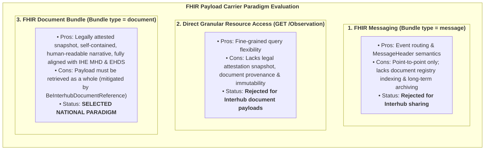

# Design Rationale: Why FHIR Document Bundles

> **Where this page sits in the guide** — *Architecture*, page 2 of 2. This is the **why** behind every specification page: which FHIR paradigms were evaluated, which were rejected, and why `Bundle.type = #document` plus a decoupled `DocumentReference` was mandated. Readers who wonder *"why can't I just `GET /Observation`?"* should start here.
>
> * **Owned by this page:** the carrier-paradigm evaluation, document immutability and legal attestation, and the rationale for a decoupled discovery envelope.
> * **Specified elsewhere:** the envelope fields → [Envelope & Metadata](envelope-and-metadata.html); the transactions that carry these bundles → [Transactions](transactions.html); deep dive into IHE MHD profile choices → [IHE MHD Alignment](ihe-mhd-alignment.html); concrete payloads → [Laboratory Reports](lab-report-sharing.html) and [Telemonitoring](mapping-telemonitoring-to-hub.html).
> * **Previous:** [Architecture & Federation Model](architecture.html) · **Next:** [Envelope & Metadata](envelope-and-metadata.html)

## 1. Context & Architectural Problem

FHIR offers several ways of moving clinical data between systems, and they are not interchangeable. Picking one for the Belgian hub network meant weighing four requirements against each other:
1. **Clinical Integrity & Immutability**: A shared medical record (such as a laboratory report or discharge letter) must represent an authenticated snapshot in time that cannot change retroactively without explicit versioning.
2. **Metadata Discovery vs. Content Retrieval**: Separation between lightweight search operations across millions of records and targeted content retrieval.
3. **Decoupled Architecture**: Preserving autonomy between independent hub source systems (hospital EHRs, laboratory information systems, pharmacy and practice software) and regional hubs without requiring complex cross-enterprise database synchronization.
4. **European Harmonization**: Alignment with the **European Health Data Space (EHDS)** and **IHE MHD**, analysed in [EHDS Alignment](ehds-alignment.html) and [IHE MHD Alignment](ihe-mhd-alignment.html).

---

## 2. Evaluation of Candidate Carrier Paradigms



| Option | Pros | Cons / Reason for Rejection | Selection Status |
| :--- | :--- | :--- | :--- |
| **1. FHIR Messaging** (`Bundle.type = #message`) | Built-in MessageHeader and event routing semantics. | Point-to-point oriented; does not support document indexing, search, & archive. | Rejected |
| **2. Direct Resource Queries** (RESTful `Observation` / `DiagnosticReport`) | Fine-grained queries on individual resources (e.g. `GET /Observation`). | Lacks document integrity, authorship context, legal attestation, & immutability. | Rejected |
| **3. FHIR Document Bundle** (`Bundle.type = #document` + Root `Composition`) | Self-contained & immutable snapshot, mandatory narrative for safety, complete clinical context & author, fully aligned with IHE MHD & EHDS. | Requires full bundle retrieval for viewing (addressed by decoupled metadata). | **SELECTED PARADIGM** (Mandated) |

### 2.1 Why FHIR Messaging (`Bundle.type = #message`) Was Not Selected
Messaging suits event-driven, asynchronous routing between endpoints that already know about one another, much as HL7 v2 did. The Belgian hub ecosystem works the other way round. It is an **indexing, discovery and retrieval** network: a document is registered or exposed once and then catalogued, searched years later, and fetched on demand across hubs by consumers the author never anticipated. Messaging has no registry query semantics to offer for any of that, and nothing equivalent to `ITI-67`.

### 2.2 Why Direct Granular RESTful Resource Access Was Not Selected
Opening `Observation` and `DiagnosticReport` to direct federated querying would point clinical search traffic straight at operational source systems, widen the attack surface, and discard the provenance, institutional authorship and legal signature that make a result citable in the first place. There is a subtler cost as well: a record assembled on the fly from live source tables changes whenever those tables change, so what a clinician read last year cannot reliably be reproduced today.

### 2.3 The Mandated Solution: FHIR Document Bundles (`Bundle.type = #document`)
The Belgian Interhub standard mandates that **all shared clinical payloads are strictly exchanged as FHIR Bundles of type `document`**:
1. **Immutability & Legal Validity**: A FHIR Document is a legally attested, digitally signable snapshot in time. Once generated, its content is fixed. Revisions require creating a new document version linked via `relatesTo`.
2. **Clinical Safety Narrative (`Composition.section.text`)**: Every document section includes a human-readable XHTML narrative. Clinicians can safely view the content on any workstation, even if the receiving system does not support all discrete code systems.
3. **Self-Contained Completeness**: All resources referenced by the Composition are bundled within the `Bundle.entry` list, eliminating external URL dependencies during retrieval or long-term archiving.

The normative constraints implementing this decision (`Bundle.type`, `entry[0]`, narrative and completeness requirements) are specified in [Transactions §3.3](transactions.html#33-payload-structure-strictly-fhir-bundles-of-type-document), and shown in practice in [Laboratory Reports](lab-report-sharing.html) and [Telemonitoring](mapping-telemonitoring-to-hub.html).

---

## 3. The Role of Contained MHD Comprehensive DocumentReference

Belgian Interhub document sharing adopts **`IHE.MHD.Comprehensive.DocumentReference` with Contained Resources** for discovery metadata (`ITI-67`).

```
Federated Discovery (MHD ITI-67) ──► Returns DocumentReference
├── Contained: BePatient (Demographics snapshot)
├── Contained: BeOrganization (Answering Hub)
├── Contained: BeOrganization (Hospital / Laboratory)
├── Contained: BePractitioner (Authoring Physician)
└── content.attachment.url ──► Retrieve Payload ($retrieve-document / ITI-68)
```

### Architectural Benefits:
1. **Solving the Multi-Author Barrier**: Captures the answering regional hub, originating healthcare institution, and authoring practitioner in one entry, preserving the legacy KMEHR retrieval key without being blocked by federal `1..1` constraints.
2. **Zero Secondary Network Queries**: Integrators rendering search lists receive all necessary display names, NIHDI numbers, and CBE identifiers directly inside the search response bundle, eliminating the N+1 dereferencing problem across federated regional gateways.
3. **Point-in-Time Demographic Integrity**: Captures patient demographics as an immutable snapshot at publication time (`context.sourcePatientInfo`), separating historical record states from live MPI queries.
4. **Cross-Border EHDS & IHE Compatibility**: Conforms natively to European cross-border profiling while respecting Belgian national identity constraints.

For a detailed comparative analysis of MHD Minimal vs Comprehensive and Contained vs UnContained profiles, see [IHE MHD Alignment](ihe-mhd-alignment.html).

---

## Continue reading

* **Previous:** [Architecture & Federation Model](architecture.html) — the network these decisions apply to.
* **Next:** [Envelope & Metadata](envelope-and-metadata.html) — the discovery envelope this page justifies, specified element by element.
* **Related:** [IHE MHD Alignment](ihe-mhd-alignment.html) for deep-dive technical comparisons; [Transactions §3.3](transactions.html#33-payload-structure-strictly-fhir-bundles-of-type-document) for the normative bundle constraints; [Laboratory Reports](lab-report-sharing.html) and [Telemonitoring](mapping-telemonitoring-to-hub.html) for concrete payloads.
