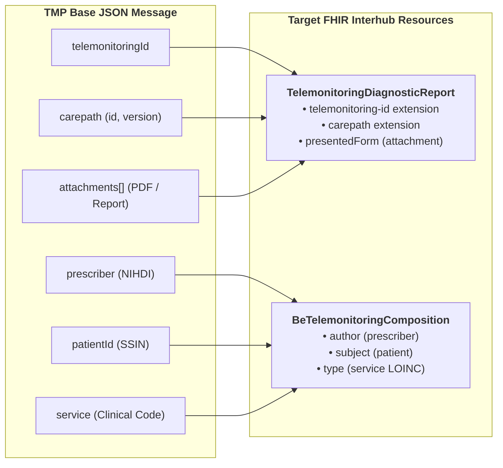

# TMP Base Message (Telemonitoring Source Example)

> **Where this page sits in the guide** — *Document Types*, appendix to [Telemonitoring](mapping-telemonitoring-to-hub.html). It shows the raw TMP JSON message that the telemonitoring transformation starts from. The normative field-by-field mapping is in [Telemonitoring §3](mapping-telemonitoring-to-hub.html#3-mapping-from-proprietary-tmp-json-to-fhir-document), and the resulting document bundle in [Telemonitoring §5](mapping-telemonitoring-to-hub.html#5-complete-json-document-walkthrough).

Everything in this IG's telemonitoring chain begins with one simple JSON message: the payload a provider pushes to a hub source — a hospital, a home-care organisation, a practice — or to any other consumer.



This is an example of a message that can be sent by a provider:

```json
{
  "telemonitoringId": "",
  "status": "requested",
  "prescriber": "",
  "patientId": "",
  "service": "",
  "prescriberApplication": "",
  "attachments": [
    {
      "id": "",
      "name": "",
      "etag": "",
      "contentType": "application/pdf",
      "contentLanguage": "nl",
      "lastModified": "",
      "uri": "",
      "headers": {
        "additionalProperty": ""
      }
    }
  ],
  "carepath": {
    "id": "",
    "version": ""
  },
  "patientAuthenticationToken": "",
  "patientAuthenticationUrl": ""
}
```

---

## Continue reading

* **Back to:** [Telemonitoring](mapping-telemonitoring-to-hub.html) — the normative transformation of this message into a FHIR document bundle.
* **Related:** [Artifacts](artifacts.html) for the `TelemonitoringId`, `Carepath` and `PrescriberApplication` extensions referenced above.
