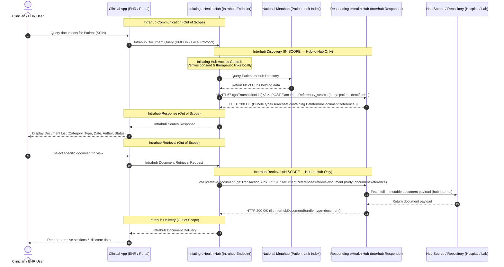
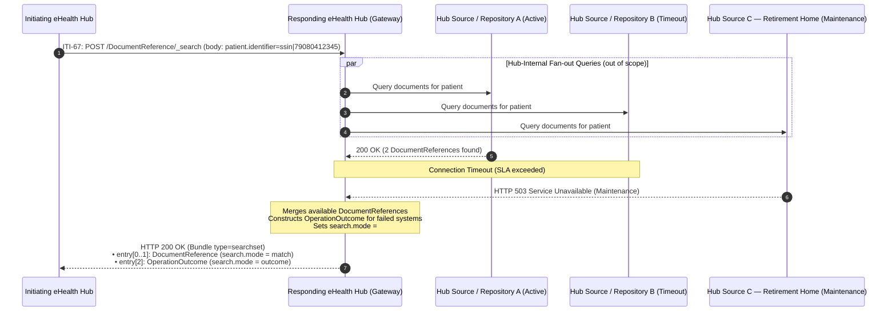
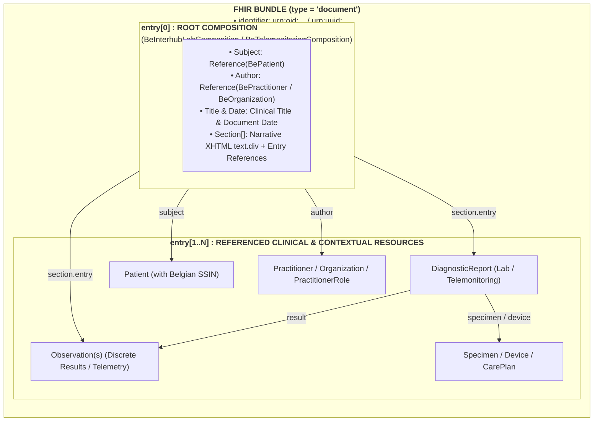
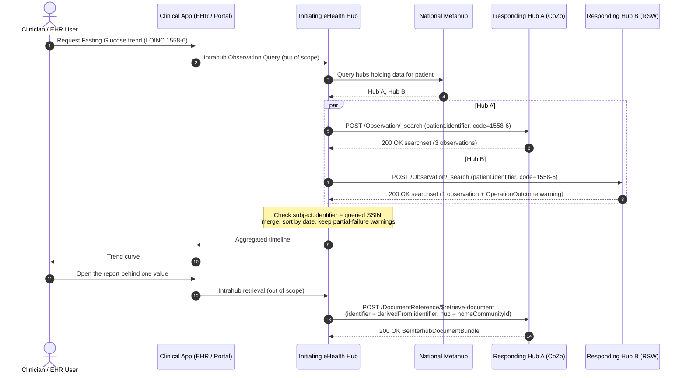

# Interhub Transactions: getTransactionList, getTransaction & Lab Observation Search

> **Where this page sits in the guide** — *Specification*, page 2 of 4. This page is the **wire-level contract**: URLs, parameters, status codes and response shapes.
>
> * **Owned by this page:** `getTransactionList` (ITI-67), `getTransaction` (ITI-68), the laboratory observation search, partial-failure `OperationOutcome` handling, and the error-code crosswalk.
> * **Not covered here:** the fields of the `DocumentReference` returned by ITI-67 → [Envelope & Metadata](envelope-and-metadata.html); how the calling hub is authenticated and the request is tamper-proofed → [Security & Authentication](security.html); what a real payload looks like per domain → [Laboratory Reports](lab-report-sharing.html) and [Telemonitoring](mapping-telemonitoring-to-hub.html); why the payload is a document bundle at all → [Design Rationale](resource-considerations.html).
> * **Previous:** [Envelope & Metadata](envelope-and-metadata.html) · **Next:** [Security & Authentication](security.html)

## 1. Overview of Interhub Transactions

The Belgian federated hub architecture relies on three core interactions:
1. **Document Discovery (`getTransactionList`)**: Enables an initiating hub to discover available clinical documents for a patient across all connected regional hubs.
2. **Document Retrieval (`getTransaction`)**: Enables an initiating hub to retrieve the complete, immutable clinical document payload for a specific transaction from the authoritative responding hub.
3. **Laboratory Observation Search (DIGIRELAB)**: Enables an initiating hub to search across the federation for individual laboratory results by LOINC code, each linked to the laboratory report it was extracted from.

> **Scope Boundary (Intrahub vs. Interhub)**: Clinical applications (EHRs, LIS, regional/patient portals) interact with their local Hub via **Intrahub protocols** (out of scope). The local Hub, acting as the **initiating hub**, executes these Interhub transactions across the federation. Interhub communication is strictly Hub-to-Hub.

In the modernized FHIR-based Belgian Interhub standard, these operations are mapped to RESTful HL7® FHIR® R4 interactions, with strict enforcement of HTTP POST:

| Legacy / Domain Operation | Target FHIR / Interhub Transaction | Target Resource / Action | Payload Returned |
| :--- | :--- | :--- | :--- |
| **`getTransactionList`** | **MHD ITI-67** (`Find DocumentReferences`) | `POST [base]/DocumentReference/_search`<br/>(`application/x-www-form-urlencoded` body) | `Bundle` (type = `searchset`) containing `BeInterhubDocumentReference` entries |
| **`getTransaction`** | **MHD ITI-68** (`Retrieve Document`) / `$retrieve-document` | `POST [base]/DocumentReference/$retrieve-document`<br/>(Body: `Parameters` with `documentReference`) | Complete `BeInterhubDocumentBundle` (type = `document`) |
| **`getTransactionSet`** | **MHD ITI-68** with content negotiation / `$retrieve-document` | `POST [base]/DocumentReference/$retrieve-document`<br/>with `Accept: application/pdf` or `application/fhir+json` | The same document, either as a set of related transactions or as a hub-rendered PDF — see [§3.4](#34-transaction-sets-and-rendered-pdf-gettransactionset) |
| *(new, DIGIRELAB)* | **Laboratory Observation Search**, based on **IHE QEDm PCC-44** | `POST [base]/Observation/_search`<br/>(Body: `patient.identifier`, `code`, `date`) | `Bundle` (type = `searchset`) containing `BeInterhubLabObservation` entries |

> **Endpoint Restriction**: A responding hub serves only `DocumentReference` (search and `$retrieve-document`) and `Observation` (search). There are no endpoints for Patient, Practitioner, Organization, Specimen or ServiceRequest. Every reference in a returned resource is either a contained resource or a **logical reference** by national business identifier (SSIN, NIHDI, CBE, document uniqueId), never a URL to resolve.

The resource returned by ITI-67 is specified field by field in [Envelope & Metadata](envelope-and-metadata.html#2-element-by-element-specification-beinterhubdocumentreference). The resource returned by `$retrieve-document` is a `BeInterhubDocumentBundle`, whose per-domain content is specified in [Laboratory Reports](lab-report-sharing.html) and [Telemonitoring](mapping-telemonitoring-to-hub.html). The laboratory observation search is specified in [§4](#4-transaction-3-laboratory-observation-search-digirelab). The legacy SOAP operations in the left-hand column are crosswalked in [KMEHR to FHIR Mapping](mapping-kmehr-to-hub.html).



---

## 2. Transaction 1: `getTransactionList` (MHD ITI-67 `Find DocumentReferences`)

### 2.1 Trigger & Scope
An **initiating hub** triggers this transaction across partner regional hubs to query for health documents available for a patient identified by their Belgian **SSIN / INSS** (following a local Intrahub request from a clinical application or user).

The **initiating hub** performs its access control before emitting this transaction (e.g. by checking the Metahub for an informed consent / therapeutic link, or by consulting its own local database). The answering hub authenticates the calling hub, trusts it, and answers the query. This trust model is only summarised here; it is specified in full — together with the responsibility split between the two hubs — in [Security & Authentication §1.1](security.html#11-trust-model-access-control-is-the-initiating-hubs-responsibility).

### 2.2 HTTP Interaction & Query Parameters (POST-Based Search)

> **Architectural Privacy Rationale: POST Everywhere**: In HTTP GET requests, query parameters and URLs are routinely logged in plaintext by web servers, reverse proxies, API gateways, load balancers, SIEM systems, browser histories, and intermediary access logs (`access.log`). Placing sensitive patient identifiers (such as Belgian SSINs) or clinical search filters in URL query strings creates major data leakage risks. To enforce strict medical confidentiality and GDPR compliance, Belgian Interhub mandates **HTTP POST** for document discovery searches, with parameters submitted securely in the HTTP request body.

```http
POST [base]/DocumentReference/_search HTTP/1.1
Host: hub.cozo.be
Content-Type: application/x-www-form-urlencoded
Accept: application/fhir+json; fhirVersion=4.0
Authorization: Bearer <calling-hub-authentication-token>

patient.identifier=https%3A%2F%2Fwww.ehealth.fgov.be%2Fstandards%2Ffhir%2Fcore%2FNamingSystem%2Fssin%7C79080412345&category=https%3A%2F%2Fwww.ehealth.fgov.be%2Fstandards%2Ffhir%2Fcore%2FCodeSystem%2Fcd-transaction%7Clabresult&date=ge2026-01-01T00%3A00%3A00Z&date=le2026-12-31T23%3A59%3A59Z&status=current&_count=50
```

The `Authorization: Bearer` token above is obtained through one of the three connection routes specified in [Security & Authentication §2](security.html#2-the-three-authentication--connection-routes-proposal); every request additionally carries DPoP or RFC 9421 tamper-proofing headers ([§3](security.html#3-replay-attack-prevention--query-tamper-proofing-dpop-rfc-9449--rfc-9421)).

#### Conformance & Normative Rules for POST Search:
1. **HTTP Method & Endpoint**: Consumers **SHALL use `POST [base]/DocumentReference/_search`**.
2. **Body Encoding**: Search parameters **SHALL be encoded in the request body using `application/x-www-form-urlencoded`**. Parameters **SHALL NOT be placed in the URL query string** in the Belgian profile to prevent sensitive patient identifier leakage in network access logs.
3. **FHIR Search Semantics**: Search parameter names, modifiers, prefixes, repetition, and combination semantics **SHALL follow standard HL7 FHIR R4 search rules**.
4. **Server Conformance**: Responding servers **SHALL support POST search**. Responding servers MAY additionally support GET search as required by generic FHIR/IHE conformance, but consumers operating within Belgian Interhub SHALL use POST.
5. **Response Representation**: Successful response **SHALL be `200 OK` with a `Bundle.type = searchset`**, formatted according to the `Accept` header (`application/fhir+json; fhirVersion=4.0`).
6. **Error Handling**: Failures at the FHIR layer SHALL return the appropriate `4xx`/`5xx` HTTP status code accompanied by an `OperationOutcome` resource.

#### Explicit Rules for POST-Based Pagination:
FHIR R4 notes that while an initial search may be POST, subsequent page links in `Bundle.link[relation="next"].url` normally contain URLs. To prevent query criteria leakage during pagination and maintain a strict zero-GET policy for consumers:
* Initiating hubs **SHALL execute pagination requests using HTTP POST**.
* Responding servers **SHOULD support POST-based continuation**:
  ```http
  POST [base]/DocumentReference/_search?<server-continuation-parameters>
  Content-Type: application/x-www-form-urlencoded
  ```
  or by including continuation parameters directly in the `application/x-www-form-urlencoded` request body.
* Server-generated continuation tokens/parameters **MUST remain opaque** to the consumer.

#### Supported Search Parameters:

| FHIR Search Parameter | Syntax & Modifier | KMEHR Concept | Description |
| :--- | :--- | :--- | :--- |
| **`patient.identifier`** *(Mandatory)* | `token` (`system\|value`) | `folder/patient/id[@S="INSS"]` | Patient's national Social Security Identification Number (SSIN). Systems must support both `https://www.ehealth.fgov.be/standards/fhir/core/NamingSystem/ssin` and `urn:oid:1.3.6.1.4.1.21297.100.1.1`. |
| **`category`** *(Optional)* | `token` (`system\|code`) | `transaction/cd[@S="CD-TRANSACTION"]`, and any `transaction/cd[@S="LOCAL"]` | Filters by Belgian document category (e.g. `sumehr`, `labresult`, `discharge`, `telemonitoring`). A hub matches on **any** coding present in the `CodeableConcept`, national or local ([Envelope & Metadata §4.2](envelope-and-metadata.html#42-multiple-codings-national-and-local-codes-for-the-same-concept)). |
| **`type`** *(Optional)* | `token` (`system\|code`) | *derived* — see note below | Filters by clinical LOINC code (e.g. `http://loinc.org\|11502-2` for Lab Report, `http://loinc.org\|18754-2` for Holter Study). A KMEHR hub transaction is not natively typed with LOINC; the responding hub derives the coding from `CD-TRANSACTION` and the local `cd`, so a hub that cannot derive one returns no match rather than a wrong one. |
| **`date`** *(Optional)* | `date` (`ge`, `le`, `gt`, `lt`) | `transaction/date` + `transaction/time`, mapped onto `select/transaction/begindate` & `enddate` | Filters on the **document** date/time, not on when the hub indexed it. The legacy `select/transaction/begindate`/`enddate` filter is date-granular; a hub that can only filter by whole days MUST widen the range and filter the remainder itself rather than dropping matches. |
| **`author.identifier`** *(Optional)* | `token` (`system\|value`) | `transaction/author/hcparty/id` | Filters by authoring physician NIHDI (`1.3.6.1.4.1.21297.100.9.1`) or institution NIHDI (`100.11.1`). |
| **`status`** *(Optional)* | `token` (`current`, `superseded`) | presence in the hub index | Filter on metadata status. Defaults to `current`. |
| **`_id`** / **`identifier`** *(Optional)* | `token` | `transaction/id` | Query for a specific document reference by ID. |
| **`_count`** *(Optional)* | `integer` | `maxrows` (audit-trail selects) | Maximum number of results requested per page. |
| **`_sort`** *(Optional)* | `string` (`-date`, `date`) | Order of results | Defaults to descending by document date (`-date`). |
| **`searchtype`** *(Optional, Belgian)* | `token` (`local` \| `federated`) | `select/searchtype` | Restricts the search to the responding hub's **own** index (`local`) instead of letting it fan out to its connected hub sources and partner hubs (`federated`, the default). The legacy hub services carry this as `select/searchtype = local`; without it, a consumer cannot ask a hub "what do *you* hold" and cross-hub queries duplicate work. Formal `SearchParameter` definition pending — see the project TODO. |

The *KMEHR Concept* column above is a pointer, not the full crosswalk: the complete bi-directional field mapping is in [KMEHR to FHIR Mapping §2](mapping-kmehr-to-hub.html#2-master-metadata-mapping-matrix), and the elements being searched are defined in [Envelope & Metadata §2](envelope-and-metadata.html#2-element-by-element-specification-beinterhubdocumentreference).

### 2.3 Response Structure (`Bundle` type = `searchset`)

The answering hub returns an **HTTP 200 OK** with a FHIR `Bundle` of type `searchset`:
* `Bundle.total`: Total number of matching document entries.
* `Bundle.entry[]`: Array of matching `BeInterhubDocumentReference` resources.
* If no matching documents exist, an empty searchset Bundle is returned (`total = 0`, `entry = []`).

Each entry conforms to `BeInterhubDocumentReference`; refer to [Envelope & Metadata](envelope-and-metadata.html#2-element-by-element-specification-beinterhubdocumentreference) for the meaning and cardinality of the elements shown in the example below, and to [§3.1](envelope-and-metadata.html#31-home-community-id-beexthomecommunityid) to [§3.4](envelope-and-metadata.html#34-source-system-recording-timestamp-beextrecorddatetime) for its extensions.

```json
{
  "resourceType": "Bundle",
  "id": "bundle-transaction-list-response",
  "type": "searchset",
  "total": 1,
  "entry": [
    {
      "fullUrl": "https://hub.cozo.be/fhir/DocumentReference/DocRefLabReportContainedExample",
      "resource": {
        "resourceType": "DocumentReference",
        "id": "DocRefLabReportContainedExample",
        "meta": {
          "profile": [
            "https://www.ehealth.fgov.be/standards/fhir/interhub/StructureDefinition/be-interhub-documentreference"
          ]
        },
        "contained": [
          {
            "resourceType": "Patient",
            "id": "ContainedPatient",
            "identifier": [
              {
                "system": "https://www.ehealth.fgov.be/standards/fhir/core/NamingSystem/ssin",
                "value": "79080412345"
              }
            ],
            "name": [
              {
                "family": "Peeters",
                "given": [ "Jan" ]
              }
            ],
            "gender": "male",
            "birthDate": "1979-08-04"
          },
          {
            "resourceType": "Organization",
            "id": "ContainedHubCoZo",
            "identifier": [
              {
                "system": "urn:ietf:rfc:3986",
                "value": "urn:oid:1.3.6.1.4.1.21297.1.3"
              }
            ],
            "type": [
              {
                "coding": [
                  {
                    "system": "https://www.ehealth.fgov.be/standards/fhir/core/CodeSystem/cd-hcparty",
                    "code": "application",
                    "display": "software application"
                  }
                ]
              }
            ],
            "name": "CoZo Regional Hub"
          },
          {
            "resourceType": "Organization",
            "id": "ContainedOrgUZLeuven",
            "identifier": [
              {
                "system": "https://www.ehealth.fgov.be/standards/fhir/core/NamingSystem/nihdi",
                "value": "71000012"
              },
              {
                "system": "https://www.ehealth.fgov.be/standards/fhir/core/NamingSystem/cbe",
                "value": "0419052173"
              }
            ],
            "type": [
              {
                "coding": [
                  {
                    "system": "https://www.ehealth.fgov.be/standards/fhir/core/CodeSystem/cd-hcparty",
                    "code": "orghospital",
                    "display": "hospital"
                  }
                ]
              }
            ],
            "name": "UZ Leuven"
          },
          {
            "resourceType": "Practitioner",
            "id": "ContainedDrGovaerts",
            "identifier": [
              {
                "system": "https://www.ehealth.fgov.be/standards/fhir/core/NamingSystem/nihdi",
                "value": "10000007999"
              }
            ],
            "name": [
              {
                "family": "Govaerts",
                "given": [ "Danièle" ]
              }
            ]
          }
        ],
        "extension": [
          {
            "url": "https://www.ehealth.fgov.be/standards/fhir/interhub/StructureDefinition/be-ext-home-community-id",
            "valueUri": "urn:oid:1.3.6.1.4.1.21297.1.3"
          },
          {
            "url": "https://www.ehealth.fgov.be/standards/fhir/interhub/StructureDefinition/be-ext-patient-access",
            "extension": [
              { "url": "access", "valueCode": "yes" },
              { "url": "accessDate", "valueDate": "2026-03-15" }
            ]
          },
          {
            "url": "https://www.ehealth.fgov.be/standards/fhir/interhub/StructureDefinition/be-ext-record-datetime",
            "valueInstant": "2026-03-15T10:35:00Z"
          }
        ],
        "masterIdentifier": {
          "system": "urn:ietf:rfc:3986",
          "value": "urn:oid:1.3.6.1.4.1.21297.100.2.1.815933567"
        },
        "identifier": [
          {
            "system": "urn:ietf:rfc:3986",
            "value": "urn:oid:1.3.6.1.4.1.21297.100.2.1.815933567"
          },
          {
            "system": "urn:ietf:rfc:3986",
            "value": "urn:uuid:8b3e2365-5136-46b5-901d-5b32ec8ef991"
          },
          {
            "system": "https://uzleuven.be/lab/reports",
            "value": "LAB-2026-03-815933567"
          }
        ],
        "status": "current",
        "category": [
          {
            "coding": [
              {
                "system": "https://www.ehealth.fgov.be/standards/fhir/core/CodeSystem/cd-transaction",
                "code": "labresult",
                "display": "Laboratory Result"
              }
            ]
          }
        ],
        "type": {
          "coding": [
            {
              "system": "http://loinc.org",
              "code": "11502-2",
              "display": "Laboratory report"
            }
          ]
        },
        "subject": {
          "reference": "Patient/PatientPeeters",
          "identifier": {
            "system": "https://www.ehealth.fgov.be/standards/fhir/core/NamingSystem/ssin",
            "value": "79080412345"
          }
        },
        "date": "2026-03-15T10:30:00Z",
        "author": [
          {
            "extension": [
              {
                "url": "https://www.ehealth.fgov.be/standards/fhir/interhub/StructureDefinition/be-ext-hcparty-type",
                "valueCoding": {
                  "system": "https://www.ehealth.fgov.be/standards/fhir/core/CodeSystem/cd-hcparty",
                  "code": "application",
                  "display": "software application"
                }
              }
            ],
            "reference": "#ContainedHubCoZo"
          },
          {
            "extension": [
              {
                "url": "https://www.ehealth.fgov.be/standards/fhir/interhub/StructureDefinition/be-ext-hcparty-type",
                "valueCoding": {
                  "system": "https://www.ehealth.fgov.be/standards/fhir/core/CodeSystem/cd-hcparty",
                  "code": "orghospital",
                  "display": "hospital"
                }
              }
            ],
            "reference": "#ContainedOrgUZLeuven"
          },
          {
            "extension": [
              {
                "url": "https://www.ehealth.fgov.be/standards/fhir/interhub/StructureDefinition/be-ext-hcparty-type",
                "valueCoding": {
                  "system": "https://www.ehealth.fgov.be/standards/fhir/core/CodeSystem/cd-hcparty",
                  "code": "persphysician",
                  "display": "physician"
                }
              }
            ],
            "reference": "#ContainedDrGovaerts"
          }
        ],
        "authenticator": {
          "extension": [
            {
              "url": "https://www.ehealth.fgov.be/standards/fhir/interhub/StructureDefinition/be-ext-hcparty-type",
              "valueCoding": {
                "system": "https://www.ehealth.fgov.be/standards/fhir/core/CodeSystem/cd-hcparty",
                "code": "persphysician",
                "display": "physician"
              }
            }
          ],
          "reference": "#ContainedDrGovaerts"
        },
        "custodian": {
          "extension": [
            {
              "url": "https://www.ehealth.fgov.be/standards/fhir/interhub/StructureDefinition/be-ext-hcparty-type",
              "valueCoding": {
                "system": "https://www.ehealth.fgov.be/standards/fhir/core/CodeSystem/cd-hcparty",
                "code": "orghospital",
                "display": "hospital"
              }
            }
          ],
          "reference": "#ContainedOrgUZLeuven"
        },
        "relatesTo": [
          {
            "code": "replaces",
            "target": {
              "identifier": {
                "system": "urn:ietf:rfc:3986",
                "value": "urn:oid:1.3.6.1.4.1.21297.100.2.1.815933566"
              },
              "display": "Preliminary laboratory report of 2026-03-15 08:40"
            }
          }
        ],
        "description": "Comprehensive Blood Biochemistry and Hematology Laboratory Report",
        "securityLabel": [
          {
            "coding": [
              {
                "system": "http://terminology.hl7.org/CodeSystem/v3-Confidentiality",
                "code": "N",
                "display": "Normal"
              }
            ]
          }
        ],
        "content": [
          {
            "attachment": {
              "contentType": "application/fhir+json",
              "language": "nl-BE",
              "url": "https://hub.cozo.be/fhir/Bundle/bundle-lab-report-example-01",
              "title": "Lab Report - Peeters Jan",
              "creation": "2026-03-15T10:30:00Z"
            },
            "format": {
              "system": "https://www.ehealth.fgov.be/standards/fhir/interhub/CodeSystem/be-cs-interhub-format-codes",
              "code": "urn:be:fgov:ehealth:lab:document:1.0",
              "display": "Belgian Lab Report FHIR Document (v1.0)"
            }
          }
        ],
        "context": {
          "period": {
            "start": "2026-03-15T08:00:00Z",
            "end": "2026-03-15T10:30:00Z"
          },
          "facilityType": {
            "coding": [
              {
                "system": "http://snomed.info/sct",
                "code": "257622000",
                "display": "Healthcare related organization"
              }
            ]
          },
          "practiceSetting": {
            "coding": [
              {
                "system": "http://snomed.info/sct",
                "code": "394595002",
                "display": "Pathology"
              }
            ]
          },
          "sourcePatientInfo": {
            "reference": "#ContainedPatient"
          }
        }
      }
    }
  ]
}
```

### 2.4 Downstream System Unavailability, Partial Failures & OperationOutcome Handling

A single discovery query fans out. To answer one `getTransactionList` (MHD ITI-67), the responding hub interrogates hospital EHRs, independent laboratory information systems, pharmacy and practice software, care homes and remote partner hubs, then merges whatever comes back.

Some of them will not come back. A system may be in scheduled maintenance, sitting behind a network partition, or simply slower than the configured SLA timeout. In a federation of this size that is ordinary operation rather than an error condition, and the specification treats it accordingly.



#### 2.4.1 Architectural Rules for Partial Failures

1. **HTTP Status Code**: The answering Hub **MUST return HTTP 200 OK** (not 500, 502, or 504) as long as the search request was syntactically valid and any available portion of the federated network responded.
2. **Searchset Bundle Assembly**:
   * `Bundle.total`: Represents the total count of successfully matched `DocumentReference` records.
   * `Bundle.entry[]` (`search.mode = "match"`): All valid `BeInterhubDocumentReference` resources discovered from responding nodes.
   * `Bundle.entry[]` (`search.mode = "outcome"`): A populated **`OperationOutcome`** resource capturing specific issues for each downstream system that failed to reply.
3. **No Phantom Empty States**: A hub MUST NEVER return an empty `Bundle (total = 0)` without an `OperationOutcome` when underlying systems failed, as this could mislead the treating physician into believing no medical records exist for the patient.

#### 2.4.2 OperationOutcome Issue Structure & Coding

Each failing or timed-out downstream system generates an entry in the `OperationOutcome.issue` list:

| `OperationOutcome.issue` Field | Value / Datatype | Description & Usage |
| :--- | :--- | :--- |
| **`severity`** | `code` (`warning` \| `information`) | Fixed to `warning` for partial failures where other document records are returned. |
| **`code`** | `code` (`timeout` \| `transient` \| `exception` \| `suppressed`) | `timeout`: Downstream system exceeded SLA response time.<br/>`transient`: System down for maintenance (HTTP 503).<br/>`exception`: Unexpected internal subsystem error.<br/>`suppressed`: Downstream system returned a partial result set for its own local reasons. |
| **`details`** | `CodeableConcept` | Standard issue type from `http://terminology.hl7.org/CodeSystem/issue-type` with a human-readable text description. |
| **`diagnostics`** | `string` | Diagnostic text explicitly identifying the failing repository/system (including NIHDI license, CBE number, or URI) and stating that records from that location could not be included. |

#### 2.4.3 Complete Searchset Bundle Example with OperationOutcome

Below is a complete HTTP 200 OK searchset response: one matched laboratory document reference, plus an embedded `OperationOutcome` reporting the downstream systems that did not answer.

```json
{
  "resourceType": "Bundle",
  "id": "bundle-transaction-list-response-partial",
  "type": "searchset",
  "total": 1,
  "entry": [
    {
      "fullUrl": "https://hub.cozo.be/fhir/DocumentReference/docref-lab-example-01",
      "search": {
        "mode": "match"
      },
      "resource": {
        "resourceType": "DocumentReference",
        "id": "docref-lab-example-01",
        "meta": {
          "profile": [
            "https://www.ehealth.fgov.be/standards/fhir/interhub/StructureDefinition/be-interhub-documentreference"
          ]
        },
        "status": "current",
        "category": [
          {
            "coding": [
              {
                "system": "https://www.ehealth.fgov.be/standards/fhir/core/CodeSystem/cd-transaction",
                "code": "labresult",
                "display": "Laboratory Result"
              }
            ]
          }
        ],
        "type": {
          "coding": [
            {
              "system": "http://loinc.org",
              "code": "11502-2",
              "display": "Laboratory report"
            }
          ]
        },
        "subject": {
          "reference": "Patient/PatientPeeters",
          "identifier": {
            "system": "https://www.ehealth.fgov.be/standards/fhir/core/NamingSystem/ssin",
            "value": "79080412345"
          }
        },
        "content": [
          {
            "attachment": {
              "contentType": "application/fhir+json",
              "language": "nl-BE",
              "url": "https://hub.cozo.be/fhir/Bundle/bundle-lab-report-example-01",
              "title": "Lab Report - Peeters Jan",
              "creation": "2026-03-15T10:30:00Z"
            },
            "format": {
              "system": "https://www.ehealth.fgov.be/standards/fhir/interhub/CodeSystem/be-cs-interhub-format-codes",
              "code": "urn:be:fgov:ehealth:lab:document:1.0",
              "display": "Belgian Lab Report FHIR Document (v1.0)"
            }
          }
        ]
      }
    },
    {
      "fullUrl": "urn:uuid:6a28746c-63cf-4a69-8db3-705a5a1f26f2",
      "search": {
        "mode": "outcome"
      },
      "resource": {
        "resourceType": "OperationOutcome",
        "id": "outcome-partial-timeout-example",
        "issue": [
          {
            "severity": "warning",
            "code": "timeout",
            "details": {
              "coding": [
                {
                  "system": "http://terminology.hl7.org/CodeSystem/issue-type",
                  "code": "timeout",
                  "display": "Timeout"
                }
              ],
              "text": "Downstream clinical repository timeout"
            },
            "diagnostics": "Timeout communicating with connected laboratory repository (NIHDI: 71000012). Results from this facility may be incomplete or omitted from this list."
          },
          {
            "severity": "warning",
            "code": "transient",
            "details": {
              "coding": [
                {
                  "system": "http://terminology.hl7.org/CodeSystem/issue-type",
                  "code": "transient",
                  "display": "Transient Issue"
                }
              ],
              "text": "Downstream system unavailable (maintenance)"
            },
            "diagnostics": "Connected hub source (NIHDI: 72000034) is currently unavailable due to scheduled maintenance. Historical documents from this organisation are temporarily excluded."
          }
        ]
      }
    }
  ]
}
```

#### 2.4.4 Initiating Hub & Consuming Gateway Responsibilities

Initiating hubs and gateways processing `getTransactionList` (MHD ITI-67) responses **MUST implement the following behaviours** before relaying information to local Intrahub consumers:

1. **Inspect `search.mode = "outcome"`**: Hub parsers must actively scan the `Bundle.entry` array for resources with `resourceType == "OperationOutcome"` (or `search.mode == "outcome"`).
2. **Propagate Partial Failure Indicators**: When an `OperationOutcome` with severity `warning` is returned, the initiating hub MUST propagate this partial-failure state through its Intrahub protocol so clinical interfaces can alert the clinician that records from specific repositories could not be retrieved:
   > **Notice: document list incomplete**  
   > *One or more connected clinical repositories did not respond (e.g. system maintenance or timeout). Some historical patient documents may not appear in this list.*
3. **Auditability**: The initiating hub SHOULD log the diagnostics in local access audit logs so support teams can diagnose why specific downstream repositories failed.

---

## 3. Transaction 2: `getTransaction` (Belgian FHIR `$retrieve-document` Operation)

### 3.1 Trigger & Scope
This transaction fires when an initiating hub requests a specific document payload from a responding hub (following a retrieval request received locally via Intrahub). As with discovery, the access decision was already taken by the initiating hub; the responding hub authenticates the calling hub, serves the payload and logs the retrieval.

### 3.2 HTTP Interaction: The `$retrieve-document` Operation

> **Architectural Rationale: Why an Operation rather than POST read?**  
> In HL7 FHIR R4, the standard `read` interaction (`GET [base]/Bundle/{id}` or `GET [base]/Binary/{id}`) is strictly defined as an HTTP GET interaction. Attempting `POST [base]/Bundle/{id]` is invalid FHIR.  
> Furthermore, transmitting document identifiers or direct repository URIs in GET requests causes those URLs to be logged in plaintext across intermediate proxies and network access logs.  
> To maintain strict FHIR R4 compliance while enforcing the Belgian **POST-everywhere privacy mandate**, document retrieval is formally specified as a type-level FHIR Operation: **`POST [base]/DocumentReference/$retrieve-document`**.

#### Operation Contract (`OperationDefinition/be-op-retrieve-document`):
* **Operation Code**: `retrieve-document`
* **Resource Type**: `DocumentReference`
* **Invocation Level**: Type-level (`system = false`, `type = true`, `instance = false`).
* **State Mutation**: `affectsState = false` (document retrieval is read-only; generating audit trail entries does not alter clinical resource state).
* **Complex Input Parameter**: `documentReference : Reference(DocumentReference) [1..1]`. Because the operation defines a complex input parameter, HTTP GET invocation is not required under FHIR R4 operation invocation rules.
* **Direct Resource Output**: A single output parameter named **`return : Resource [0..1]`**. Per FHIR R4 operation rules, when an operation defines a single resource output named `return`, the server returns that resource directly in the HTTP response body without wrapping it inside an outer `Parameters` envelope.

#### Sample HTTP Request (Structured FHIR Document Bundle):
```http
POST https://hub.cozo.be/fhir/DocumentReference/$retrieve-document HTTP/1.1
Host: hub.cozo.be
Content-Type: application/fhir+json; fhirVersion=4.0
Accept: application/fhir+json; fhirVersion=4.0
Authorization: Bearer <calling-hub-authentication-token>

{
  "resourceType": "Parameters",
  "parameter": [
    {
      "name": "documentReference",
      "valueReference": {
        "reference": "DocumentReference/DocRefLabReportContainedExample"
      }
    }
  ]
}
```

#### Successful HTTP Response:
```http
HTTP/1.1 200 OK
Content-Type: application/fhir+json; fhirVersion=4.0

{
  "resourceType": "Bundle",
  "id": "bundle-lab-report-example-01",
  "meta": {
    "profile": [
      "https://www.ehealth.fgov.be/standards/fhir/interhub/StructureDefinition/be-interhub-document-bundle"
    ]
  },
  "type": "document",
  "timestamp": "2026-03-15T10:30:00Z",
  "entry": [ ... ]
}
```

> **Retrieval via DocumentReference Reference and Gateway Resolution.** In legacy KMEHR hub services, retrieving a document meant re-sending a `select/transaction` element containing the local id, its `@SL` scheme *and* the full list of author `hcparty` elements copied from the list entry — a composite key the consumer had to carry around and reproduce exactly ([KMEHR to FHIR Mapping §2.1](mapping-kmehr-to-hub.html#21-what-actually-identifies-a-transaction-in-kmehr)). In the modernized model, the consumer submits the target `DocumentReference` reference in the `$retrieve-document` request. The responding hub / gateway securely resolves this reference to the internal repository endpoint and returns the document payload. The reference may be literal (`DocumentReference/[id]`, as above) or logical, carrying only the document uniqueId in `identifier` (system `urn:ietf:rfc:3986`), which is how a laboratory observation points to its report ([§4.3](#43-from-a-result-to-the-full-report)). The responding hub SHALL accept both.

### 3.3 Payload Structure: Strictly FHIR Bundles of Type `document`

In the Belgian Interhub standard, **all retrieved structured transaction payloads are strictly Bundles of type `document` (`Bundle.type = #document`)**:



#### Bundle Constraints:
* **`Bundle.type`**: Fixed to `#document`. No other bundle types (`collection`, `transaction`, `batch`) are permitted for shared clinical document payloads.
* **`Bundle.entry[0]`**: MUST be a valid `Composition` conforming to the relevant profile (`BeInterhubLabComposition`, `BeTelemonitoringComposition`, etc.).
* **Narrative Requirement (`Composition.section.text`)**: In accordance with FHIR and Belgian clinical safety guidelines, every section MUST include human-readable XHTML narrative (`status = #generated` or `#extensions`), ensuring safe rendering on any clinical workstation.
* **Completeness**: The document bundle must be **self-contained**. All resources referenced in the Composition sections must be bundled inside the `Bundle.entry` array.

Why documents rather than FHIR messaging or granular resource access: [Design Rationale](resource-considerations.html#2-evaluation-of-candidate-carrier-paradigms). Complete worked payloads for both supported document types: [Laboratory Reports §5](lab-report-sharing.html#5-complete-json-document-walkthrough) and [Telemonitoring §5](mapping-telemonitoring-to-hub.html#5-complete-json-document-walkthrough).

### 3.4 Transaction Sets and Rendered PDF (`getTransactionSet`)

Two things the legacy hub services do at retrieval time have no place in the two transactions above, and both are still required.

**Transaction sets.** Some Belgian document categories are not a single transaction but a *set* that only makes clinical sense together — the pharmaceutical medication scheme is the canonical case, where the current scheme and its history are retrieved as one unit. The legacy protocol exposes this as a separate `getTransactionSet` operation rather than as `getTransaction`, and a client picks the operation from the transaction's category.

In FHIR this distinction disappears at the wire level: a set is still one `Bundle` of `type = document` whose `Composition` has one section per constituent transaction, retrieved through the same `$retrieve-document` call. What the consumer needs is a way to know *which* it is getting, and that comes from `content.format` and `category` in the discovery entry — not from a second endpoint.

**Hub-rendered PDF.** A responding hub can also return a **rendered PDF** of the same document instead of the structured payload; the legacy request signals this with `transaction/cd[@S="CD-HUBSERVICE"] = "pdf"`. This is not a fallback for hubs that cannot produce structured data — it is the hub's own authoritative rendering, which matters when what must be shown to a clinician is exactly what the source system printed.

The FHIR equivalent uses HTTP content negotiation on `$retrieve-document`, backed by a second `content[]` entry in the discovery result:

```http
POST https://hub.cozo.be/fhir/DocumentReference/$retrieve-document HTTP/1.1
Host: hub.cozo.be
Content-Type: application/fhir+json; fhirVersion=4.0
Accept: application/pdf
Authorization: Bearer <calling-hub-authentication-token>

{
  "resourceType": "Parameters",
  "parameter": [
    {
      "name": "documentReference",
      "valueReference": {
        "reference": "DocumentReference/DocRefLabReportContainedExample"
      }
    }
  ]
}
```

```http
HTTP/1.1 200 OK
Content-Type: application/pdf

<Native raw PDF binary stream>
```

```json
"content": [
  {
    "attachment": {
      "contentType": "application/fhir+json",
      "url": "https://hub.cozo.be/fhir/Bundle/bundle-lab-report-example-01"
    },
    "format": {
      "system": "https://www.ehealth.fgov.be/standards/fhir/interhub/CodeSystem/be-cs-interhub-format-codes",
      "code": "urn:be:fgov:ehealth:lab:document:1.0"
    }
  },
  {
    "attachment": {
      "contentType": "application/pdf",
      "url": "https://hub.cozo.be/fhir/Binary/rendered-lab-report-example-01",
      "title": "Lab Report - Peeters Jan (hub rendering)"
    },
    "format": {
      "system": "https://www.ehealth.fgov.be/standards/fhir/interhub/CodeSystem/be-cs-interhub-format-codes",
      "code": "urn:ihe:iti:xds:2017:pdf"
    }
  }
]
```

Rules:
* Per FHIR R4 Binary content negotiation rules, when `$retrieve-document` returns non-FHIR binary content (such as a PDF or CDA), the server returns the raw binary stream directly with the matching `Content-Type` (e.g. `application/pdf`).
* A hub that can render a document as PDF **SHOULD** advertise it as an additional `content[]` entry rather than as a separate operation, so that a consumer discovers the option in the same search result.
* A consumer **MUST NOT** assume that a PDF rendering exists; `content[0]` remains the structured payload.
* Both entries describe **the same document** and therefore share `identifier[uniqueId]`, `date`, `author` and `securityLabel`. A PDF rendering is not a separate document and MUST NOT be published as a second `DocumentReference`.

---

<a id="lab-observation-search"></a>

## 4. Transaction 3: Laboratory Observation Search (DIGIRELAB)

**Implementer entry point:** [Request and search parameters](#lab-observation-search-parameters), [responder capabilities](CapabilityStatement-BeInterhubDocumentResponder.html), [consumer capabilities](CapabilityStatement-BeInterhubDocumentConsumer.html), and the [returned laboratory observation profile](StructureDefinition-be-interhub-lab-observation.html).

The artifact index's **Search Parameters** section lists search parameter definitions authored by this guide, including the custom `searchtype`. It is not the complete list of supported query inputs. The table below specifies all inputs for this transaction, including reused FHIR search parameters and result controls. Laboratory observation search uses `POST Observation/_search`, so it has no custom OperationDefinition.

### 4.1 Trigger & Scope

Under the Belgian **DIGIRELAB** initiative, laboratory reports are shared as FHIR Document Bundles containing discrete `Observation` resources. Clinical use cases such as chronic disease follow-up (a glucose curve, renal function under oncology treatment) need a **time series of one analyte** (e.g. Fasting Glucose `1558-6`, Serum Creatinine `2160-0`, HbA1c `4548-4`) across hospital stays, laboratories and regional hubs.

Answering that through the document transactions forces the consumer to:
1. Query dozens of `DocumentReference` envelopes across hubs.
2. Fetch dozens of complete `BeInterhubDocumentBundle` payloads.
3. Walk every bundle's `Composition`, `DiagnosticReport` and sections to extract a single value.

**Transaction 3** is a federated search that returns the matching lab results directly, as `BeInterhubLabObservation` resources, each linked to the report it was extracted from. The report itself stays the legal reference and is still retrieved with `$retrieve-document`.

`BeInterhubLabObservation` specializes [BeClinicalObservation](https://www.ehealth.fgov.be/standards/fhir/core-clinical/en/StructureDefinition-be-clinical-observation.html) from `hl7.fhir.be.core-clinical` **1.1.0**, using the existing pinned dependency. It inherits mandatory `identifier` (1..*), `subject` (1..1), `effective[x]` (1..1) and `performer` (1..*). The result identifier identifies the individual laboratory result, separately from the resource `id` and the source document uniqueId in `derivedFrom`. Preserve the source result's business identifier when available; otherwise the publishing hub assigns a stable identifier in its own namespace.

The laboratory specialization retains mandatory LOINC coding with open slicing for additional local codes, the laboratory category, UCUM for quantitative values, logical references, and mandatory source-document traceability and routing. BeClinicalObservation explicitly permits LOINC for laboratory tests; no SNOMED CT coding is added as a requirement. Its optional `issued`, `method`, `component` and body-site extensions remain available with inherited Must Support flags. The optional reference elements prohibited below remain 0..0 for interhub exchange, even where the parent marks them Must Support; their context is obtained from the source report.

---

### 4.2 References Without Endpoints: Logical References

The responding hub serves **no endpoint other than** `DocumentReference` (search and `$retrieve-document`) and `Observation` (search). There is no `/Patient`, `/Practitioner`, `/Organization`, `/Specimen` or `/Encounter`.

That does not require dropping references. FHIR R4 lets a `Reference` name its target by **business identifier only** (`Reference.identifier`, with no `Reference.reference` URL). This is a *logical reference*: the consumer knows exactly *who* or *what* is meant, without being told *where* to fetch it. This guide already uses the same form for `DocumentReference.subject` and `DocumentReference.relatesTo.target`.

In `BeInterhubLabObservation`, every reference is either a logical reference or prohibited:

| Element | Card. | Identified by | Why it is there |
| :--- | :--- | :--- | :--- |
| `subject` | **1..1** | SSIN / INSZ (`https://www.ehealth.fgov.be/standards/fhir/core/NamingSystem/ssin`) | The initiating hub merges results from several hubs. It checks that each one belongs to the queried patient before merging, instead of trusting each responder blindly. |
| `performer` | **1..*** | NIHDI or CBE number, typed with `BeExtHcPartyType` | Which laboratory produced the value. Results from different laboratories and methods are not always directly comparable on one curve. |
| `derivedFrom` | **1..1** | Source document **uniqueId** (`urn:ietf:rfc:3986`, = `DocumentReference.masterIdentifier`) | Traceability to the legal report. |
| `extension[homeCommunityId]` | **1..1** | Hub OID (`urn:oid:1.3.6.1.4.1.21297.1.X`) | Which hub to send `$retrieve-document` to for that report. Same value as on the source `DocumentReference`. |
| `basedOn`, `partOf`, `focus`, `encounter`, `specimen`, `device`, `hasMember` | 0..0 | — | No national business identifier exists for these, and the context they carry is part of the source report. Panel members are returned as individual observations. |

```json
"subject": {
  "identifier": { "system": "https://www.ehealth.fgov.be/standards/fhir/core/NamingSystem/ssin", "value": "79080412345" },
  "display": "Jan Peeters"
},
"performer": [ {
  "extension": [ {
    "url": "https://www.ehealth.fgov.be/standards/fhir/interhub/StructureDefinition/be-ext-hcparty-type",
    "valueCoding": { "system": "https://www.ehealth.fgov.be/standards/fhir/core/CodeSystem/cd-hcparty", "code": "orghospital" }
  } ],
  "identifier": { "system": "https://www.ehealth.fgov.be/standards/fhir/core/NamingSystem/nihdi", "value": "71000012" },
  "display": "UZ Leuven"
} ],
"derivedFrom": [ {
  "identifier": { "system": "urn:ietf:rfc:3986", "value": "urn:oid:1.3.6.1.4.1.21297.100.2.1.815933567" },
  "display": "Biochemistry & Hematology Laboratory Report (2026-03-15)"
} ]
```

A consumer **SHALL NOT** try to resolve a logical reference. There is nothing to resolve: the identifier *is* the information.

---

### 4.3 From a Result to the Full Report

When a clinician needs the full context of a value (specimen, requesting physician, biologist validation, conclusion), the initiating hub:

1. takes `derivedFrom.identifier.value` and the `homeCommunityId` extension from the observation;
2. sends `$retrieve-document` ([§3.2](#32-http-interaction-the-retrieve-document-operation)) **to the hub named by `homeCommunityId`**, passing the uniqueId as a logical reference:

```http
POST https://hub.cozo.be/fhir/DocumentReference/$retrieve-document HTTP/1.1
Content-Type: application/fhir+json; fhirVersion=4.0
Authorization: Bearer <calling-hub-token>

{
  "resourceType": "Parameters",
  "parameter": [ {
    "name": "documentReference",
    "valueReference": {
      "identifier": { "system": "urn:ietf:rfc:3986", "value": "urn:oid:1.3.6.1.4.1.21297.100.2.1.815933567" }
    }
  } ]
}
```

A responding hub **SHALL** accept both forms of `documentReference`: the literal `DocumentReference/[id]` obtained from `getTransactionList`, and this identifier-only form.

---

### 4.4 Responder Rules

1. **POST search only.** `POST [base]/Observation/_search`. There is no read, no operation and no GET search, for the same reason as [§2.2](#22-http-interaction--query-parameters-post-based-search).
2. **Same access decision as the source document.** An observation **SHALL NOT** be returned to a request for which its source `DocumentReference` would not be returned by `getTransactionList`. This covers `BeExtPatientAccess`, `securityLabel` and the hub's local filtering. Extracting a value from a document must not become a way around the document's access rules.
3. **No extraction from encrypted documents.** Observations are only available for documents the hub can read in plaintext. Documents exchanged under [end-to-end encryption](end-to-end-encryption.html) yield no observations.
4. **Only current documents.** A hub **SHALL** only return observations whose source `DocumentReference.status` is `current`. When a report is replaced (`relatesTo.code = replaces`), the observations of the replaced report disappear from the results. Without this rule, a final report replacing a preliminary one would put both values on the trend curve. Observations with status `entered-in-error` are never returned.
5. **Consistent routing.** `extension[homeCommunityId]` **SHALL** equal the `homeCommunityId` of the source `DocumentReference`.

---

<a id="lab-observation-search-parameters"></a>

### 4.5 HTTP Interaction & Query Parameters

```http
POST [base]/Observation/_search HTTP/1.1
Host: hub.cozo.be
Content-Type: application/x-www-form-urlencoded
Accept: application/fhir+json; fhirVersion=4.0
Authorization: Bearer <calling-hub-token>

patient.identifier=https%3A%2F%2Fwww.ehealth.fgov.be%2Fstandards%2Ffhir%2Fcore%2FNamingSystem%2Fssin%7C79080412345&code=http%3A%2F%2Floinc.org%7C1558-6&date=ge2025-01-01&_count=50&_sort=-date
```

| Parameter | Type | Cardinality | Description |
| :--- | :--- | :--- | :--- |
| **`patient.identifier`** | `token` | **1..1** | Patient SSIN / INSZ, same syntax as `getTransactionList`. Matched against `Observation.subject.identifier`; the responder does not resolve a Patient resource. |
| **`code`** | `token` | **1..*** | One or more LOINC codes (`http://loinc.org\|1558-6`, comma-separated for several). Mandatory: the transaction serves analyte trends, not a dump of every lab result of a patient. |
| **`date`** | `date` | 0..2 | Range on `effective[x]` with FHIR prefixes (`ge`, `le`, `gt`, `lt`). |
| **`category`** | `token` | 0..1 | `http://terminology.hl7.org/CodeSystem/observation-category\|laboratory`. Accepted for IHE QEDm compatibility; every result on this endpoint is a laboratory result. |
| **`searchtype`** | `token` | 0..1 | `federated` (default) or `local`, as in [§2.2](#22-http-interaction--query-parameters-post-based-search). |
| **`_count`** | `number` | 0..1 | Page size. |
| **`_sort`** | `string` | 0..1 | `-date` (default, newest first) or `date`. |

Partial failures of downstream sources are reported exactly as for `getTransactionList` ([§2.4](#24-downstream-system-unavailability-partial-failures--operationoutcome-handling)).

---

### 4.6 Federated Query Sequence



---

### 4.7 Wire Example: Response Searchset Bundle

Abridged to one of the two matches. The complete, validated response is the example `BundleLabObservationSearchsetExample`.

```json
{
  "resourceType": "Bundle",
  "type": "searchset",
  "total": 2,
  "entry": [
    {
      "fullUrl": "https://hub.cozo.be/fhir/Observation/InterhubObsGlucoseDiscreteExample",
      "resource": {
        "resourceType": "Observation",
        "id": "InterhubObsGlucoseDiscreteExample",
        "meta": {
          "profile": [ "https://www.ehealth.fgov.be/standards/fhir/interhub/StructureDefinition/be-interhub-lab-observation" ]
        },
        "extension": [ {
          "url": "https://www.ehealth.fgov.be/standards/fhir/interhub/StructureDefinition/be-ext-home-community-id",
          "valueUri": "urn:oid:1.3.6.1.4.1.21297.1.3"
        } ],
        "status": "final",
        "category": [ {
          "coding": [ { "system": "http://terminology.hl7.org/CodeSystem/observation-category", "code": "laboratory" } ]
        } ],
        "code": {
          "coding": [ { "system": "http://loinc.org", "code": "1558-6", "display": "Fasting glucose [Mass/volume] in Serum or Plasma" } ]
        },
        "subject": {
          "identifier": { "system": "https://www.ehealth.fgov.be/standards/fhir/core/NamingSystem/ssin", "value": "79080412345" },
          "display": "Jan Peeters"
        },
        "effectiveDateTime": "2026-03-15T08:15:00Z",
        "performer": [ {
          "extension": [ {
            "url": "https://www.ehealth.fgov.be/standards/fhir/interhub/StructureDefinition/be-ext-hcparty-type",
            "valueCoding": { "system": "https://www.ehealth.fgov.be/standards/fhir/core/CodeSystem/cd-hcparty", "code": "orghospital", "display": "hospital" }
          } ],
          "identifier": { "system": "https://www.ehealth.fgov.be/standards/fhir/core/NamingSystem/nihdi", "value": "71000012" },
          "display": "UZ Leuven"
        } ],
        "valueQuantity": { "value": 92, "unit": "mg/dL", "system": "http://unitsofmeasure.org", "code": "mg/dL" },
        "referenceRange": [ {
          "low": { "value": 70, "unit": "mg/dL", "system": "http://unitsofmeasure.org", "code": "mg/dL" },
          "high": { "value": 99, "unit": "mg/dL", "system": "http://unitsofmeasure.org", "code": "mg/dL" }
        } ],
        "derivedFrom": [ {
          "identifier": { "system": "urn:ietf:rfc:3986", "value": "urn:oid:1.3.6.1.4.1.21297.100.2.1.815933567" },
          "display": "Biochemistry & Hematology Laboratory Report (2026-03-15)"
        } ]
      },
      "search": { "mode": "match" }
    },
    {
      "fullUrl": "urn:uuid:6a28746c-63cf-4a69-8db3-705a5a1f26f2",
      "resource": {
        "resourceType": "OperationOutcome",
        "issue": [ {
          "severity": "warning",
          "code": "timeout",
          "diagnostics": "Timeout communicating with connected laboratory repository (NIHDI: 71000012). Results from this facility may be incomplete or omitted from this list."
        } ]
      },
      "search": { "mode": "outcome" }
    }
  ]
}
```

---

### 4.8 Relationship to IHE QEDm and IHE mXDE

Transaction 3 does not reinvent anything. It reuses two IHE profiles, and keeps them no more complex than the Interhub needs.

* **[IHE QEDm](https://profiles.ihe.net/PCC/QEDm/) (Query for Existing Data for Mobile), transaction PCC-44.** This is the IHE transaction for querying `Observation` resources by patient, category, code and date. Transaction 3 is PCC-44 with the Belgian Interhub adaptations.
* **[IHE mXDE](https://profiles.ihe.net/ITI/mXDE/) (Mobile Cross-Enterprise Document Data Element Extraction).** mXDE describes exactly this situation: data elements extracted from shared documents, each traceable to its source document. mXDE records that link in a separate **Provenance** resource ([`IHE.ITI.mXDE.Provenance`](https://profiles.ihe.net/ITI/mXDE/StructureDefinition-IHE.ITI.mXDE.Provenance.html)), retrieved with `_revinclude=Provenance:target`. The Interhub carries the same link **on the Observation itself**, in `derivedFrom`, so no additional resource, endpoint or include parameter is needed.

| IHE mXDE Provenance | `BeInterhubLabObservation` |
| :--- | :--- |
| `target` (the extracted resources) | The Observation itself |
| `entity.role = source`, `entity.what` = the source `DocumentReference` | `derivedFrom`, logical reference by document uniqueId |
| `activity = Derivation` | Meaning of `derivedFrom` ("the resource this observation value is derived from") |
| `agent[assembler]` (the extracting system) | `extension[homeCommunityId]` (the hub holding the document and serving its observations) |
| `recorded` | `meta.lastUpdated` |
| `policy = urn:ihe:iti:mxde:2023:document-provenance-policy` | `meta.profile` = this profile |

| IHE QEDm PCC-44 | Belgian Interhub |
| :--- | :--- |
| `GET [base]/Observation?...` | `POST [base]/Observation/_search` (POST-everywhere privacy rule) |
| `patient` as a reference to a Patient resource | `patient.identifier` (SSIN); no Patient endpoint |
| `patient` + `category` is a required combination | `code` is mandatory; patient-wide lab queries are not offered |
| Provenance Option (`_revinclude=Provenance:target`) | Not used; `derivedFrom` is inline |

What the Interhub adds: mXDE leaves document replacement and access control to the implementer, and its own security considerations warn that extracted data can escape document-level restrictions. Responder rules 2 to 4 in [§4.4](#44-responder-rules) close that gap.

This transaction is **aligned with** QEDm and mXDE, not claimed as conformant. A hub that also implements mXDE internally may keep producing Provenance resources, but Interhub consumers **SHALL NOT** depend on them.

---

## 5. Error Codes & Exception Crosswalk

### 5.1 How the legacy protocol reports failure

KMEHR hub services do not signal application errors with SOAP faults. Every response carries an `acknowledge` element, and **that** is where success and failure live:

```xml
<acknowledge>
    <iscomplete>false</iscomplete>
    <error>
        <cd S="CD-ERROR" SV="1.0">VZN.0.SYS.MH.X</cd>
        <description>Metahub temporarily unavailable</description>
    </error>
</acknowledge>
```

* `acknowledge/iscomplete = false` means **the answer you are holding is not the whole answer** — not that the call failed. A hub that fanned out to five sources and heard back from three reports `iscomplete = false` and still returns the three sources' transactions.
* `acknowledge/error[]` is a **repeating** list: one entry per thing that went wrong, each with a coded `cd` and a human-readable `description`.

The FHIR mapping follows directly, and it is the same mechanism as [§2.4](#24-downstream-system-unavailability-partial-failures--operationoutcome-handling):

| KMEHR `acknowledge` | HTTP Status | FHIR representation |
| :--- | :--- | :--- |
| `iscomplete = true`, no errors | `200 OK` | `Bundle` (searchset or document), no `OperationOutcome` entry. |
| `iscomplete = false`, results present | `200 OK` | `Bundle` with the matches **plus** an `OperationOutcome` entry at `search.mode = "outcome"`, one `issue` per `acknowledge/error`. Never a 5xx. |
| `iscomplete = false`, no results, query itself was valid | `200 OK` | Empty searchset **with** an `OperationOutcome` — never a bare empty bundle ([§2.4.1](#241-architectural-rules-for-partial-failures)). |
| `iscomplete = false` on a retrieval (`getTransaction`) | `404` / `502` / `500` per the table below | A retrieval either produces the document or it fails; there is no partial document. |
| `error/cd` | — | `OperationOutcome.issue.details.coding` — preserve the Belgian hub error code **verbatim**, with the national error code system as `system`. |
| `error/description` | — | `OperationOutcome.issue.details.text` and/or `issue.diagnostics`. |

Preserving `error/cd` verbatim matters: Belgian hub error codes are structured (`VZN.0.SYS.MH.X` names the subsystem that failed) and existing support processes are built on them. A gateway that collapses them into a generic FHIR issue code destroys the only diagnostic signal the service desk has.

### 5.2 Condition to HTTP status crosswalk

| Condition | HTTP Status | FHIR `OperationOutcome.issue.code` | Remediation / Clinical Context |
| :--- | :--- | :--- | :--- |
| **Invalid or malformed patient identifier** | `400 Bad Request` | `value` / `invalid` | The supplied SSIN is malformed or its checksum failed. |
| **Mandatory search parameter missing** | `400 Bad Request` | `required` | `patient.identifier` is mandatory on ITI-67. |
| **Unauthenticated / untrusted calling hub** | `401 Unauthorized` / `403 Forbidden` | `security` | The calling hub could not be authenticated (invalid mTLS certificate, token signature, or tamper-proofing header). |
| **Replay detected / stale proof** | `401 Unauthorized` | `security` | DPoP `jti` already seen, or `iat` outside the freshness window ([Security §3](security.html#3-replay-attack-prevention--query-tamper-proofing-dpop-rfc-9449--rfc-9421)). |
| **No transaction found for the given identifier** | `404 Not Found` | `not-found` | The requested document `uniqueId` does not exist, or is no longer served by this hub. |
| **Document exists but the retrieval key can no longer be resolved** | `410 Gone` | `not-found` | The hub knew this document but its source system has withdrawn it. Distinguishing `410` from `404` lets a consumer clear a stale bookmark instead of retrying. |
| **Owner outside of network / home community unreachable** | `502 Bad Gateway` | `exception` | The target repository or home community is unreachable on **retrieval**. On *discovery* the same condition is a partial failure, not an error ([§2.4](#24-downstream-system-unavailability-partial-failures--operationoutcome-handling)). |
| **Downstream timeout on retrieval** | `504 Gateway Timeout` | `timeout` | The hub source did not answer within the SLA. |
| **Technical error** | `500 Internal Error` | `transient` / `exception` | Internal repository failure. |

The `401` / `403` conditions above are raised by the authentication and tamper-proofing layer specified in [Security & Authentication](security.html#2-the-three-authentication--connection-routes-proposal); note in particular that a responding hub never refuses on access-control grounds such as "no therapeutic link" ([Security & Authentication §4](security.html#4-division-of-responsibility-between-initiating-and-responding-hub)). Partial downstream failures are *not* errors and are handled as described in [§2.4](#24-downstream-system-unavailability-partial-failures--operationoutcome-handling) above.

---

## Continue reading

* **Previous:** [Envelope & Metadata](envelope-and-metadata.html) — the `BeInterhubDocumentReference` returned by `getTransactionList`.
* **Next:** [Security & Authentication](security.html) — how the calling hub is authenticated, how requests are protected against replay and tampering, and how each of these transactions is audited.
* **Related:** [Laboratory Reports](lab-report-sharing.html#5-complete-json-document-walkthrough) and [Telemonitoring](mapping-telemonitoring-to-hub.html#5-complete-json-document-walkthrough) for complete ITI-68 payloads; [KMEHR to FHIR Mapping](mapping-kmehr-to-hub.html) for the SOAP operations these transactions replace.
